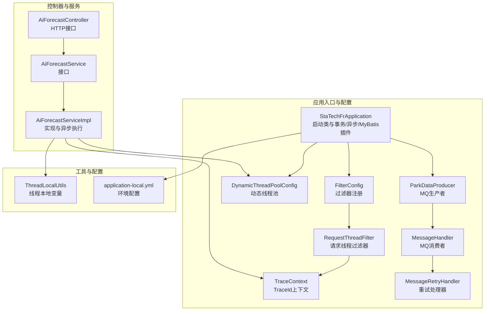
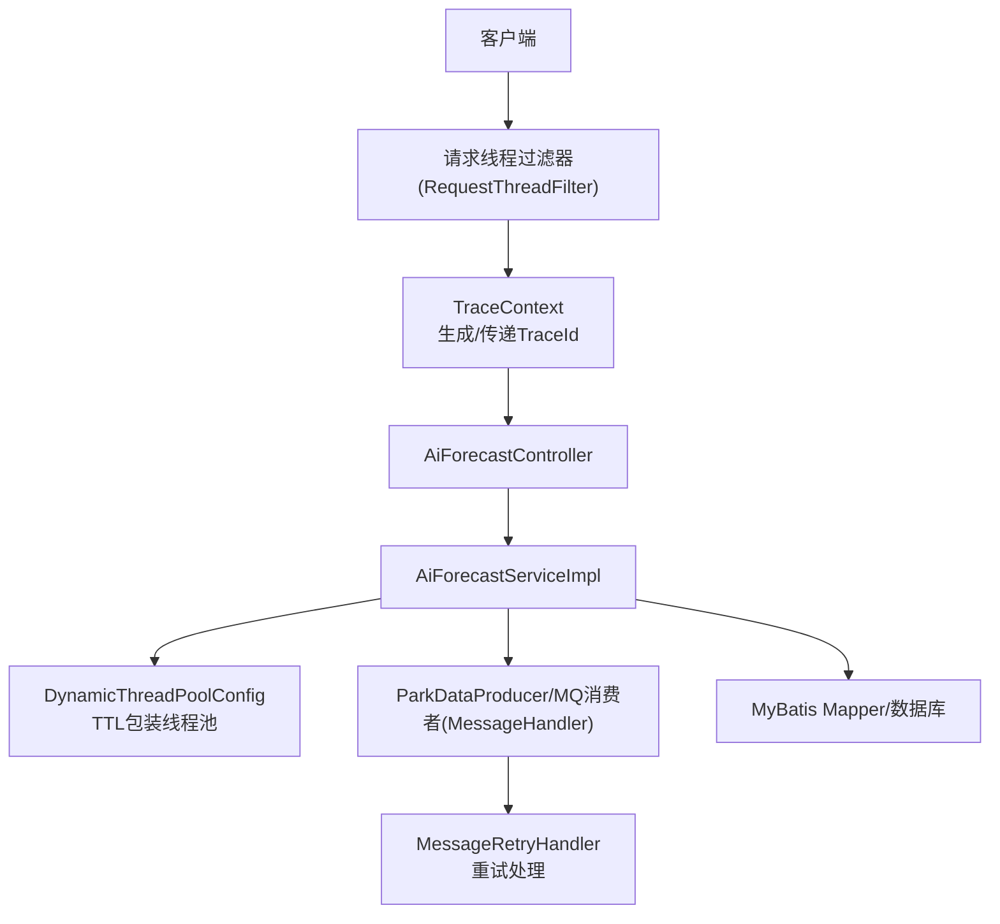
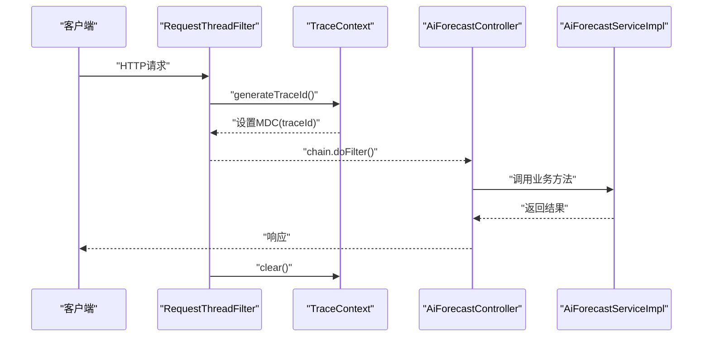
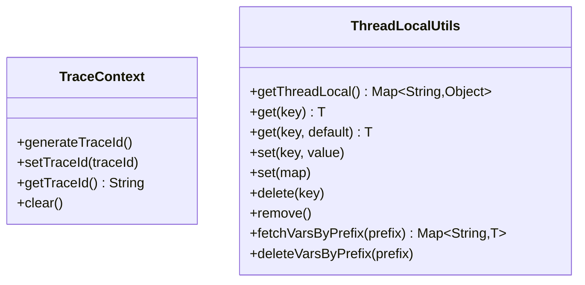
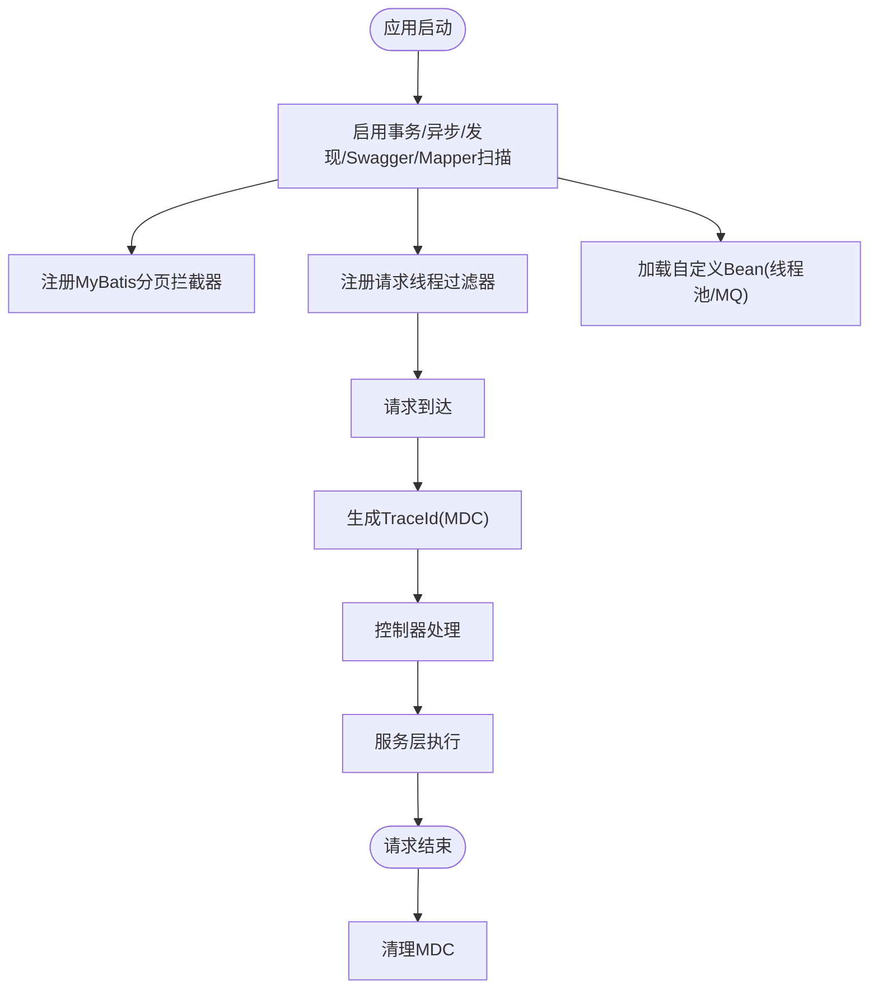
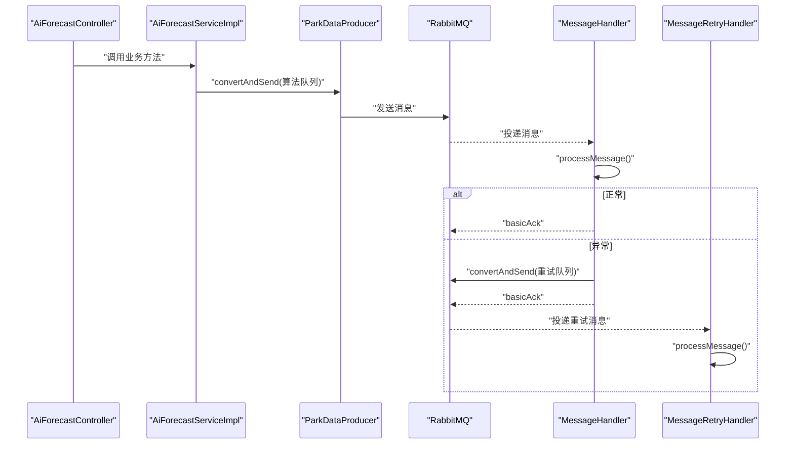
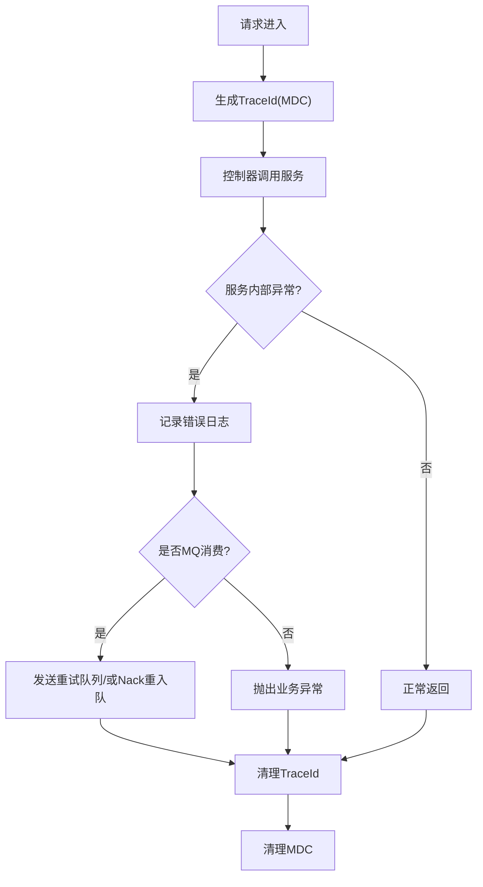
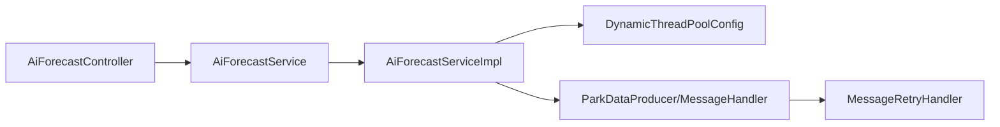

# 组件交互设计

<cite>
**本文引用的文件**
- [StaTechFrApplication.java](file://src/main/java/cn/staitech/fr/StaTechFrApplication.java)
- [FilterConfig.java](file://src/main/java/cn/staitech/fr/config/FilterConfig.java)
- [RequestThreadFilter.java](file://src/main/java/cn/staitech/fr/config/RequestThreadFilter.java)
- [TraceContext.java](file://src/main/java/cn/staitech/fr/config/TraceContext.java)
- [DynamicThreadPoolConfig.java](file://src/main/java/cn/staitech/fr/config/DynamicThreadPoolConfig.java)
- [ParkDataProducer.java](file://src/main/java/cn/staitech/fr/config/ParkDataProducer.java)
- [MessageHandler.java](file://src/main/java/cn/staitech/fr/config/MessageHandler.java)
- [MessageRetryHandler.java](file://src/main/java/cn/staitech/fr/config/MessageRetryHandler.java)
- [AiForecastController.java](file://src/main/java/cn/staitech/fr/controller/AiForecastController.java)
- [AiForecastService.java](file://src/main/java/cn/staitech/fr/service/AiForecastService.java)
- [AiForecastServiceImpl.java](file://src/main/java/cn/staitech/fr/service/impl/AiForecastServiceImpl.java)
- [ThreadLocalUtils.java](file://src/main/java/cn/staitech/fr/utils/ThreadLocalUtils.java)
- [application-local.yml](file://src/main/resources/application-local.yml)
</cite>

## 目录
1. [引言](#引言)
2. [项目结构](#项目结构)
3. [核心组件](#核心组件)
4. [架构总览](#架构总览)
5. [详细组件分析](#详细组件分析)
6. [依赖分析](#依赖分析)
7. [性能考虑](#性能考虑)
8. [故障排查指南](#故障排查指南)
9. [结论](#结论)
10. [附录](#附录)

## 引言
本设计文档聚焦FR模块的组件交互，围绕过滤器链路、拦截器机制与上下文传递展开；阐明组件初始化顺序、依赖注入关系与生命周期管理；解释跨模块调用、事件发布订阅与回调机制；并提供组件交互图与时序图，覆盖关键交互点、异常处理与性能优化措施。此外，结合现有代码，说明AOP切面、事务传播与分布式事务处理现状与建议。

## 项目结构
FR模块采用Spring Boot工程组织，核心层次包括：
- 应用入口与配置：应用启动类、过滤器注册、线程池与MQ配置、动态数据源等
- 控制器层：对外HTTP接口，如AI预测结果接口
- 服务层：业务服务接口与实现，包含异步与线程池调度
- 工具与上下文：线程本地上下文、TraceId传递、线程工具
- 资源与配置：YAML配置文件，定义数据源、MQ、线程池、脏器结构等

图表来源
- [StaTechFrApplication.java:1-63](file://src/main/java/cn/staitech/fr/StaTechFrApplication.java#L1-L63)
- [FilterConfig.java:1-22](file://src/main/java/cn/staitech/fr/config/FilterConfig.java#L1-L22)
- [RequestThreadFilter.java:1-24](file://src/main/java/cn/staitech/fr/config/RequestThreadFilter.java#L1-L24)
- [TraceContext.java:1-82](file://src/main/java/cn/staitech/fr/config/TraceContext.java#L1-L82)
- [DynamicThreadPoolConfig.java:1-53](file://src/main/java/cn/staitech/fr/config/DynamicThreadPoolConfig.java#L1-L53)
- [ParkDataProducer.java:1-48](file://src/main/java/cn/staitech/fr/config/ParkDataProducer.java#L1-L48)
- [MessageHandler.java:1-128](file://src/main/java/cn/staitech/fr/config/MessageHandler.java#L1-L128)
- [MessageRetryHandler.java:1-44](file://src/main/java/cn/staitech/fr/config/MessageRetryHandler.java#L1-L44)
- [AiForecastController.java:1-31](file://src/main/java/cn/staitech/fr/controller/AiForecastController.java#L1-L31)
- [AiForecastService.java:1-29](file://src/main/java/cn/staitech/fr/service/AiForecastService.java#L1-L29)
- [AiForecastServiceImpl.java:1-372](file://src/main/java/cn/staitech/fr/service/impl/AiForecastServiceImpl.java#L1-L372)
- [ThreadLocalUtils.java:1-140](file://src/main/java/cn/staitech/fr/utils/ThreadLocalUtils.java#L1-L140)
- [application-local.yml:1-311](file://src/main/resources/application-local.yml#L1-L311)

章节来源
- [StaTechFrApplication.java:1-63](file://src/main/java/cn/staitech/fr/StaTechFrApplication.java#L1-L63)
- [application-local.yml:1-311](file://src/main/resources/application-local.yml#L1-L311)

## 核心组件
- 应用启动与基础能力
  - 启动类启用发现、异步、事务、MyBatis分页插件与Mapper扫描
  - 初始化国际化消息源
- 过滤器与上下文
  - 注册全局请求线程过滤器，生成并传递TraceId，确保日志可追踪
  - TraceContext基于TransmittableThreadLocal与MDC实现跨线程上下文传递
- 线程池与异步
  - 动态线程池配置，支持监控与饱和策略
  - 业务中使用TTL包装线程池，保障上下文透传
- MQ与事件
  - 生产者发送普通与延迟消息
  - 消费者监听主队列与重试队列，手动确认，异常入重试队列或Nack重入队
- 控制器与服务
  - HTTP接口调用服务层，服务层执行复杂计算与异步任务

章节来源
- [StaTechFrApplication.java:26-62](file://src/main/java/cn/staitech/fr/StaTechFrApplication.java#L26-L62)
- [FilterConfig.java:10-22](file://src/main/java/cn/staitech/fr/config/FilterConfig.java#L10-L22)
- [RequestThreadFilter.java:8-24](file://src/main/java/cn/staitech/fr/config/RequestThreadFilter.java#L8-L24)
- [TraceContext.java:10-82](file://src/main/java/cn/staitech/fr/config/TraceContext.java#L10-L82)
- [DynamicThreadPoolConfig.java:10-53](file://src/main/java/cn/staitech/fr/config/DynamicThreadPoolConfig.java#L10-L53)
- [AiForecastServiceImpl.java:51-84](file://src/main/java/cn/staitech/fr/service/impl/AiForecastServiceImpl.java#L51-L84)

## 架构总览
FR模块采用“Web控制器—业务服务—数据访问—外部中间件”的分层架构。请求通过过滤器链注入TraceId，进入控制器后由服务层执行业务逻辑，并可能触发异步任务或MQ事件。上下文通过TTL与MDC在多线程间传递，保证日志与追踪一致。

图表来源
- [RequestThreadFilter.java:11-24](file://src/main/java/cn/staitech/fr/config/RequestThreadFilter.java#L11-L24)
- [TraceContext.java:13-82](file://src/main/java/cn/staitech/fr/config/TraceContext.java#L13-L82)
- [AiForecastController.java:17-31](file://src/main/java/cn/staitech/fr/controller/AiForecastController.java#L17-L31)
- [AiForecastServiceImpl.java:51-84](file://src/main/java/cn/staitech/fr/service/impl/AiForecastServiceImpl.java#L51-L84)
- [DynamicThreadPoolConfig.java:13-53](file://src/main/java/cn/staitech/fr/config/DynamicThreadPoolConfig.java#L13-L53)
- [ParkDataProducer.java:17-48](file://src/main/java/cn/staitech/fr/config/ParkDataProducer.java#L17-L48)
- [MessageHandler.java:28-128](file://src/main/java/cn/staitech/fr/config/MessageHandler.java#L28-L128)
- [MessageRetryHandler.java:18-44](file://src/main/java/cn/staitech/fr/config/MessageRetryHandler.java#L18-L44)

## 详细组件分析

### 过滤器链路与拦截器机制
- 全局过滤器注册：通过配置类注册请求线程过滤器，匹配所有URL，优先级为1
- 过滤器职责：在请求进入时生成TraceId并写入MDC，在请求结束时清理，避免内存泄漏
- 上下文传递：TraceContext基于TransmittableThreadLocal实现跨线程复制与透传，beforeExecute/afterExecute确保MDC在子线程可用

图表来源
- [FilterConfig.java:13-22](file://src/main/java/cn/staitech/fr/config/FilterConfig.java#L13-L22)
- [RequestThreadFilter.java:13-24](file://src/main/java/cn/staitech/fr/config/RequestThreadFilter.java#L13-L24)
- [TraceContext.java:47-81](file://src/main/java/cn/staitech/fr/config/TraceContext.java#L47-L81)
- [AiForecastController.java:26-31](file://src/main/java/cn/staitech/fr/controller/AiForecastController.java#L26-L31)

章节来源
- [FilterConfig.java:10-22](file://src/main/java/cn/staitech/fr/config/FilterConfig.java#L10-L22)
- [RequestThreadFilter.java:8-24](file://src/main/java/cn/staitech/fr/config/RequestThreadFilter.java#L8-L24)
- [TraceContext.java:10-82](file://src/main/java/cn/staitech/fr/config/TraceContext.java#L10-L82)

### 上下文传递与线程本地变量
- TraceContext
  - 提供生成、设置、获取、清理TraceId的能力
  - 通过TransmittableThreadLocal与MDC配合，确保在异步线程中仍可读取TraceId
- ThreadLocalUtils
  - 提供键值对形式的线程本地存储，支持按前缀检索与删除，便于临时上下文管理

图表来源
- [TraceContext.java:13-82](file://src/main/java/cn/staitech/fr/config/TraceContext.java#L13-L82)
- [ThreadLocalUtils.java:19-140](file://src/main/java/cn/staitech/fr/utils/ThreadLocalUtils.java#L19-L140)

章节来源
- [TraceContext.java:10-82](file://src/main/java/cn/staitech/fr/config/TraceContext.java#L10-L82)
- [ThreadLocalUtils.java:13-140](file://src/main/java/cn/staitech/fr/utils/ThreadLocalUtils.java#L13-L140)

### 组件初始化顺序、依赖注入与生命周期
- 启动类初始化
  - 启用事务、异步、发现、Swagger、Mapper扫描
  - 注册MyBatis分页拦截器
  - 初始化国际化消息源
- 过滤器初始化
  - FilterRegistrationBean注册RequestThreadFilter，URL匹配“/*”，优先级1
- 线程池与MQ
  - 自定义ExecutorService Bean，支持监控与饱和策略
  - RabbitTemplate与队列配置在YAML中集中管理
- 生命周期
  - 过滤器在请求前后执行
  - 服务方法在容器中以单例形式管理，线程池与MQ消费者由Spring管理

图表来源
- [StaTechFrApplication.java:29-62](file://src/main/java/cn/staitech/fr/StaTechFrApplication.java#L29-L62)
- [FilterConfig.java:13-22](file://src/main/java/cn/staitech/fr/config/FilterConfig.java#L13-L22)
- [DynamicThreadPoolConfig.java:13-53](file://src/main/java/cn/staitech/fr/config/DynamicThreadPoolConfig.java#L13-L53)
- [application-local.yml:57-75](file://src/main/resources/application-local.yml#L57-L75)

章节来源
- [StaTechFrApplication.java:26-62](file://src/main/java/cn/staitech/fr/StaTechFrApplication.java#L26-L62)
- [FilterConfig.java:10-22](file://src/main/java/cn/staitech/fr/config/FilterConfig.java#L10-L22)
- [application-local.yml:57-75](file://src/main/resources/application-local.yml#L57-L75)

### 跨模块调用、事件发布订阅与回调机制
- HTTP调用
  - 控制器通过资源注入的服务进行业务处理，属于本地模块内调用
- MQ事件
  - 生产者向算法消息队列发送消息，消费者处理后手动确认
  - 异常时消息发送至重试队列，或Nack重入队
  - 支持延迟消息，通过延迟交换机与路由键实现定时检查

图表来源
- [AiForecastController.java:23-31](file://src/main/java/cn/staitech/fr/controller/AiForecastController.java#L23-L31)
- [AiForecastServiceImpl.java:138-147](file://src/main/java/cn/staitech/fr/service/impl/AiForecastServiceImpl.java#L138-L147)
- [ParkDataProducer.java:27-44](file://src/main/java/cn/staitech/fr/config/ParkDataProducer.java#L27-L44)
- [MessageHandler.java:43-86](file://src/main/java/cn/staitech/fr/config/MessageHandler.java#L43-L86)
- [MessageRetryHandler.java:25-42](file://src/main/java/cn/staitech/fr/config/MessageRetryHandler.java#L25-L42)

章节来源
- [AiForecastController.java:17-31](file://src/main/java/cn/staitech/fr/controller/AiForecastController.java#L17-L31)
- [AiForecastServiceImpl.java:138-147](file://src/main/java/cn/staitech/fr/service/impl/AiForecastServiceImpl.java#L138-L147)
- [MessageHandler.java:28-128](file://src/main/java/cn/staitech/fr/config/MessageHandler.java#L28-L128)
- [MessageRetryHandler.java:18-44](file://src/main/java/cn/staitech/fr/config/MessageRetryHandler.java#L18-L44)

### 关键交互点与异常处理
- TraceId贯穿请求全链路，异常清理MDC，避免泄漏
- MQ消费者手动确认，异常分支：
  - 发送至重试队列并确认原消息
  - 若重试发送失败，则Nack原消息并要求重入队
- 服务层异步任务通过TTL包装线程池，确保上下文透传

图表来源
- [TraceContext.java:47-81](file://src/main/java/cn/staitech/fr/config/TraceContext.java#L47-L81)
- [MessageHandler.java:54-75](file://src/main/java/cn/staitech/fr/config/MessageHandler.java#L54-L75)
- [AiForecastServiceImpl.java:152-157](file://src/main/java/cn/staitech/fr/service/impl/AiForecastServiceImpl.java#L152-L157)

章节来源
- [TraceContext.java:47-81](file://src/main/java/cn/staitech/fr/config/TraceContext.java#L47-L81)
- [MessageHandler.java:54-75](file://src/main/java/cn/staitech/fr/config/MessageHandler.java#L54-L75)
- [AiForecastServiceImpl.java:152-157](file://src/main/java/cn/staitech/fr/service/impl/AiForecastServiceImpl.java#L152-L157)

### 性能优化措施
- 线程池监控：在execute/beforeExecute/afterExecute记录队列长度、线程数、活跃数，便于容量评估与调优
- TTL线程池：使用TtlExecutors包装，保障跨线程上下文传递
- MQ配置：开启publisher confirm/returns，手动确认，降低丢消息风险
- 数据源：动态数据源与连接池参数可调，支持主从分离与高并发

章节来源
- [DynamicThreadPoolConfig.java:27-51](file://src/main/java/cn/staitech/fr/config/DynamicThreadPoolConfig.java#L27-L51)
- [AiForecastServiceImpl.java:55-57](file://src/main/java/cn/staitech/fr/service/impl/AiForecastServiceImpl.java#L55-L57)
- [application-local.yml:57-75](file://src/main/resources/application-local.yml#L57-L75)

## 依赖分析
- 组件耦合
  - 控制器依赖服务接口，服务实现依赖Mapper与线程池
  - MQ生产者与消费者解耦，通过消息契约交互
- 外部依赖
  - RabbitMQ、Redis、数据库、Feign客户端等由配置文件集中管理
- 循环依赖
  - 当前结构未见明显循环依赖；服务层对线程池与上下文的依赖为必要耦合

图表来源
- [AiForecastController.java:23-31](file://src/main/java/cn/staitech/fr/controller/AiForecastController.java#L23-L31)
- [AiForecastService.java:16-28](file://src/main/java/cn/staitech/fr/service/AiForecastService.java#L16-L28)
- [AiForecastServiceImpl.java:51-84](file://src/main/java/cn/staitech/fr/service/impl/AiForecastServiceImpl.java#L51-L84)
- [DynamicThreadPoolConfig.java:13-53](file://src/main/java/cn/staitech/fr/config/DynamicThreadPoolConfig.java#L13-L53)
- [ParkDataProducer.java:17-48](file://src/main/java/cn/staitech/fr/config/ParkDataProducer.java#L17-L48)
- [MessageHandler.java:28-128](file://src/main/java/cn/staitech/fr/config/MessageHandler.java#L28-L128)
- [MessageRetryHandler.java:18-44](file://src/main/java/cn/staitech/fr/config/MessageRetryHandler.java#L18-L44)

章节来源
- [AiForecastController.java:17-31](file://src/main/java/cn/staitech/fr/controller/AiForecastController.java#L17-L31)
- [AiForecastService.java:16-28](file://src/main/java/cn/staitech/fr/service/AiForecastService.java#L16-L28)
- [AiForecastServiceImpl.java:51-84](file://src/main/java/cn/staitech/fr/service/impl/AiForecastServiceImpl.java#L51-L84)

## 性能考虑
- 线程池参数
  - 核心池大小、最大池大小、队列长度与饱和策略需结合业务峰值与耗时模型调优
  - TTL包装线程池避免上下文丢失带来的调试成本与潜在问题
- MQ吞吐
  - 开启publisher confirm/returns，合理设置重试次数与间隔
  - 分离主队列与重试队列，避免阻塞主流程
- 数据库与缓存
  - 动态数据源与连接池参数可调，建议根据QPS与RT设定最大连接数与空闲超时
  - Redis连接池参数与超时设置需与业务场景匹配

## 故障排查指南
- TraceId缺失
  - 检查过滤器是否注册且优先级正确
  - 确认finally中是否调用TraceContext.clear()
- MQ消息堆积
  - 查看消费者线程数与处理耗时，评估是否需要扩容或拆分队列
  - 检查重试队列是否持续积压，定位异常原因
- 异步任务未执行
  - 检查线程池是否被正确注入与包装
  - 确认TtlRunnable包装是否生效
- 数据库连接异常
  - 检查动态数据源配置与连接池参数
  - 关注连接超时、验证查询与心跳设置

章节来源
- [RequestThreadFilter.java:13-24](file://src/main/java/cn/staitech/fr/config/RequestThreadFilter.java#L13-L24)
- [TraceContext.java:77-81](file://src/main/java/cn/staitech/fr/config/TraceContext.java#L77-L81)
- [MessageHandler.java:54-75](file://src/main/java/cn/staitech/fr/config/MessageHandler.java#L54-L75)
- [DynamicThreadPoolConfig.java:27-51](file://src/main/java/cn/staitech/fr/config/DynamicThreadPoolConfig.java#L27-L51)
- [application-local.yml:15-56](file://src/main/resources/application-local.yml#L15-L56)

## 结论
FR模块通过统一的过滤器链与TraceContext实现了端到端的上下文传递；服务层结合TTL线程池与MQ实现了高性能与可靠的消息处理；配置文件集中管理外部依赖，便于运维与扩展。建议后续完善AOP切面与事务传播策略，以及分布式事务处理方案，以进一步提升一致性与可观测性。

## 附录
- AOP切面与事务传播
  - 现状：启动类启用@EnableTransactionManagement，但未见显式AOP切面配置
  - 建议：在服务层使用@Transactional标注关键路径，明确传播行为与隔离级别；必要时引入@Async与线程池策略协同
- 分布式事务
  - 现状：未见分布式事务框架集成
  - 建议：对于跨模块强一致场景，可引入Seata或TCC模式；对于最终一致场景，保持MQ幂等与重试策略即可