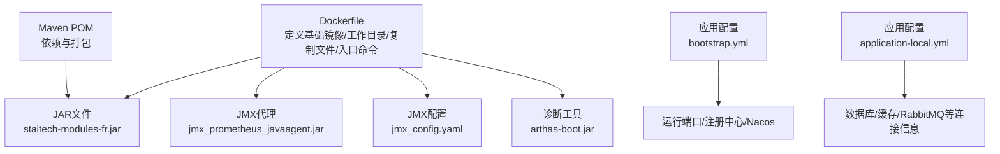
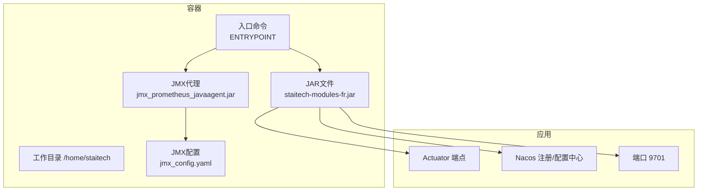
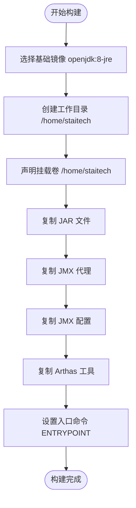
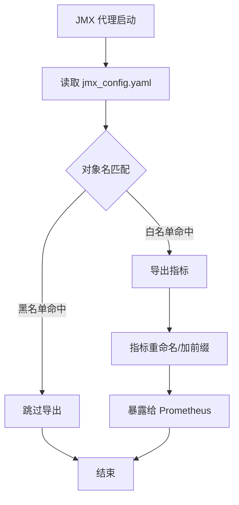
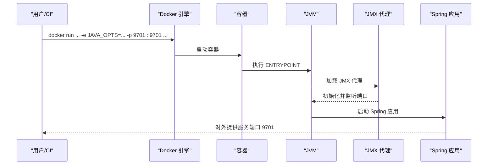
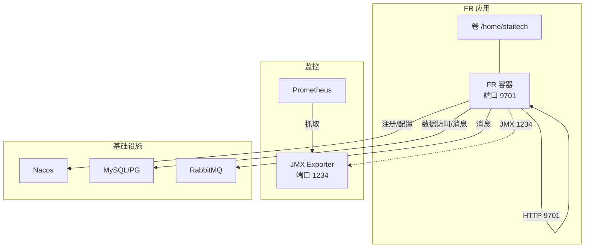
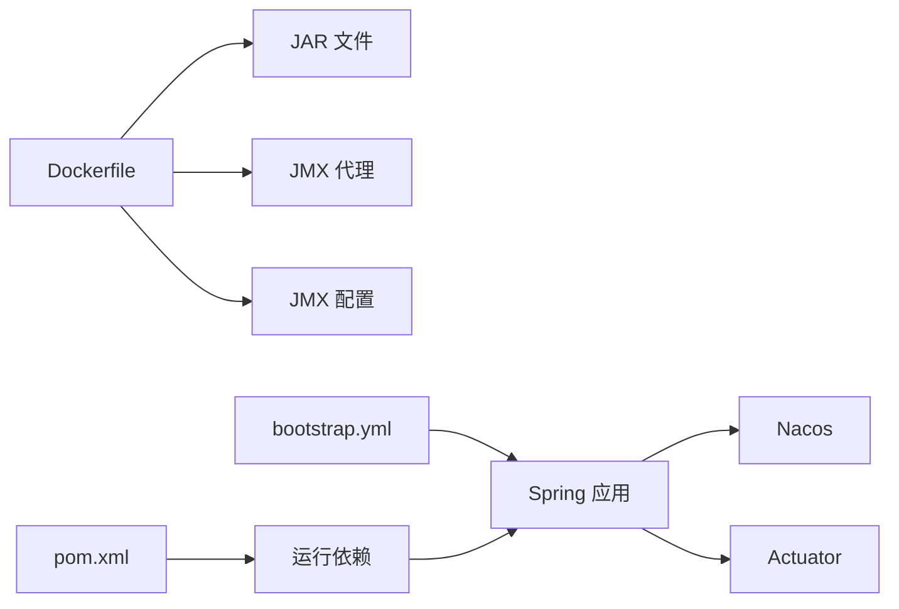

# Docker部署

<cite>
**本文引用的文件**
- [dockerfile](file://docker/staitech/modules/fr/dockerfile)
- [jmx_config.yaml](file://docker/staitech/modules/fr/jmx_config.yaml)
- [bootstrap.yml](file://src/main/resources/bootstrap.yml)
- [application-local.yml](file://src/main/resources/application-local.yml)
- [pom.xml](file://pom.xml)
</cite>

## 目录
1. [简介](#简介)
2. [项目结构](#项目结构)
3. [核心组件](#核心组件)
4. [架构总览](#架构总览)
5. [组件详解](#组件详解)
6. [依赖关系分析](#依赖关系分析)
7. [性能考量](#性能考量)
8. [故障排查指南](#故障排查指南)
9. [结论](#结论)
10. [附录](#附录)

## 简介
本指南面向FR模块的Docker部署，围绕Dockerfile构建流程、JAR文件复制、JMX代理配置、容器启动命令与参数、镜像构建与运行、环境变量设置、Docker Compose多容器编排、网络与数据卷配置以及生产环境最佳实践与安全建议进行系统化说明。内容基于仓库中现有的Docker与配置文件进行提炼与扩展，帮助读者快速完成本地与生产环境的容器化部署。

## 项目结构
FR模块的Docker相关资产位于docker/staitech/modules/fr目录，关键文件包括：
- Dockerfile：定义基础镜像、工作目录、复制JAR与监控代理、JMX配置文件以及入口命令
- jmx_config.yaml：Prometheus JMX Exporter的指标暴露规则与过滤策略
- application-local.yml与bootstrap.yml：应用端口、Nacos注册与配置中心等运行时配置
- pom.xml：项目依赖与打包产物信息

图表来源
- [dockerfile:1-22](file://docker/staitech/modules/fr/dockerfile#L1-L22)
- [jmx_config.yaml:1-125](file://docker/staitech/modules/fr/jmx_config.yaml#L1-L125)
- [bootstrap.yml:1-48](file://src/main/resources/bootstrap.yml#L1-L48)
- [application-local.yml:1-311](file://src/main/resources/application-local.yml#L1-L311)
- [pom.xml:1-200](file://pom.xml#L1-L200)

章节来源
- [dockerfile:1-22](file://docker/staitech/modules/fr/dockerfile#L1-L22)
- [bootstrap.yml:1-48](file://src/main/resources/bootstrap.yml#L1-L48)
- [application-local.yml:1-311](file://src/main/resources/application-local.yml#L1-L311)
- [pom.xml:1-200](file://pom.xml#L1-L200)

## 核心组件
- 基础镜像与运行时
  - 使用openjdk:8-jre作为基础镜像，确保Java 8运行时可用
  - 容器内工作目录为/home/staitech，挂载卷也为该路径，便于持久化与日志收集
- JAR与代理
  - 将构建产物staitech-modules-fr.jar复制至容器内并作为可执行JAR
  - 复制jmx_prometheus_javaagent-0.16.1.jar与jmx_config.yaml，启用JMX指标导出
  - 同时复制arthas-boot.jar，用于线上诊断与问题定位
- 入口命令
  - 通过ENTRYPOINT以sh -c方式启动，使用$JAVA_OPTS传递JVM参数，并加载JMX代理后启动JAR

章节来源
- [dockerfile:1-22](file://docker/staitech/modules/fr/dockerfile#L1-L22)
- [jmx_config.yaml:1-125](file://docker/staitech/modules/fr/jmx_config.yaml#L1-L125)

## 架构总览
FR模块在容器内的运行架构如下：
- 容器启动时加载JMX代理，按配置规则导出JVM指标
- 应用通过Spring Boot Actuator与Nacos注册/配置中心交互
- 默认监听端口由bootstrap.yml定义，可通过环境变量覆盖

图表来源
- [dockerfile:1-22](file://docker/staitech/modules/fr/dockerfile#L1-L22)
- [bootstrap.yml:1-48](file://src/main/resources/bootstrap.yml#L1-L48)
- [jmx_config.yaml:1-125](file://docker/staitech/modules/fr/jmx_config.yaml#L1-L125)

## 组件详解

### Dockerfile构建流程
- 基础镜像选择：openjdk:8-jre，满足当前应用运行需求
- 目录与挂载：创建工作目录并声明VOLUME，便于外部挂载与数据持久化
- 文件复制：
  - 复制JAR文件至容器内
  - 复制JMX代理与配置文件
  - 复制Arthas诊断工具
- 启动命令：ENTRYPOINT通过sh -c执行，支持$JAVA_OPTS传参，加载JMX代理并启动JAR

图表来源
- [dockerfile:1-22](file://docker/staitech/modules/fr/dockerfile#L1-L22)

章节来源
- [dockerfile:1-22](file://docker/staitech/modules/fr/dockerfile#L1-L22)

### JMX代理与指标配置
- JMX代理端口：配置文件中定义了JMX Exporter监听端口（如1234），结合容器端口映射对外暴露
- 白名单与黑名单：对JMX对象进行筛选，仅导出必要指标，降低开销
- 指标重命名与前缀：统一指标命名风格，便于Prometheus采集与展示
- 连接与SSL：支持本地JMX连接，默认不启用SSL；如需远程监控可配置jmxUrl与SSL参数

图表来源
- [jmx_config.yaml:1-125](file://docker/staitech/modules/fr/jmx_config.yaml#L1-L125)

章节来源
- [jmx_config.yaml:1-125](file://docker/staitech/modules/fr/jmx_config.yaml#L1-L125)

### 容器启动命令与参数
- 启动命令：ENTRYPOINT采用sh -c方式，允许通过$JAVA_OPTS注入JVM参数（如堆大小、GC策略、调试参数等）
- JMX代理：通过-agentpath或-agentlib形式加载，监听端口与配置文件路径均在ENTRYPOINT中指定
- JAR运行：以standalone JAR方式启动，端口由应用配置决定

图表来源
- [dockerfile:21-22](file://docker/staitech/modules/fr/dockerfile#L21-L22)
- [bootstrap.yml:1-48](file://src/main/resources/bootstrap.yml#L1-L48)

章节来源
- [dockerfile:21-22](file://docker/staitech/modules/fr/dockerfile#L21-L22)
- [bootstrap.yml:1-48](file://src/main/resources/bootstrap.yml#L1-L48)

### 环境变量与配置
- 端口：应用默认监听9701，可通过环境变量覆盖（如SERVER_PORT）
- Nacos：注册中心地址、命名空间、分组等由bootstrap.yml中的占位符控制，实际值在构建或运行时注入
- Actuator：管理端点默认仅暴露env、health、info，可按需调整
- 数据库/缓存/RabbitMQ：application-local.yml中包含本地开发环境的连接信息，生产环境应通过配置中心或Secrets注入

章节来源
- [bootstrap.yml:1-48](file://src/main/resources/bootstrap.yml#L1-L48)
- [application-local.yml:1-311](file://src/main/resources/application-local.yml#L1-L311)

### Docker Compose多容器编排（概念性说明）
以下为概念性编排思路，便于理解多容器协作：
- 应用容器：运行FR模块，暴露9701端口，挂载/home/staitech用于日志与持久化
- 监控容器：Prometheus拉取JMX Exporter指标
- 注册与配置中心：Nacos容器，应用通过bootstrap.yml连接
- 数据库与消息队列：MySQL/PostgreSQL与RabbitMQ容器，连接信息通过配置中心下发

（本图为概念性示意，不对应具体源码文件）

## 依赖关系分析
- Dockerfile对JAR与JMX代理的依赖：JAR是应用主体，JMX代理与配置用于监控
- 应用配置对运行时的影响：bootstrap.yml决定端口与注册/配置中心，application-local.yml提供本地连接信息
- Maven依赖：pom.xml定义了Actuator、Nacos、RabbitMQ、数据库驱动等，这些能力在容器内同样生效

图表来源
- [dockerfile:1-22](file://docker/staitech/modules/fr/dockerfile#L1-L22)
- [bootstrap.yml:1-48](file://src/main/resources/bootstrap.yml#L1-L48)
- [pom.xml:1-200](file://pom.xml#L1-L200)

章节来源
- [dockerfile:1-22](file://docker/staitech/modules/fr/dockerfile#L1-L22)
- [bootstrap.yml:1-48](file://src/main/resources/bootstrap.yml#L1-L48)
- [pom.xml:1-200](file://pom.xml#L1-L200)

## 性能考量
- JMX指标范围：通过白/黑名单与规则限制导出指标数量，避免过度采集导致CPU与内存开销增加
- 指标命名规范化：统一前缀与小写命名，提升Prometheus查询效率
- JVM参数调优：通过$JAVA_OPTS传入堆大小、GC策略等参数，结合容器资源限制进行平衡
- 端口与网络：仅暴露必要端口，减少攻击面；合理规划容器间网络隔离

（本节为通用指导，不直接分析具体文件）

## 故障排查指南
- 容器无法启动
  - 检查JAR是否正确复制到/home/staitech，确认ENTRYPOINT命令与JAR路径一致
  - 查看JMX代理与配置文件是否存在且权限正确
- 端口冲突或不可访问
  - 确认应用端口（默认9701）与容器端口映射一致
  - 检查防火墙与安全组策略
- 监控指标缺失
  - 核对JMX Exporter监听端口（如1234）与Prometheus抓取配置
  - 检查jmx_config.yaml中的白/黑名单与规则是否过于严格
- 连接异常（数据库/缓存/消息队列）
  - 生产环境连接信息应通过配置中心或Secrets注入，避免硬编码
  - 核对Nacos命名空间、分组与超时配置

章节来源
- [dockerfile:1-22](file://docker/staitech/modules/fr/dockerfile#L1-L22)
- [jmx_config.yaml:1-125](file://docker/staitech/modules/fr/jmx_config.yaml#L1-L125)
- [bootstrap.yml:1-48](file://src/main/resources/bootstrap.yml#L1-L48)
- [application-local.yml:1-311](file://src/main/resources/application-local.yml#L1-L311)

## 结论
本指南基于仓库现有Docker与配置文件，给出了FR模块的容器化部署要点：基础镜像、目录与文件复制、JMX代理配置、容器启动命令与参数、端口与网络、以及生产环境最佳实践。建议在生产环境中结合配置中心、Secrets与最小权限原则，进一步完善安全与可观测性体系。

（本节为总结性内容，不直接分析具体文件）

## 附录

### 镜像构建步骤（概要）
- 在构建环境中准备好staitech-modules-fr.jar与JMX代理、配置文件
- 使用Dockerfile构建镜像，确保复制路径与ENTRYPOINT一致
- 推送镜像至私有仓库或公共仓库，供CI/CD或编排工具使用

章节来源
- [dockerfile:1-22](file://docker/staitech/modules/fr/dockerfile#L1-L22)

### 容器运行命令（示例性说明）
- 基本运行：docker run -d --name fr-app -p 9701:9701 -v /host/logs:/home/staitech -e JAVA_OPTS="-Xms512m -Xmx2g" <镜像名>
- 参数说明：
  - -p：端口映射（应用端口9701映射到宿主机）
  - -v：数据卷挂载（持久化日志与临时文件）
  - -e JAVA_OPTS：JVM参数（可根据需要调整）
- 环境变量建议：
  - SERVER_PORT：覆盖默认端口
  - NACOS_SERVER_ADDR/NACOS_NAMESPACE/NACOS_GROUP：Nacos连接参数
  - SPRING_PROFILES_ACTIVE：激活的配置文件

章节来源
- [dockerfile:21-22](file://docker/staitech/modules/fr/dockerfile#L21-L22)
- [bootstrap.yml:1-48](file://src/main/resources/bootstrap.yml#L1-L48)

### Docker Compose编排（概念性示例）
- 服务定义：应用、Prometheus、Nacos、数据库、消息队列
- 网络：自定义桥接网络，实现服务间互通
- 卷：挂载日志与数据目录
- 环境变量：通过.env或环境字段注入敏感信息

（本节为概念性说明，不对应具体源码文件）

### 生产环境最佳实践与安全建议
- 最小权限：容器以非root用户运行，仅授予必要文件权限
- 资源限制：设置CPU与内存上限，避免资源争抢
- 网络隔离：使用独立子网与防火墙策略，仅开放必要端口
- 配置与密钥：通过Kubernetes Secrets或配置中心注入，避免硬编码
- 日志与审计：集中化日志收集，开启审计与访问日志
- 健康检查：配置Liveness/Readiness探针，保障滚动更新与自愈能力

（本节为通用指导，不直接分析具体文件）