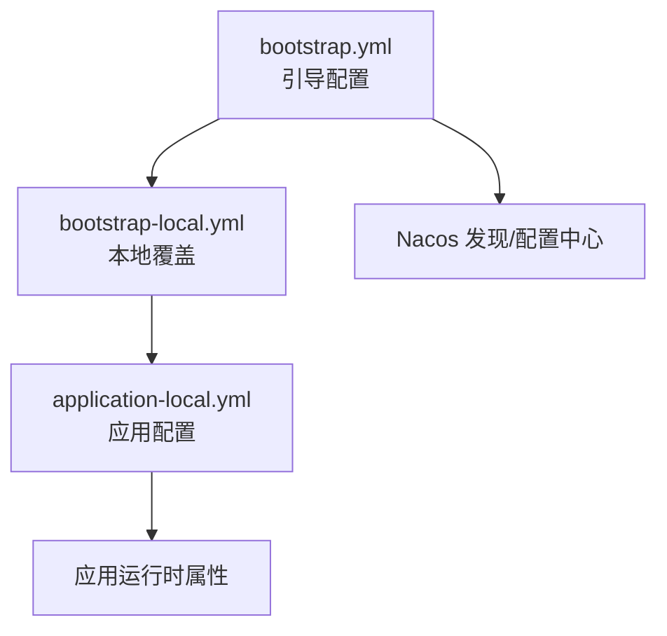
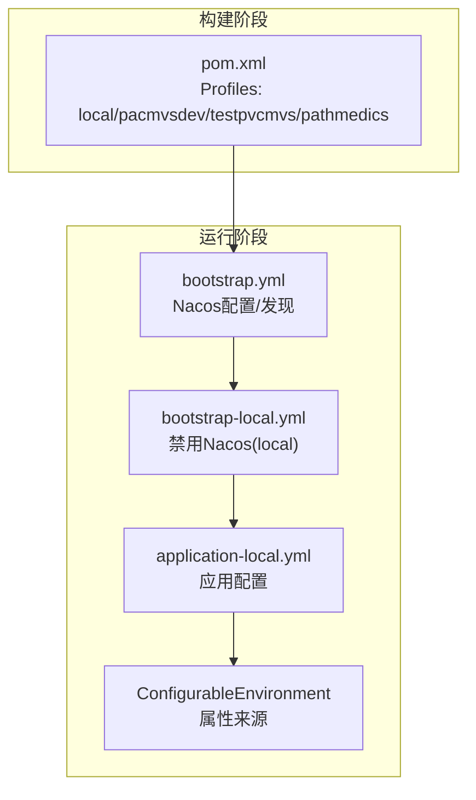
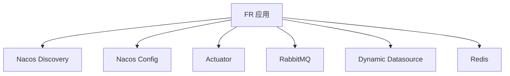

# 环境配置

<cite>
**本文引用的文件**
- [application-local.yml](file://src/main/resources/application-local.yml)
- [bootstrap-local.yml](file://src/main/resources/bootstrap-local.yml)
- [bootstrap.yml](file://src/main/resources/bootstrap.yml)
- [pom.xml](file://pom.xml)
- [InitializinConfig.java](file://src/main/java/cn/staitech/fr/config/InitializinConfig.java)
- [EnvironmentLogger.java](file://src/main/java/cn/staitech/fr/config/EnvironmentLogger.java)
- [DynamicDataPool.java](file://src/main/java/cn/staitech/fr/config/DynamicDataPool.java)
- [DynamicThreadPoolConfig.java](file://src/main/java/cn/staitech/fr/config/DynamicThreadPoolConfig.java)
- [MessageHandler.java](file://src/main/java/cn/staitech/fr/config/MessageHandler.java)
- [MessageRetryHandler.java](file://src/main/java/cn/staitech/fr/config/MessageRetryHandler.java)
</cite>

## 目录
1. [简介](#简介)
2. [项目结构](#项目结构)
3. [核心组件](#核心组件)
4. [架构总览](#架构总览)
5. [详细组件分析](#详细组件分析)
6. [依赖分析](#依赖分析)
7. [性能考量](#性能考量)
8. [故障排查指南](#故障排查指南)
9. [结论](#结论)
10. [附录](#附录)

## 简介
本指南聚焦于FR模块的环境配置管理，围绕以下目标展开：
- 解释application-local.yml与bootstrap-local.yml的配置项含义与设置方法
- 说明开发、测试、生产等多环境的配置差异与切换方式
- 提供数据库连接、Redis缓存、消息队列、第三方服务的配置要点
- 说明配置文件的优先级与覆盖规则
- 给出环境变量与外部化配置的最佳实践
- 介绍配置验证与热更新机制的现状与建议

## 项目结构
FR模块采用Spring Boot标准资源目录组织，关键配置位于resources目录：
- bootstrap.yml：应用启动引导配置（端口、国际化、Nacos发现与配置中心接入）
- bootstrap-local.yml：本地开发环境的引导覆盖（禁用Nacos）
- application-local.yml：本地开发环境的应用配置（数据库、Redis、RabbitMQ、MyBatis、Swagger、日志、Actuator等）

图表来源
- [bootstrap.yml:1-48](file://src/main/resources/bootstrap.yml#L1-L48)
- [bootstrap-local.yml:1-9](file://src/main/resources/bootstrap-local.yml#L1-L9)
- [application-local.yml:1-311](file://src/main/resources/application-local.yml#L1-L311)

章节来源
- [bootstrap.yml:1-48](file://src/main/resources/bootstrap.yml#L1-L48)
- [bootstrap-local.yml:1-9](file://src/main/resources/bootstrap-local.yml#L1-L9)
- [application-local.yml:1-311](file://src/main/resources/application-local.yml#L1-L311)

## 核心组件
- 引导配置（bootstrap.yml）：定义应用名、端口、国际化、Nacos服务发现与配置中心地址、分组、命名空间、共享配置等。
- 本地引导覆盖（bootstrap-local.yml）：激活本地profile，并禁用Nacos发现与配置中心，确保本地直连数据库与缓存。
- 本地应用配置（application-local.yml）：定义数据库连接池、Redis连接、RabbitMQ连接、MyBatis映射、Swagger、日志级别、Actuator暴露端点、脏器结构配置、消息队列名称与延迟时间、动态线程池参数等。

章节来源
- [bootstrap.yml:11-46](file://src/main/resources/bootstrap.yml#L11-L46)
- [bootstrap-local.yml:1-9](file://src/main/resources/bootstrap-local.yml#L1-L9)
- [application-local.yml:5-106](file://src/main/resources/application-local.yml#L5-L106)

## 架构总览
FR模块通过Spring Cloud Alibaba Nacos实现服务发现与外部化配置；在本地开发时可禁用Nacos，直接读取本地配置文件。应用启动后，会加载bootstrap.yml中的占位符属性并通过Maven Profile注入实际值，随后按顺序合并application-local.yml等环境特定配置。

图表来源
- [pom.xml:302-363](file://pom.xml#L302-L363)
- [bootstrap.yml:11-46](file://src/main/resources/bootstrap.yml#L11-L46)
- [bootstrap-local.yml:1-9](file://src/main/resources/bootstrap-local.yml#L1-L9)
- [application-local.yml:1-311](file://src/main/resources/application-local.yml#L1-L311)

章节来源
- [pom.xml:302-363](file://pom.xml#L302-L363)

## 详细组件分析

### 本地开发配置项详解（application-local.yml）
- Spring Profile与上传限制
  - 激活本地profile
  - 文件上传大小限制
- Redis缓存
  - 主机、端口、密码
- 数据库连接（动态多数据源）
  - 主库（MySQL）：驱动、URL、用户名、密码、HikariCP连接池参数
  - 从库（PostgreSQL）：驱动、URL、用户名、密码、HikariCP连接池参数
  - 默认主库与连接池参数
- RabbitMQ消息队列
  - 主机、端口、虚拟主机、认证信息
  - 生产者返回与确认类型
  - listener.simple与listener.direct的确认模式、重试次数与间隔
- MyBatis
  - 类型别名包、Mapper XML扫描路径、日志实现
- Swagger
  - 文档标题、许可信息
- 日志与监控
  - 日志级别（含AMQP与Mapper）
  - Actuator暴露端点（env、health、info）
- 其他
  - 蜡块路径（waxPath）
  - 脏器结构配置（organ-structures）
  - 消息队列名称与延迟时间（queues、delayTime）
  - 动态线程池参数（dynamic.corePoolSize、dynamic.maxPoolSize）

章节来源
- [application-local.yml:1-311](file://src/main/resources/application-local.yml#L1-L311)

### 本地引导配置（bootstrap-local.yml）
- 激活本地profile
- 禁用Nacos服务发现与配置中心，确保本地直连

章节来源
- [bootstrap-local.yml:1-9](file://src/main/resources/bootstrap-local.yml#L1-L9)

### 引导配置（bootstrap.yml）
- 应用基础信息：端口、Knife4j开关、国际化资源
- Spring Profiles：激活属性占位符
- Nacos服务发现：server-addr、namespace、group、超时
- Nacos配置中心：server-addr、file-extension、namespace、group、shared-configs、超时

章节来源
- [bootstrap.yml:1-48](file://src/main/resources/bootstrap.yml#L1-L48)

### Maven Profile与环境切换
- local：激活local配置，Nacos相关占位符留空
- pacmvsdev/testpvcmvs/pathmedics：分别设置Nacos命名空间、地址、分组与服务地址

章节来源
- [pom.xml:302-363](file://pom.xml#L302-L363)

### 配置优先级与覆盖规则
- 属性来源顺序（示例，具体以Spring Boot实现为准）：命令行参数 > 系统环境变量 > application-{profile}.yml > application.yml > @PropertySource > 默认属性
- 在本地开发：bootstrap-local.yml禁用Nacos后，application-local.yml直接生效
- 在集成环境：bootstrap.yml通过Maven Profile注入Nacos占位符，结合Nacos共享配置实现外部化

章节来源
- [bootstrap.yml:20-46](file://src/main/resources/bootstrap.yml#L20-L46)
- [bootstrap-local.yml:1-9](file://src/main/resources/bootstrap-local.yml#L1-L9)
- [pom.xml:302-363](file://pom.xml#L302-L363)

### 数据库连接配置
- 主库（MySQL）：驱动、URL、用户名、密码、HikariCP连接池参数（最大池大小、最小空闲、空闲超时、最大存活时间、连接超时、校验超时、自动提交、连接测试查询、JMX注册）
- 从库（PostgreSQL）：驱动、URL、用户名、密码、HikariCP连接池参数
- 默认主库与动态多数据源primary

章节来源
- [application-local.yml:15-56](file://src/main/resources/application-local.yml#L15-L56)

### Redis缓存配置
- 主机、端口、密码
- 运行时校验连接（LettuceConnectionFactory.validateConnection=true）

章节来源
- [application-local.yml:11-14](file://src/main/resources/application-local.yml#L11-L14)
- [InitializinConfig.java:18-24](file://src/main/java/cn/staitech/fr/config/InitializinConfig.java#L18-L24)

### 消息队列配置
- RabbitMQ：主机、端口、认证、虚拟主机、生产者返回与确认类型
- listener.simple：手动确认、重试次数、初始间隔、拒绝后不回队
- listener.direct：手动确认
- 消息队列名称与延迟时间：queues.algoMsg、queues.algoMsgRetry、queues.delayTime

章节来源
- [application-local.yml:57-75](file://src/main/resources/application-local.yml#L57-L75)
- [MessageHandler.java:32-75](file://src/main/java/cn/staitech/fr/config/MessageHandler.java#L32-L75)

### 第三方服务配置
- Nacos服务发现与配置中心：在非local环境下启用，通过Maven Profile注入命名空间、地址、分组与服务地址

章节来源
- [bootstrap.yml:23-46](file://src/main/resources/bootstrap.yml#L23-L46)
- [pom.xml:302-363](file://pom.xml#L302-L363)

### 动态线程池与队列参数
- 动态线程池参数：dynamic.corePoolSize、dynamic.maxPoolSize
- JSON任务线程池：固定核心与最大线程、有界队列、拒绝策略
- 消费者线程池监控：提交/开始/完成日志

章节来源
- [application-local.yml:309-311](file://src/main/resources/application-local.yml#L309-L311)
- [DynamicDataPool.java:15-23](file://src/main/java/cn/staitech/fr/config/DynamicDataPool.java#L15-L23)
- [DynamicThreadPoolConfig.java:13-51](file://src/main/java/cn/staitech/fr/config/DynamicThreadPoolConfig.java#L13-L51)

### 配置验证与热更新机制
- 配置验证：EnvironmentLogger在应用就绪事件中输出PropertySource列表，便于核验配置来源与覆盖关系
- 热更新：当前仓库未见显式的配置热更新实现（如Spring Cloud Bus或@RefreshScope），建议在启用Nacos配置中心时结合其推送能力实现配置热更新

章节来源
- [EnvironmentLogger.java:17-24](file://src/main/java/cn/staitech/fr/config/EnvironmentLogger.java#L17-L24)

## 依赖分析
- Nacos依赖：spring-cloud-starter-alibaba-nacos-discovery、spring-cloud-starter-alibaba-nacos-config
- Actuator：spring-boot-starter-actuator
- AMQP：spring-boot-starter-amqp
- 动态数据源：dynamic-datasource-spring-boot-starter
- Redis：staitech-common-redis

图表来源
- [pom.xml:25-47](file://pom.xml#L25-L47)
- [bootstrap.yml:23-46](file://src/main/resources/bootstrap.yml#L23-L46)

章节来源
- [pom.xml:25-47](file://pom.xml#L25-L47)

## 性能考量
- 数据库连接池：合理设置最大池大小、最小空闲、空闲超时与最大存活时间，避免连接泄漏与抖动
- 线程池：动态线程池参数应结合CPU核心数与任务特性调整，避免过度并发导致资源争用
- 消费者确认：手动确认与重试策略需平衡吞吐与一致性，避免重复消费与堆积

## 故障排查指南
- 配置来源核验：利用EnvironmentLogger输出的PropertySource列表定位配置覆盖问题
- 消息队列异常：检查queues配置、消费者确认与重试队列转发逻辑
- Redis连接：确认Lettuce连接校验开启与网络连通性
- 数据库连接：核对主从库URL、凭据与连接池参数

章节来源
- [EnvironmentLogger.java:17-24](file://src/main/java/cn/staitech/fr/config/EnvironmentLogger.java#L17-L24)
- [MessageHandler.java:43-75](file://src/main/java/cn/staitech/fr/config/MessageHandler.java#L43-L75)
- [InitializinConfig.java:18-24](file://src/main/java/cn/staitech/fr/config/InitializinConfig.java#L18-L24)

## 结论
FR模块通过bootstrap与application的分层配置实现本地直连与Nacos外部化配置的灵活切换。建议在本地开发时使用bootstrap-local.yml禁用Nacos，配合application-local.yml完成快速迭代；在集成/生产环境启用Nacos并结合Maven Profile实现环境隔离与配置热更新。

## 附录

### 不同环境的配置差异与切换方式
- local：禁用Nacos，直连本地数据库与缓存
- pacmvsdev/testpvcmvs/pathmedics：启用Nacos，按Profile注入命名空间、地址、分组与服务地址

章节来源
- [bootstrap-local.yml:1-9](file://src/main/resources/bootstrap-local.yml#L1-L9)
- [bootstrap.yml:20-46](file://src/main/resources/bootstrap.yml#L20-L46)
- [pom.xml:302-363](file://pom.xml#L302-L363)

### 配置文件优先级与覆盖规则（摘要）
- 本地覆盖优先于通用配置
- Nacos共享配置与本地配置按Spring Boot属性合并规则生效
- 通过Maven Profile注入占位符，最终确定运行时属性

章节来源
- [bootstrap.yml:20-46](file://src/main/resources/bootstrap.yml#L20-L46)
- [bootstrap-local.yml:1-9](file://src/main/resources/bootstrap-local.yml#L1-L9)
- [pom.xml:302-363](file://pom.xml#L302-L363)

### 环境变量与外部化配置最佳实践
- 将敏感信息（数据库密码、Redis密码、Nacos地址）置于环境变量或密管系统
- 通过Maven Profile与Nacos命名空间实现环境隔离
- 使用Actuator的env端点核验最终生效属性

章节来源
- [bootstrap.yml:11-46](file://src/main/resources/bootstrap.yml#L11-L46)
- [pom.xml:302-363](file://pom.xml#L302-L363)