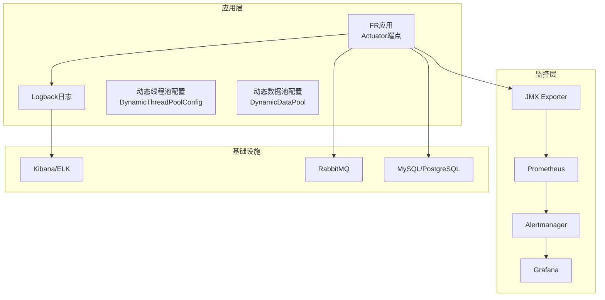
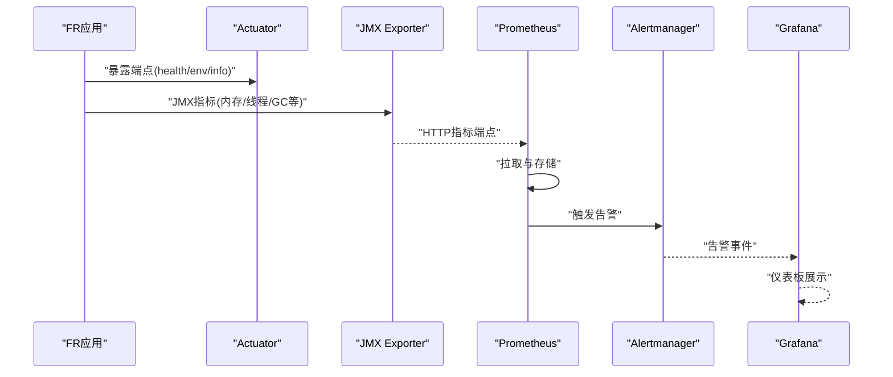
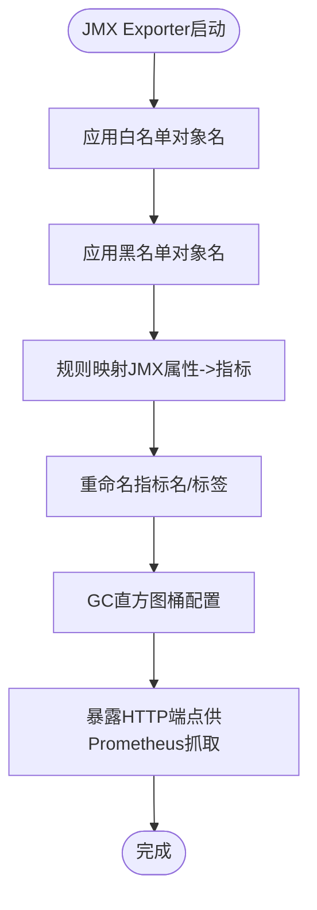
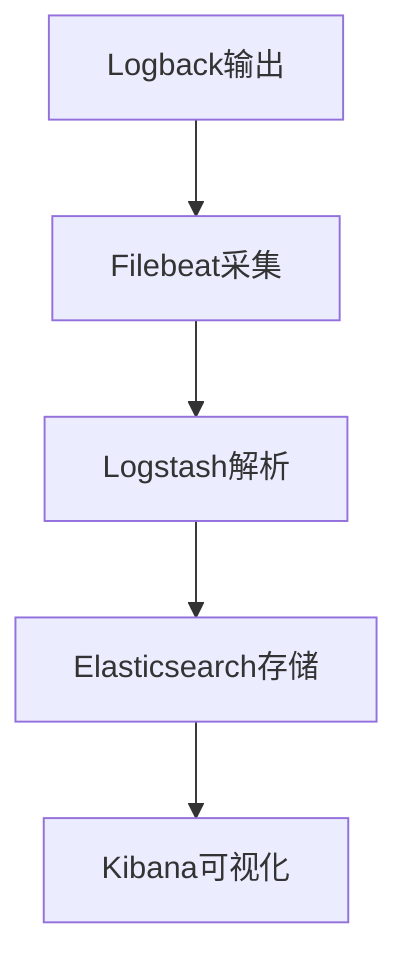
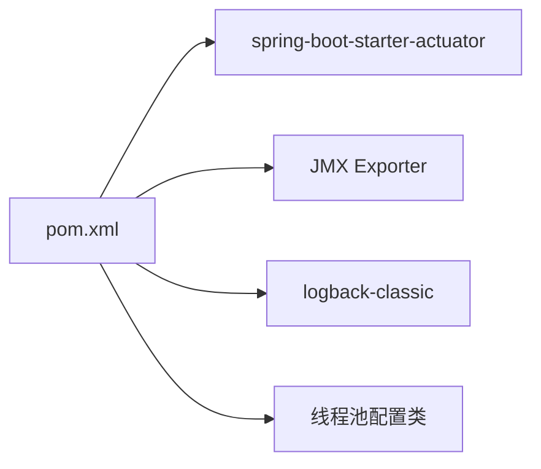

# 监控告警

<cite>
**本文引用的文件**
- [jmx_config.yaml](file://docker\staitech\modules\fr\jmx_config.yaml)
- [bootstrap.yml](file://src\main\resources\bootstrap.yml)
- [application-local.yml](file://src\main\resources\application-local.yml)
- [logback.xml](file://src\main\resources\logback.xml)
- [DynamicThreadPoolConfig.java](file://src\main\java\cn\staitech\fr\config\DynamicThreadPoolConfig.java)
- [DynamicDataPool.java](file://src\main\java\cn\staitech\fr\config\DynamicDataPool.java)
- [pom.xml](file://pom.xml)
</cite>

## 目录
1. [简介](#简介)
2. [项目结构](#项目结构)
3. [核心组件](#核心组件)
4. [架构总览](#架构总览)
5. [详细组件分析](#详细组件分析)
6. [依赖分析](#依赖分析)
7. [性能考虑](#性能考虑)
8. [故障排查指南](#故障排查指南)
9. [结论](#结论)
10. [附录](#附录)

## 简介
本指南面向FR模块的监控与告警体系，覆盖以下方面：
- JMX监控配置与Prometheus指标采集
- 关键业务指标定义与阈值建议
- 日志收集与ELK Stack集成方案
- 性能监控（CPU、内存、磁盘、网络）
- 告警规则、通知渠道与升级策略
- 监控仪表板搭建与可视化
- APM工具与分布式链路追踪集成

目标是帮助运维与开发团队建立稳定、可观测、可预警的运行环境。

## 项目结构
FR模块采用Spring Boot工程，结合Actuator暴露运行状态，通过JMX Exporter将JMX指标暴露给Prometheus；日志由Logback输出至文件，并支持按模块/级别过滤；线程池配置位于配置类中，便于观测与调优。

图示来源
- [bootstrap.yml:1-48](file://src\main\resources\bootstrap.yml#L1-L48)
- [logback.xml:1-102](file://src\main\resources\logback.xml#L1-L102)
- [DynamicThreadPoolConfig.java:1-53](file://src\main\java\cn\staitech\fr\config\DynamicThreadPoolConfig.java#L1-L53)
- [DynamicDataPool.java:1-231](file://src\main\java\cn\staitech\fr\config\DynamicDataPool.java#L1-L231)
- [jmx_config.yaml:1-125](file://docker\staitech\modules\fr\jmx_config.yaml#L1-L125)

章节来源
- [bootstrap.yml:1-48](file://src\main\resources\bootstrap.yml#L1-L48)
- [logback.xml:1-102](file://src\main\resources\logback.xml#L1-L102)
- [DynamicThreadPoolConfig.java:1-53](file://src\main\java\cn\staitech\fr\config\DynamicThreadPoolConfig.java#L1-L53)
- [DynamicDataPool.java:1-231](file://src\main\java\cn\staitech\fr\config\DynamicDataPool.java#L1-L231)
- [jmx_config.yaml:1-125](file://docker\staitech\modules\fr\jmx_config.yaml#L1-L125)

## 核心组件
- Actuator与端点暴露：通过management配置限制暴露端点，确保安全与可控。
- JMX Exporter：将JMX指标转换为Prometheus可抓取格式，覆盖JVM与操作系统关键指标。
- 日志系统：Logback按模块与级别输出，支持滚动与多文件输出，便于ELK采集。
- 线程池：动态线程池配置类提供线程池监控日志，便于观察任务积压与吞吐。
- 数据源与连接池：Hikari配置开启JMX MBeans，便于监控连接池健康度。

章节来源
- [bootstrap.yml:6-106](file://src\main\resources\bootstrap.yml#L6-L106)
- [application-local.yml:98-102](file://src\main\resources\application-local.yml#L98-L102)
- [application-local.yml:36-54](file://src\main\resources\application-local.yml#L36-L54)
- [jmx_config.yaml:18-125](file://docker\staitech\modules\fr\jmx_config.yaml#L18-L125)
- [logback.xml:85-102](file://src\main\resources\logback.xml#L85-L102)
- [DynamicThreadPoolConfig.java:13-51](file://src\main\java\cn\staitech\fr\config\DynamicThreadPoolConfig.java#L13-L51)
- [DynamicDataPool.java:29-64](file://src\main\java\cn\staitech\fr\config\DynamicDataPool.java#L29-L64)

## 架构总览
下图展示了FR模块的监控与告警整体流程：应用通过Actuator与JMX Exporter暴露指标，Prometheus定时抓取，Alertmanager根据规则触发告警，Grafana展示仪表板；日志由Logback输出，配合ELK实现检索与分析。

图示来源
- [bootstrap.yml:6-106](file://src\main\resources\bootstrap.yml#L6-L106)
- [jmx_config.yaml:18-125](file://docker\staitech\modules\fr\jmx_config.yaml#L18-L125)

## 详细组件分析

### JMX监控与Prometheus指标采集
- JMX Exporter配置要点
  - 白名单与黑名单：限定对象名，避免噪声；可按需排除冗余指标。
  - 规则映射：将JMX属性映射为Prometheus指标名与标签，便于查询与告警。
  - 名称重命名：将JMX属性名转换为标准指标名，提升一致性。
  - GC直方图桶：针对GC持续时间设置桶，便于统计慢GC分布。
  - 前缀与大小写：统一指标前缀与标签大小写，减少歧义。
- Prometheus抓取
  - 在Prometheus中配置job，抓取JMX Exporter暴露的指标端点。
  - 建议按实例分组，保留主机与应用维度标签，便于聚合与告警。

图示来源
- [jmx_config.yaml:18-125](file://docker\staitech\modules\fr\jmx_config.yaml#L18-L125)

章节来源
- [jmx_config.yaml:1-125](file://docker\staitech\modules\fr\jmx_config.yaml#L1-L125)

### 关键业务指标定义与阈值建议
- JVM与操作系统
  - jvm_memory_used_bytes、jvm_non_heap_memory_used_bytes：内存使用量，建议设置“使用率>80%持续5分钟”告警。
  - jvm_threads：活动线程数，建议设置“线程数>阈值×1.5持续10分钟”告警。
  - jvm_gc_duration_seconds、jvm_gc_count：GC频率与耗时，建议设置“单次GC>1秒或每分钟GC次数>阈值”告警。
  - os_system_load_average、os_file_descriptor_count：系统负载与文件描述符，建议设置“负载>CPU核数×2或文件描述符>上限×0.8”告警。
- 线程池与任务
  - 动态线程池队列长度、活跃线程数、完成任务数：建议设置“队列长度>阈值×0.9且持续10分钟”告警。
  - 识别任务线程池拒绝次数：建议设置“单位时间内拒绝次数>阈值”告警。
- 数据源与连接池
  - Hikari连接池指标（来自JMX MBeans）：活跃连接、空闲连接、等待时间、连接超时计数等，建议设置“活跃连接>阈值×0.9或等待时间>5秒”告警。
- RabbitMQ
  - 队列消息堆积、消费者确认失败、发布者返回：建议设置“堆积消息>阈值或确认失败率>0.1%”告警。

章节来源
- [application-local.yml:36-54](file://src\main\resources\application-local.yml#L36-L54)
- [DynamicThreadPoolConfig.java:28-45](file://src\main\java\cn\staitech\fr\config\DynamicThreadPoolConfig.java#L28-L45)
- [DynamicDataPool.java:101-115](file://src\main\java\cn\staitech\fr\config\DynamicDataPool.java#L101-L115)

### 日志收集与ELK Stack集成
- 日志输出
  - Logback配置了按模块与级别输出，支持滚动策略与多文件输出，便于按模块检索。
  - 支持traceId/trace_id字段，利于链路追踪关联。
- ELK集成
  - 使用Filebeat采集日志文件，经Logstash解析后写入Elasticsearch。
  - 在Kibana中构建仪表板，按模块、级别、traceId等维度检索与分析。
  - 建议开启错误日志独立索引，提高检索效率。

图示来源
- [logback.xml:1-102](file://src\main\resources\logback.xml#L1-L102)

章节来源
- [logback.xml:1-102](file://src\main\resources\logback.xml#L1-L102)

### 性能监控（CPU、内存、磁盘、网络）
- CPU
  - 使用操作系统指标（如系统负载、上下文切换）与线程池活跃度综合判断。
  - 建议设置“平均负载>CPU核数×2且持续10分钟”告警。
- 内存
  - 结合堆/非堆内存使用与GC行为，设置“使用率>80%持续5分钟”告警。
- 磁盘
  - 监控磁盘使用率与inode使用率，设置“使用率>85%”告警。
- 网络
  - 监控连接数、丢包率、带宽占用，设置“连接数>阈值或丢包率>0.01%”告警。

章节来源
- [jmx_config.yaml:70-77](file://docker\staitech\modules\fr\jmx_config.yaml#L70-L77)

### 告警规则、通知渠道与升级策略
- 告警规则
  - 基于Prometheus规则文件编写，结合业务SLA设定阈值与持续时间。
  - 建议区分严重、警告、注意三级阈值。
- 通知渠道
  - 通过Alertmanager路由到Webhook、邮件、IM（如钉钉、企业微信）。
- 升级策略
  - 设置静默窗口、抑制规则，避免告警风暴。
  - 对未恢复的告警进行升级通知，确保问题闭环。

章节来源
- [bootstrap.yml:6-106](file://src\main\resources\bootstrap.yml#L6-L106)

### 监控仪表板搭建与可视化
- Grafana仪表板建议
  - JVM内存、线程、GC直方图
  - 线程池队列长度、活跃线程、拒绝次数
  - 数据源连接池指标
  - RabbitMQ堆积与确认失败
  - 系统负载、磁盘、网络
- 维度与标签
  - 保留主机、应用、环境等标签，便于跨实例对比。

章节来源
- [jmx_config.yaml:18-125](file://docker\staitech\modules\fr\jmx_config.yaml#L18-L125)
- [DynamicThreadPoolConfig.java:28-45](file://src\main\java\cn\staitech\fr\config\DynamicThreadPoolConfig.java#L28-L45)
- [DynamicDataPool.java:101-115](file://src\main\java\cn\staitech\fr\config\DynamicDataPool.java#L101-L115)

### APM工具与分布式链路追踪
- 推荐方案
  - 使用SkyWalking或Zipkin作为链路追踪平台，结合OpenTelemetry SDK采集Span。
  - 在应用侧注入traceId/trace_id字段，与日志联动。
- 集成要点
  - 保证HTTP/消息队列调用链完整，标注关键业务节点。
  - 与Grafana联动展示链路拓扑与耗时分布。

章节来源
- [logback.xml:6](file://src\main\resources\logback.xml#L6)

## 依赖分析
- Actuator依赖：提供健康检查、环境信息等端点，便于运维与监控系统对接。
- JMX Exporter：将JMX指标暴露为HTTP端点，供Prometheus抓取。
- Logback：日志输出与滚动策略，支撑ELK采集。
- 线程池配置：通过日志输出线程池状态，辅助性能观测与告警。

图示来源
- [pom.xml:43-47](file://pom.xml#L43-L47)
- [pom.xml:19-211](file://pom.xml#L19-L211)

章节来源
- [pom.xml:43-47](file://pom.xml#L43-L47)
- [pom.xml:19-211](file://pom.xml#L19-L211)

## 性能考虑
- 线程池参数
  - 核心线程数与最大线程数应与CPU核数、IO特性匹配，避免过度并发导致上下文切换开销增大。
  - 有界队列有助于防止OOM，需结合拒绝策略与告警联动。
- 连接池
  - Hikari配置开启JMX MBeans，便于实时观测连接池健康度。
- 日志
  - 控制日志级别与输出格式，避免I/O瓶颈；必要时启用异步日志。

章节来源
- [DynamicThreadPoolConfig.java:13-51](file://src\main\java\cn\staitech\fr\config\DynamicThreadPoolConfig.java#L13-L51)
- [DynamicDataPool.java:29-64](file://src\main\java\cn\staitech\fr\config\DynamicDataPool.java#L29-L64)
- [application-local.yml:36-54](file://src\main\resources\application-local.yml#L36-L54)
- [logback.xml:85-102](file://src\main\resources\logback.xml#L85-L102)

## 故障排查指南
- Actuator端点不可用
  - 检查management.web.exposure配置，确保env、health、info等端点已开放。
- JMX Exporter无法抓取
  - 检查JMX URL、SSL配置与白/黑名单对象名；确认Prometheus抓取端口可达。
- 线程池积压
  - 查看线程池日志输出，结合队列长度与活跃线程数判断是否需要扩容或优化任务。
- 连接池异常
  - 关注连接池JMX指标，定位连接泄漏、超时与拒绝问题。
- 日志缺失
  - 检查Logback配置与文件权限，确认Filebeat采集路径正确。

章节来源
- [bootstrap.yml:98-102](file://src\main\resources\bootstrap.yml#L98-L102)
- [jmx_config.yaml:6-125](file://docker\staitech\modules\fr\jmx_config.yaml#L6-L125)
- [DynamicThreadPoolConfig.java:28-45](file://src\main\java\cn\staitech\fr\config\DynamicThreadPoolConfig.java#L28-L45)
- [application-local.yml:36-54](file://src\main\resources\application-local.yml#L36-L54)
- [logback.xml:1-102](file://src\main\resources\logback.xml#L1-L102)

## 结论
通过JMX Exporter与Prometheus实现JVM与系统级指标监控，结合Actuator端点与Logback日志，形成完整的可观测性闭环。配合线程池与连接池的监控日志，可有效发现性能瓶颈与异常。建议尽快落地告警规则、通知渠道与升级策略，并在Grafana中构建关键业务仪表板，持续优化阈值与可视化。

## 附录
- 端点与暴露范围
  - management.endpoints.web.exposure.include：仅暴露必要端点，降低攻击面。
- 环境与配置
  - application-local.yml中包含Redis、数据库、RabbitMQ、线程池等配置项，便于按环境差异化管理。

章节来源
- [bootstrap.yml:98-102](file://src\main\resources\bootstrap.yml#L98-L102)
- [application-local.yml:1-311](file://src\main\resources\application-local.yml#L1-L311)