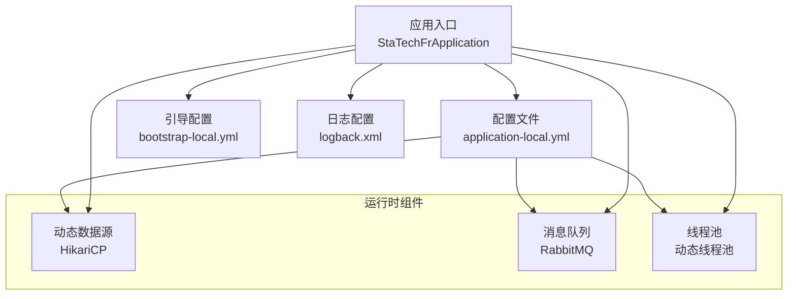
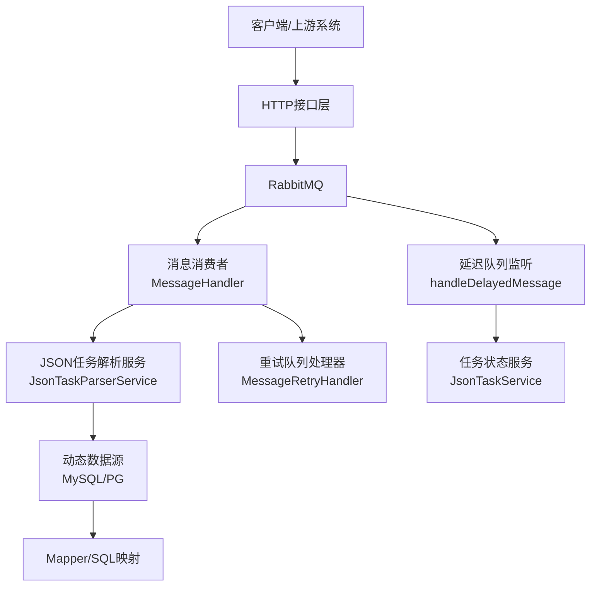
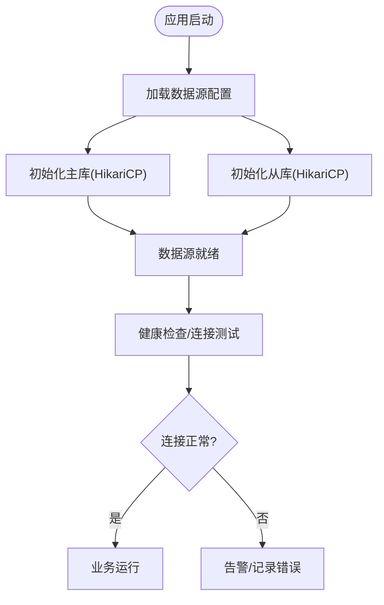
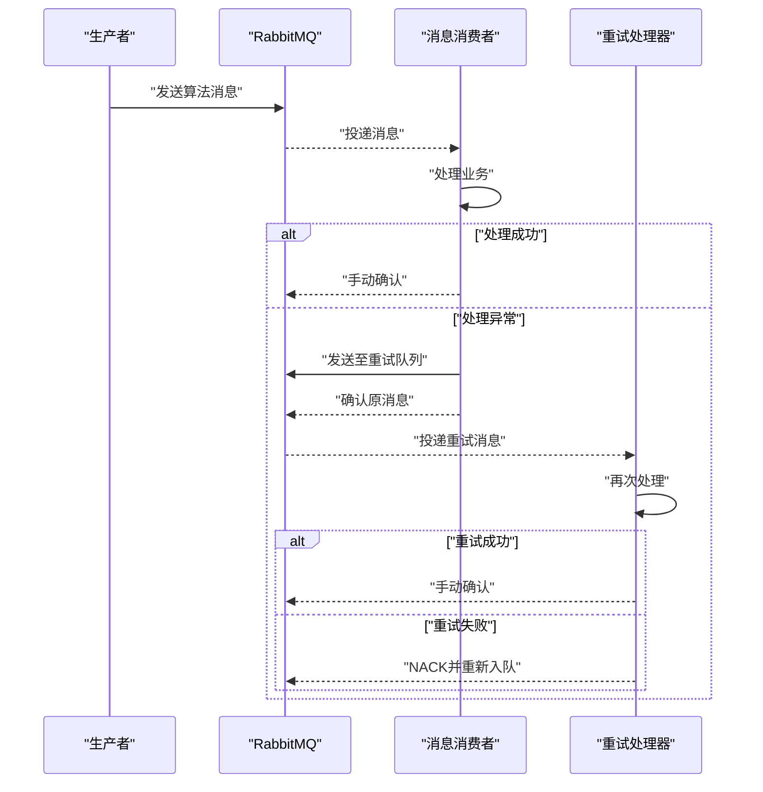
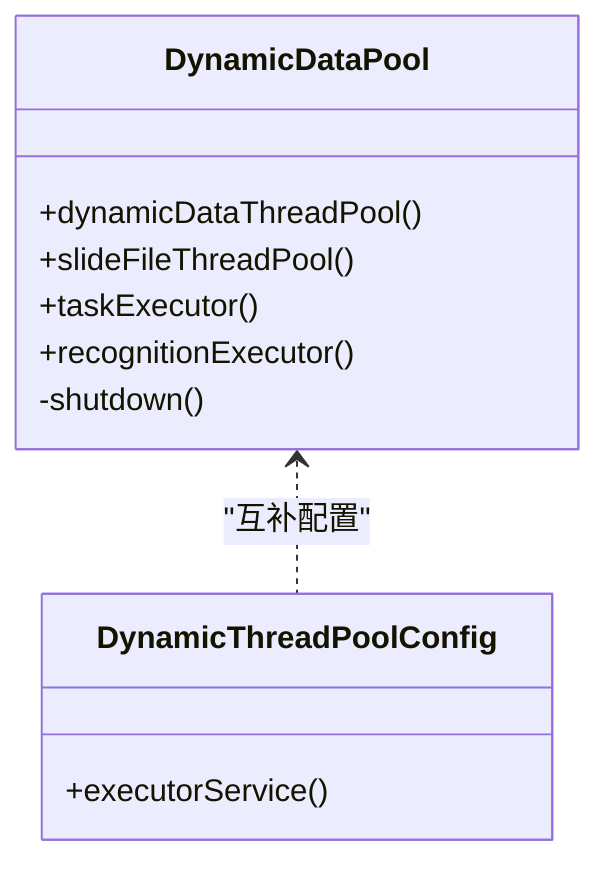
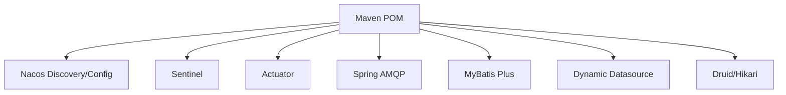

# 维护与故障排查

<cite>
**本文引用的文件**
- [StaTechFrApplication.java](file://src/main/java/cn/staitech/fr/StaTechFrApplication.java)
- [application-local.yml](file://src/main/resources/application-local.yml)
- [bootstrap-local.yml](file://src/main/resources/bootstrap-local.yml)
- [logback.xml](file://src/main/resources/logback.xml)
- [DynamicDataPool.java](file://src/main/java/cn/staitech/fr/config/DynamicDataPool.java)
- [DynamicThreadPoolConfig.java](file://src/main/java/cn/staitech/fr/config/DynamicThreadPoolConfig.java)
- [MessageHandler.java](file://src/main/java/cn/staitech/fr/config/MessageHandler.java)
- [MessageRetryHandler.java](file://src/main/java/cn/staitech/fr/config/MessageRetryHandler.java)
- [ParkDataProducer.java](file://src/main/java/cn/staitech/fr/config/ParkDataProducer.java)
- [JsonTaskParserService.java](file://src/main/java/cn/staitech/fr/service/strategy/json/JsonTaskParserService.java)
- [JsonTaskService.java](file://src/main/java/cn/staitech/fr/service/JsonTaskService.java)
- [JsonTaskMapper.xml](file://src/main/resources/mapper/JsonTaskMapper.xml)
- [JsonTaskMapper.java](file://src/main/java/cn/staitech/fr/mapper/JsonTaskMapper.java)
- [pom.xml](file://pom.xml)
</cite>

## 目录
1. [简介](#简介)
2. [项目结构](#项目结构)
3. [核心组件](#核心组件)
4. [架构总览](#架构总览)
5. [详细组件分析](#详细组件分析)
6. [依赖分析](#依赖分析)
7. [性能考虑](#性能考虑)
8. [故障排查指南](#故障排查指南)
9. [结论](#结论)
10. [附录](#附录)

## 简介
本指南面向FR模块的系统运维与故障排查，覆盖日常维护任务、定期检查项目、数据库连接问题、消息队列异常、文件存储故障的排查步骤，以及性能问题定位与优化建议。同时提供日志分析方法、错误信息解读、备份恢复策略与灾难恢复计划、应急响应流程与问题升级机制，并说明Arthas等诊断工具的使用要点。

## 项目结构
FR模块采用Spring Boot工程，主要由以下层次构成：
- 应用入口与配置：应用启动类、Spring Cloud/Nacos开关、Actuator暴露端点、日志配置
- 配置中心与数据源：动态数据源、线程池配置、消息队列与延迟队列配置
- 业务处理：消息消费者与重试处理器、JSON任务解析服务、任务状态服务
- 数据访问：MyBatis Mapper与XML映射
- 构建与依赖：Maven依赖与多环境Profile

图表来源
- [StaTechFrApplication.java:45-52](file://src/main/java/cn/staitech/fr/StaTechFrApplication.java#L45-L52)
- [application-local.yml:5-56](file://src/main/resources/application-local.yml#L5-L56)
- [bootstrap-local.yml:1-9](file://src/main/resources/bootstrap-local.yml#L1-L9)
- [logback.xml:1-102](file://src/main/resources/logback.xml#L1-L102)

章节来源
- [StaTechFrApplication.java:1-63](file://src/main/java/cn/staitech/fr/StaTechFrApplication.java#L1-L63)
- [application-local.yml:1-311](file://src/main/resources/application-local.yml#L1-L311)
- [bootstrap-local.yml:1-9](file://src/main/resources/bootstrap-local.yml#L1-L9)
- [logback.xml:1-102](file://src/main/resources/logback.xml#L1-L102)

## 核心组件
- 应用入口与分页拦截器：负责启动、Swagger启用、MyBatis Plus分页插件注册
- 动态数据源与线程池：支持MySQL主库、PostgreSQL从库；提供多种线程池以适配不同场景
- 消息队列：算法消息队列、重试队列、延迟队列；手动确认与NACK重入队
- 日志：按模块与级别控制，支持traceId链路追踪字段

章节来源
- [StaTechFrApplication.java:26-62](file://src/main/java/cn/staitech/fr/StaTechFrApplication.java#L26-L62)
- [DynamicDataPool.java:12-231](file://src/main/java/cn/staitech/fr/config/DynamicDataPool.java#L12-L231)
- [DynamicThreadPoolConfig.java:10-53](file://src/main/java/cn/staitech/fr/config/DynamicThreadPoolConfig.java#L10-L53)
- [MessageHandler.java:28-128](file://src/main/java/cn/staitech/fr/config/MessageHandler.java#L28-L128)
- [MessageRetryHandler.java:18-44](file://src/main/java/cn/staitech/fr/config/MessageRetryHandler.java#L18-L44)
- [logback.xml:85-101](file://src/main/resources/logback.xml#L85-L101)

## 架构总览
FR模块通过动态数据源连接MySQL主库与PostgreSQL从库，使用RabbitMQ实现异步消息处理，配合延迟队列与重试队列保障可靠性。日志系统通过Logback按模块与级别输出，并注入traceId便于问题定位。

图表来源
- [MessageHandler.java:43-75](file://src/main/java/cn/staitech/fr/config/MessageHandler.java#L43-L75)
- [MessageRetryHandler.java:25-42](file://src/main/java/cn/staitech/fr/config/MessageRetryHandler.java#L25-L42)
- [JsonTaskParserService.java](file://src/main/java/cn/staitech/fr/service/strategy/json/JsonTaskParserService.java)
- [JsonTaskService.java](file://src/main/java/cn/staitech/fr/service/JsonTaskService.java)
- [JsonTaskMapper.xml](file://src/main/resources/mapper/JsonTaskMapper.xml)
- [JsonTaskMapper.java](file://src/main/java/cn/staitech/fr/mapper/JsonTaskMapper.java)

## 详细组件分析

### 数据库连接与动态数据源
- 主库：MySQL，HikariCP连接池，超时与校验参数配置明确
- 从库：PostgreSQL，HikariCP连接池，读写分离策略
- 连接池参数：最大池大小、最小空闲、空闲超时、生命周期、连接超时、验证超时、测试查询等
- 日志级别：动态数据源日志级别提升，便于排查切换与连接问题

图表来源
- [application-local.yml:15-56](file://src/main/resources/application-local.yml#L15-L56)
- [logback.xml:96](file://src/main/resources/logback.xml#L96)

章节来源
- [application-local.yml:15-56](file://src/main/resources/application-local.yml#L15-L56)
- [logback.xml:96](file://src/main/resources/logback.xml#L96)

### 消息队列与重试机制
- 队列配置：算法消息队列、重试队列、延迟队列
- 消费模式：手动确认、异常入重试队列、重试失败NACK并重新入队
- 延迟消息：通过延迟交换机与路由键实现定时检查
- 生产者：统一消息发送封装，支持延迟消息

图表来源
- [MessageHandler.java:43-75](file://src/main/java/cn/staitech/fr/config/MessageHandler.java#L43-L75)
- [MessageRetryHandler.java:25-42](file://src/main/java/cn/staitech/fr/config/MessageRetryHandler.java#L25-L42)
- [ParkDataProducer.java:27-44](file://src/main/java/cn/staitech/fr/config/ParkDataProducer.java#L27-L44)

章节来源
- [MessageHandler.java:28-128](file://src/main/java/cn/staitech/fr/config/MessageHandler.java#L28-L128)
- [MessageRetryHandler.java:18-44](file://src/main/java/cn/staitech/fr/config/MessageRetryHandler.java#L18-L44)
- [ParkDataProducer.java:17-48](file://src/main/java/cn/staitech/fr/config/ParkDataProducer.java#L17-L48)
- [application-local.yml:305-311](file://src/main/resources/application-local.yml#L305-L311)

### 线程池与任务调度
- 动态数据线程池：用于动态数据处理，带守护线程与优雅关闭
- 切片文件线程池：IO密集型，有界队列
- 任务线程池：低并发、有界队列、快速失败策略，防止OOM
- 识别任务线程池：可配置核心/最大线程倍数，自定义拒绝策略，记录详细拒绝信息

图表来源
- [DynamicDataPool.java:29-231](file://src/main/java/cn/staitech/fr/config/DynamicDataPool.java#L29-L231)
- [DynamicThreadPoolConfig.java:13-51](file://src/main/java/cn/staitech/fr/config/DynamicThreadPoolConfig.java#L13-L51)

章节来源
- [DynamicDataPool.java:12-231](file://src/main/java/cn/staitech/fr/config/DynamicDataPool.java#L12-L231)
- [DynamicThreadPoolConfig.java:10-53](file://src/main/java/cn/staitech/fr/config/DynamicThreadPoolConfig.java#L10-L53)

### 日志与链路追踪
- 日志输出：控制台与按文件名分拣的滚动文件
- 日志级别：模块化控制，动态数据源、Spring、Mapper等关键模块提升级别
- 链路字段：traceId、trace_id，便于跨服务串联

章节来源
- [logback.xml:1-102](file://src/main/resources/logback.xml#L1-L102)

## 依赖分析
- Spring Cloud Alibaba：Nacos发现与配置、Sentinel限流
- Spring Boot Starter AMQP：RabbitMQ集成
- MyBatis Plus：分页与通用CRUD
- Druid/Hikari：数据库连接池
- 动态数据源：MySQL主库、PostgreSQL从库
- 其他：几何计算、导出、模板渲染等第三方库

图表来源
- [pom.xml:25-110](file://pom.xml#L25-L110)

章节来源
- [pom.xml:19-211](file://pom.xml#L19-L211)

## 性能考虑
- 数据库连接池
  - 合理设置最大池大小与空闲超时，避免连接泄漏与抖动
  - 开启连接测试查询与验证超时，确保连接可用性
- 线程池
  - 识别任务线程池采用有界队列与快速失败策略，防止内存膨胀
  - 低并发策略避免CPU资源过度竞争
- 消息队列
  - 手动确认与重试队列结合，降低重复消费与丢失风险
  - 延迟队列用于周期性检查，避免忙轮询
- 日志
  - 按模块分级，避免过多DEBUG/INFO造成I/O瓶颈

章节来源
- [application-local.yml:25-53](file://src/main/resources/application-local.yml#L25-L53)
- [DynamicDataPool.java:178-229](file://src/main/java/cn/staitech/fr/config/DynamicDataPool.java#L178-L229)
- [MessageHandler.java:43-75](file://src/main/java/cn/staitech/fr/config/MessageHandler.java#L43-L75)
- [logback.xml:85-101](file://src/main/resources/logback.xml#L85-L101)

## 故障排查指南

### 日常维护任务清单
- 检查应用健康与指标
  - 访问Actuator健康端点，关注数据库、消息队列、线程池状态
  - 查看JVM堆栈与GC情况
- 数据库连接池
  - 核查连接池活跃数、空闲数、等待数，观察超时与拒绝事件
  - 检查主从库连通性与慢查询
- 消息队列
  - 监控队列长度、死信队列堆积、重试队列积压
  - 核查消费者线程池与手动确认状态
- 文件存储
  - 校验waxPath目录空间与权限
  - 检查临时文件清理策略与磁盘占用趋势

章节来源
- [application-local.yml:98-106](file://src/main/resources/application-local.yml#L98-L106)
- [logback.xml:98-101](file://src/main/resources/logback.xml#L98-L101)

### 定期检查项目
- 数据库
  - 连接池指标：活跃连接、最大等待时间、连接拒绝次数
  - 主从延迟与一致性检查
- 消息队列
  - 死信/重试队列积压趋势
  - 消费速率与消息处理耗时
- 线程池
  - 拒绝次数与队列长度
  - 线程池饱和度与任务完成率
- 日志
  - 错误日志量与关键异常类型
  - traceId串联排查关键路径

章节来源
- [application-local.yml:98-106](file://src/main/resources/application-local.yml#L98-L106)
- [DynamicDataPool.java:69-95](file://src/main/java/cn/staitech/fr/config/DynamicDataPool.java#L69-L95)

### 数据库连接问题
- 症状
  - 连接超时、连接拒绝、连接泄漏
- 排查步骤
  1) 检查数据源配置与网络连通性
  2) 查看连接池指标与测试查询结果
  3) 核查主从库负载与慢查询
  4) 检查连接池日志级别与错误栈
- 解决建议
  - 调整最大池大小与空闲超时
  - 优化SQL与索引，减少锁等待
  - 分离读写流量，合理使用从库

章节来源
- [application-local.yml:15-56](file://src/main/resources/application-local.yml#L15-L56)
- [logback.xml:96](file://src/main/resources/logback.xml#L96)

### 消息队列异常
- 症状
  - 消息堆积、重复消费、死信队列增长
- 排查步骤
  1) 检查队列与交换机绑定关系
  2) 核查消费者手动确认与异常分支
  3) 查看重试队列与延迟队列处理情况
  4) 检查RabbitTemplate返回与确认类型
- 解决建议
  - 增加消费者并发或扩展实例
  - 优化业务处理耗时，缩短消费时间
  - 对重试失败的消息进行人工干预与清理

章节来源
- [MessageHandler.java:43-75](file://src/main/java/cn/staitech/fr/config/MessageHandler.java#L43-L75)
- [MessageRetryHandler.java:25-42](file://src/main/java/cn/staitech/fr/config/MessageRetryHandler.java#L25-L42)
- [application-local.yml:57-75](file://src/main/resources/application-local.yml#L57-L75)

### 文件存储故障
- 症状
  - 写入失败、空间不足、权限不足
- 排查步骤
  1) 检查waxPath目录是否存在与权限
  2) 查看磁盘空间与inode使用率
  3) 核查临时文件清理策略与清理脚本
- 解决建议
  - 扩容磁盘或清理历史文件
  - 调整临时目录与清理周期
  - 引入外部对象存储作为备选

章节来源
- [application-local.yml:106](file://src/main/resources/application-local.yml#L106)

### 性能问题定位与优化
- 定位手段
  - 使用Actuator查看线程池与队列状态
  - 结合日志中的traceId串联关键路径
  - 监控数据库慢查询与锁等待
- 优化建议
  - 调整线程池核心/最大线程与队列容量
  - 优化消息处理逻辑，减少阻塞操作
  - 合理拆分任务，避免单点瓶颈

章节来源
- [DynamicDataPool.java:178-229](file://src/main/java/cn/staitech/fr/config/DynamicDataPool.java#L178-L229)
- [logback.xml:85-101](file://src/main/resources/logback.xml#L85-L101)

### 日志分析方法与错误解读
- 分析方法
  - 使用traceId串联请求链路，定位异常发生点
  - 关注ERROR级别日志与异常栈
  - 按模块与级别过滤，缩小排查范围
- 常见错误解读
  - 线程池拒绝：检查队列容量与拒绝策略
  - 消息处理异常：查看业务异常与重试队列
  - 数据库连接异常：检查连接池参数与网络

章节来源
- [logback.xml:85-101](file://src/main/resources/logback.xml#L85-L101)
- [MessageHandler.java:77-86](file://src/main/java/cn/staitech/fr/config/MessageHandler.java#L77-L86)
- [DynamicDataPool.java:101-115](file://src/main/java/cn/staitech/fr/config/DynamicDataPool.java#L101-L115)

### 备份恢复策略与灾难恢复
- 备份策略
  - 数据库：全量+增量备份，保留至少7天恢复窗口
  - 配置：Nacos配置快照与版本管理
  - 日志：集中化收集与保留90天以上
- 恢复流程
  - 快速定位最近可用备份点
  - 逐步恢复数据库与应用
  - 验证消息队列与文件存储一致性
- 灾难恢复
  - 多机房部署与主备切换
  - 服务降级与熔断策略
  - 应急演练与预案更新

章节来源
- [pom.xml:303-363](file://pom.xml#L303-L363)

### 应急响应流程与问题升级机制
- 流程
  - 问题发现与初步评估
  - 通知相关团队与负责人
  - 采取紧急措施（限流、降级、隔离）
  - 根因分析与修复
  - 复盘与改进
- 升级机制
  - 严重性分级（P0/P1/P2），明确升级时限
  - 明确责任人与沟通渠道
  - 保留变更记录与影响评估

章节来源
- [MessageHandler.java:54-71](file://src/main/java/cn/staitech/fr/config/MessageHandler.java#L54-L71)

### Arthas等诊断工具使用
- 常用命令
  - dashboard：查看系统与JVM概览
  - jvm：查看JVM运行参数与内存
  - threaddump：生成线程快照定位阻塞
  - sc/sca：查看类与实例
  - mc/redefine：热更新（谨慎）
  - trace/watch/tt：方法级链路与耗时分析
- 注意事项
  - 仅在预生产或低峰时段使用
  - 严格审批与回滚预案
  - 避免对生产环境造成额外压力

章节来源
- [StaTechFrApplication.java:45-52](file://src/main/java/cn/staitech/fr/StaTechFrApplication.java#L45-L52)

## 结论
FR模块通过动态数据源、消息队列与线程池的协同，实现了高可靠与高性能的标注处理能力。建议持续完善监控与告警体系，规范备份与灾备流程，强化日志与链路追踪能力，并结合Arthas等工具进行深度诊断，以保障系统稳定运行。

## 附录
- Actuator端点：health、info、env
- 关键配置项：datasource、rabbitmq、queues、dynamic、logging
- 常用Profile：local、pacmvsdev、testpvcmvs、pathmedics

章节来源
- [application-local.yml:98-106](file://src/main/resources/application-local.yml#L98-L106)
- [pom.xml:303-363](file://pom.xml#L303-L363)