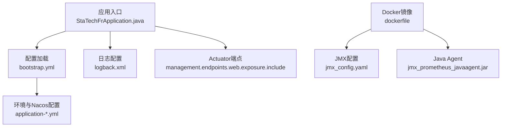
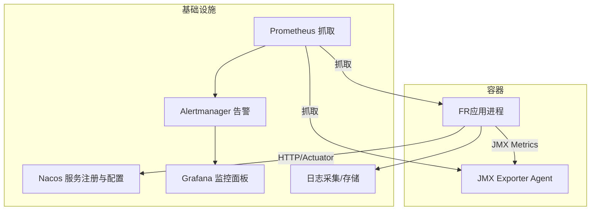
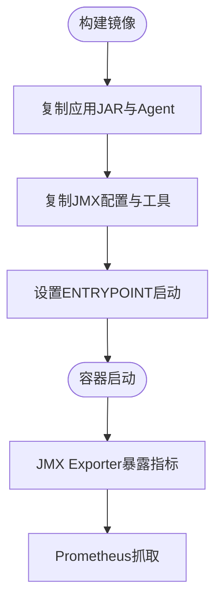
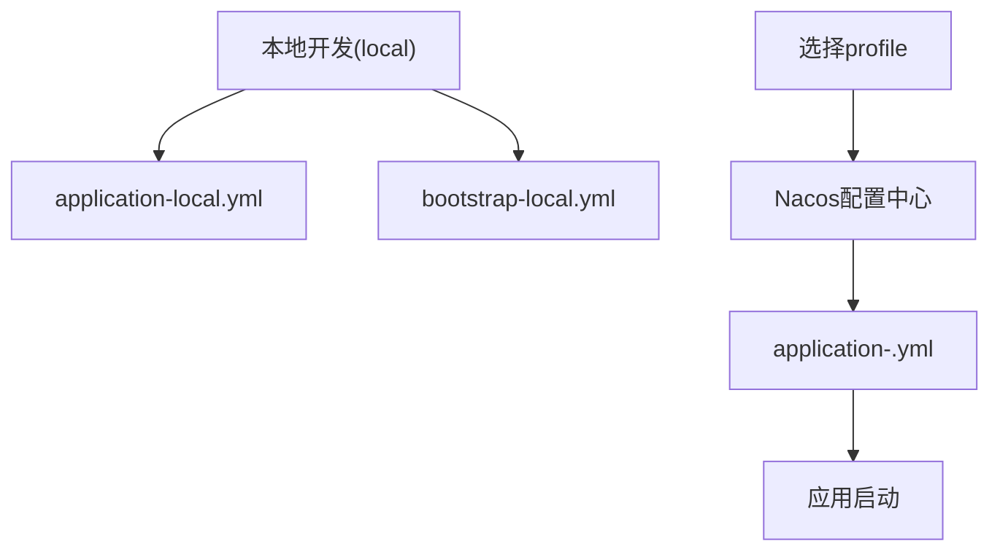
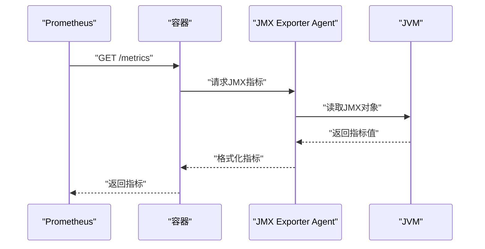
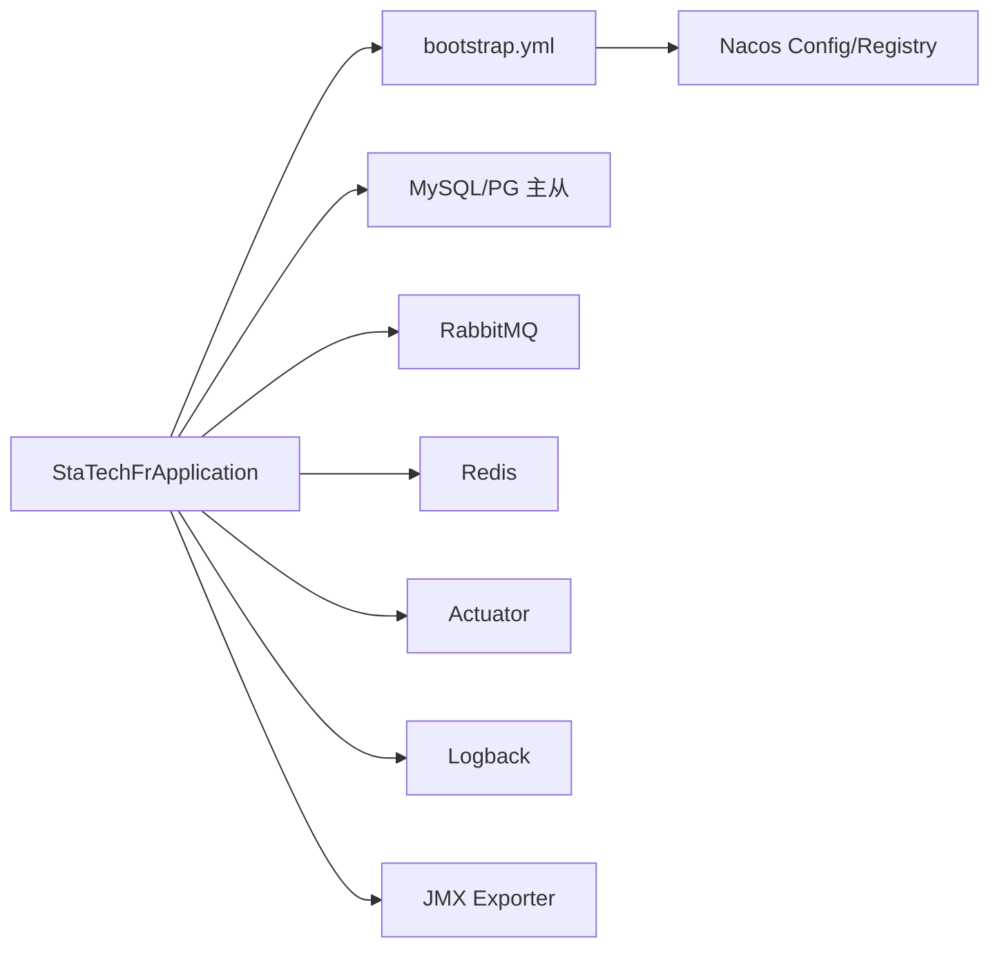

# 部署与运维

<cite>
**本文引用的文件**
- [dockerfile](file://docker/staitech/modules/fr/dockerfile)
- [jmx_config.yaml](file://docker/staitech/modules/fr/jmx_config.yaml)
- [application-local.yml](file://src/main/resources/application-local.yml)
- [bootstrap.yml](file://src/main/resources/bootstrap.yml)
- [bootstrap-local.yml](file://src/main/resources/bootstrap-local.yml)
- [pom.xml](file://pom.xml)
- [StaTechFrApplication.java](file://src/main/java/cn/staitech/fr/StaTechFrApplication.java)
- [logback.xml](file://src/main/resources/logback.xml)
</cite>

## 目录
1. [简介](#简介)
2. [项目结构](#项目结构)
3. [核心组件](#核心组件)
4. [架构总览](#架构总览)
5. [详细组件分析](#详细组件分析)
6. [依赖关系分析](#依赖关系分析)
7. [性能考虑](#性能考虑)
8. [故障排查指南](#故障排查指南)
9. [结论](#结论)
10. [附录](#附录)

## 简介
本指南面向FR模块的运维与部署，覆盖Docker镜像构建、容器运行、JMX监控配置、环境配置与分层策略、系统监控指标与日志采集、告警配置建议、常见故障诊断与解决方案、备份与恢复策略以及性能调优建议。目标是帮助运维人员快速、稳定地完成部署与日常维护。

## 项目结构
FR模块为Spring Boot应用，采用多环境配置与Nacos配置中心集成，使用Actuator暴露运行状态，日志通过Logback按模块与启动阶段分类落盘。Docker镜像通过Dockerfile构建，内置JMX Exporter用于Prometheus拉取指标。

图表来源
- [StaTechFrApplication.java:45-52](file://src/main/java/cn/staitech/fr/StaTechFrApplication.java#L45-L52)
- [bootstrap.yml:11-47](file://src/main/resources/bootstrap.yml#L11-L47)
- [application-local.yml:98-102](file://src/main/resources/application-local.yml#L98-L102)
- [logback.xml:2-101](file://src/main/resources/logback.xml#L2-L101)
- [dockerfile:16-22](file://docker/staitech/modules/fr/dockerfile#L16-L22)
- [jmx_config.yaml:1-125](file://docker/staitech/modules/fr/jmx_config.yaml#L1-L125)

章节来源
- [pom.xml:19-211](file://pom.xml#L19-L211)
- [bootstrap.yml:11-47](file://src/main/resources/bootstrap.yml#L11-L47)
- [application-local.yml:98-102](file://src/main/resources/application-local.yml#L98-L102)
- [logback.xml:2-101](file://src/main/resources/logback.xml#L2-L101)
- [dockerfile:16-22](file://docker/staitech/modules/fr/dockerfile#L16-L22)
- [jmx_config.yaml:1-125](file://docker/staitech/modules/fr/jmx_config.yaml#L1-L125)

## 核心组件
- 应用入口与启动
  - 应用主类负责启用发现、异步、事务、MyBatis分页等能力，并在启动后输出访问文档地址。
- 配置体系
  - bootstrap.yml定义端口、应用名、Nacos注册与配置中心地址、激活的profile占位符。
  - application-local.yml定义Redis、数据库、RabbitMQ、线程池、脏器结构配置、日志级别与Actuator端点暴露范围。
  - bootstrap-local.yml在本地禁用Nacos注册与配置中心。
- 监控与日志
  - Actuator端点通过management暴露，结合Prometheus JMX Exporter采集JVM指标。
  - Logback按模块与启动阶段输出日志，支持控制台与滚动文件输出。
- Docker与JMX
  - Dockerfile复制JAR与JMX Agent，并以Agent方式启动应用；JMX配置文件定义白名单、规则与命名规范化。

章节来源
- [StaTechFrApplication.java:26-62](file://src/main/java/cn/staitech/fr/StaTechFrApplication.java#L26-L62)
- [bootstrap.yml:11-47](file://src/main/resources/bootstrap.yml#L11-L47)
- [application-local.yml:98-102](file://src/main/resources/application-local.yml#L98-L102)
- [logback.xml:2-101](file://src/main/resources/logback.xml#L2-L101)
- [dockerfile:16-22](file://docker/staitech/modules/fr/dockerfile#L16-L22)
- [jmx_config.yaml:1-125](file://docker/staitech/modules/fr/jmx_config.yaml#L1-L125)

## 架构总览
FR模块采用Spring Cloud Alibaba生态，结合Nacos实现服务注册与配置中心，Actuator提供健康与环境信息，JMX Exporter将JVM指标暴露给Prometheus。

图表来源
- [bootstrap.yml:24-46](file://src/main/resources/bootstrap.yml#L24-L46)
- [application-local.yml:98-102](file://src/main/resources/application-local.yml#L98-L102)
- [jmx_config.yaml:1-125](file://docker/staitech/modules/fr/jmx_config.yaml#L1-L125)
- [dockerfile:16-22](file://docker/staitech/modules/fr/dockerfile#L16-L22)

## 详细组件分析

### Docker镜像构建与容器运行
- 基础镜像与工作目录
  - 使用openjdk:8-jre作为基础镜像，创建工作目录/home/staitech并挂载为卷。
- 文件复制与入口命令
  - 复制JAR、JMX Exporter Agent、JMX配置与Arthas工具至镜像内。
  - 通过ENTRYPOINT以javaagent方式启动应用，绑定JMX端口与配置文件。
- 容器运行建议
  - 映射JMX端口（1234）以便Prometheus抓取。
  - 挂载日志目录到宿主机，便于采集与持久化。
  - 设置JAVA_OPTS传入内存、GC与时区参数。

图表来源
- [dockerfile:16-22](file://docker/staitech/modules/fr/dockerfile#L16-L22)
- [jmx_config.yaml:1-125](file://docker/staitech/modules/fr/jmx_config.yaml#L1-L125)

章节来源
- [dockerfile:1-22](file://docker/staitech/modules/fr/dockerfile#L1-L22)
- [jmx_config.yaml:1-125](file://docker/staitech/modules/fr/jmx_config.yaml#L1-L125)

### 环境配置与分层策略
- profile与Nacos集成
  - bootstrap.yml中通过占位符激活环境与Nacos命名空间、分组与地址，支持多环境切换。
  - pom.xml定义了local、pacmvsdev、testpvcmvs、pathmedics等profile及其Nacos参数。
- 本地开发与禁用Nacos
  - bootstrap-local.yml在local环境下关闭Nacos注册与配置中心，便于离线开发。
- 关键配置项
  - Redis、MySQL主从、PostgreSQL从库、RabbitMQ连接与重试策略、线程池大小、日志级别、Actuator端点暴露范围。

图表来源
- [bootstrap.yml:20-22](file://src/main/resources/bootstrap.yml#L20-L22)
- [pom.xml:303-361](file://pom.xml#L303-L361)
- [bootstrap-local.yml:1-9](file://src/main/resources/bootstrap-local.yml#L1-L9)
- [application-local.yml:98-102](file://src/main/resources/application-local.yml#L98-L102)

章节来源
- [bootstrap.yml:11-47](file://src/main/resources/bootstrap.yml#L11-L47)
- [pom.xml:303-361](file://pom.xml#L303-L361)
- [bootstrap-local.yml:1-9](file://src/main/resources/bootstrap-local.yml#L1-L9)
- [application-local.yml:98-102](file://src/main/resources/application-local.yml#L98-L102)

### 监控与日志采集
- Actuator端点
  - 仅暴露env、health、info端点，便于健康检查与环境信息查看。
- JMX指标采集
  - 白名单包含JVM内存、线程、操作系统、GC、内存池、类加载、编译、运行时、线程状态等。
  - 规则与命名规范化，如堆内存、非堆内存、GC持续时间、线程数、系统负载、类加载计数等。
  - 支持自定义指标前缀与直方图桶配置。
- 日志采集
  - 控制台输出与按启动阶段分类的滚动文件输出，便于问题定位与审计。
  - 建议将日志目录挂载到宿主机或集中式日志系统。

图表来源
- [application-local.yml:98-102](file://src/main/resources/application-local.yml#L98-L102)
- [jmx_config.yaml:20-120](file://docker/staitech/modules/fr/jmx_config.yaml#L20-L120)
- [dockerfile:16-22](file://docker/staitech/modules/fr/dockerfile#L16-L22)

章节来源
- [application-local.yml:98-102](file://src/main/resources/application-local.yml#L98-L102)
- [jmx_config.yaml:1-125](file://docker/staitech/modules/fr/jmx_config.yaml#L1-L125)
- [logback.xml:2-101](file://src/main/resources/logback.xml#L2-L101)

### 告警配置建议
- 基于Prometheus规则的告警维度建议
  - JVM内存：堆内存使用率、非堆内存使用率、Full GC次数与耗时。
  - 线程：活动线程数、峰值线程数、死锁检测。
  - 操作系统：系统负载平均值、打开文件描述符数。
  - 数据库连接池：活跃连接数、等待队列长度、连接超时与失败。
  - MQ：消息积压、发送确认失败、消费者错误。
  - 应用健康：存活探针失败、就绪探针失败、配置刷新失败。
- 告警阈值与收敛
  - 为不同环境设定差异化阈值，结合静默窗口与告警抑制策略降低噪声。
  - 结合Grafana仪表盘展示趋势，辅助定位异常时段。

[本节为通用配置建议，无需列出章节来源]

## 依赖关系分析
- 组件耦合
  - 应用通过Nacos实现配置与注册解耦；Actuator与JMX Exporter提供可观测性；Logback提供统一日志。
- 外部依赖
  - MySQL主库、PostgreSQL从库、Redis、RabbitMQ、Nacos、Prometheus/Grafana/Alertmanager。

图表来源
- [StaTechFrApplication.java:34-37](file://src/main/java/cn/staitech/fr/StaTechFrApplication.java#L34-L37)
- [bootstrap.yml:24-46](file://src/main/resources/bootstrap.yml#L24-L46)
- [application-local.yml:11-54](file://src/main/resources/application-local.yml#L11-L54)
- [logback.xml:2-101](file://src/main/resources/logback.xml#L2-L101)
- [jmx_config.yaml:1-125](file://docker/staitech/modules/fr/jmx_config.yaml#L1-L125)

章节来源
- [pom.xml:19-211](file://pom.xml#L19-L211)
- [bootstrap.yml:24-46](file://src/main/resources/bootstrap.yml#L24-L46)
- [application-local.yml:11-54](file://src/main/resources/application-local.yml#L11-L54)

## 性能考虑
- JVM参数与时区
  - 启动时设置时区为Asia/Shanghai，避免时间相关逻辑异常。
- 数据库连接池
  - HikariCP参数包括最大池大小、最小空闲、空闲超时、最大生命周期、连接超时与校验超时，建议结合业务峰值调优。
- 线程池
  - 动态线程池核心与最大线程数较小，适用于低并发场景；若任务量增加需评估扩容。
- IO与缓存
  - RocksDB与PostGIS JDBC用于几何计算，注意磁盘IO与索引优化。
- 监控与采样
  - JMX Exporter白名单与规则已精简，避免过度采样；可根据需要调整直方图桶与命名前缀。

章节来源
- [StaTechFrApplication.java:46-47](file://src/main/java/cn/staitech/fr/StaTechFrApplication.java#L46-L47)
- [application-local.yml:25-54](file://src/main/resources/application-local.yml#L25-L54)
- [application-local.yml:309-311](file://src/main/resources/application-local.yml#L309-L311)
- [jmx_config.yaml:20-120](file://docker/staitech/modules/fr/jmx_config.yaml#L20-L120)

## 故障排查指南
- 启动失败
  - 检查Nacos连通性与命名空间/分组配置是否正确；确认application-<env>.yml可被拉取。
  - 查看容器日志与应用启动日志，定位初始化异常。
- 连接异常
  - Redis/数据库/MQ连接失败：核对连接串、账号密码、网络连通与防火墙策略。
  - 数据库主从切换：确认动态数据源primary与从库可用性。
- 指标缺失
  - 确认JMX Exporter Agent已加载且端口开放；检查JMX配置白名单与规则是否覆盖所需对象。
- 性能问题
  - 观察JVM内存与GC指标，结合线程池与数据库连接池参数进行调优。
- 日志定位
  - 利用Logback按启动阶段分类的日志文件定位问题；结合traceId与trace_id字段关联请求链路。

章节来源
- [bootstrap.yml:24-46](file://src/main/resources/bootstrap.yml#L24-L46)
- [application-local.yml:11-54](file://src/main/resources/application-local.yml#L11-L54)
- [logback.xml:59-83](file://src/main/resources/logback.xml#L59-L83)
- [jmx_config.yaml:20-120](file://docker/staitech/modules/fr/jmx_config.yaml#L20-L120)

## 结论
通过标准化的Docker镜像、清晰的多环境配置与Nacos集成、完善的JMX监控与日志采集，FR模块具备良好的可运维性。建议在生产环境中强化告警阈值与收敛策略、定期评估数据库与线程池参数，并建立备份与恢复流程以保障业务连续性。

## 附录

### Docker部署要点
- 构建镜像
  - 在docker/staitech/modules/fr目录下准备staitech-modules-fr.jar、jmx_prometheus_javaagent.jar、jmx_config.yaml与arthas-boot.jar。
  - 执行镜像构建命令，生成带JMX Agent的应用镜像。
- 运行容器
  - 挂载日志目录与必要配置目录。
  - 暴露JMX端口（1234），并传入JAVA_OPTS。
  - 通过环境变量或挂载文件注入Nacos参数（生产环境）。

章节来源
- [dockerfile:16-22](file://docker/staitech/modules/fr/dockerfile#L16-L22)
- [jmx_config.yaml:1-125](file://docker/staitech/modules/fr/jmx_config.yaml#L1-L125)

### 环境配置清单
- 开发环境(local)
  - 禁用Nacos注册与配置中心；使用本地配置文件。
- 测试/生产环境
  - 通过Nacos命名空间、分组与地址拉取对应配置；确保profile一致。

章节来源
- [bootstrap.yml:20-22](file://src/main/resources/bootstrap.yml#L20-L22)
- [pom.xml:303-361](file://pom.xml#L303-L361)
- [bootstrap-local.yml:6-8](file://src/main/resources/bootstrap-local.yml#L6-L8)

### 监控指标建议
- JVM指标：堆/非堆内存、GC次数/耗时、线程数、系统负载、类加载计数。
- 应用指标：Actuator健康与环境信息。
- 业务指标：数据库连接池、MQ消息积压、请求耗时与错误率。

章节来源
- [application-local.yml:98-102](file://src/main/resources/application-local.yml#L98-L102)
- [jmx_config.yaml:20-120](file://docker/staitech/modules/fr/jmx_config.yaml#L20-L120)

### 备份与恢复策略
- 数据库备份
  - MySQL主库与PostgreSQL从库分别制定增量/全量备份计划，验证恢复流程。
- 配置备份
  - Nacos配置中心保留历史版本，变更前做好灰度与回滚预案。
- 日志备份
  - 将日志目录挂载到持久化存储，配合集中式日志系统归档与检索。

[本节为通用运维建议，无需列出章节来源]