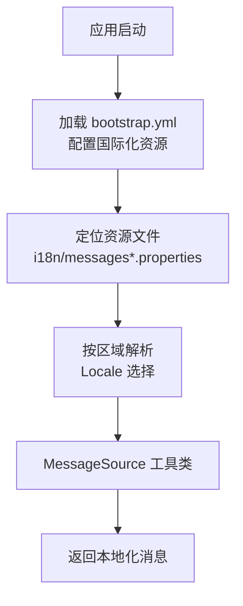
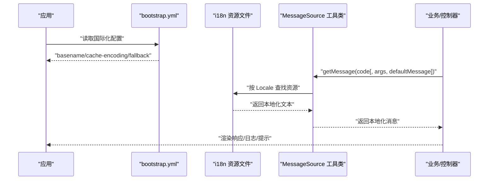
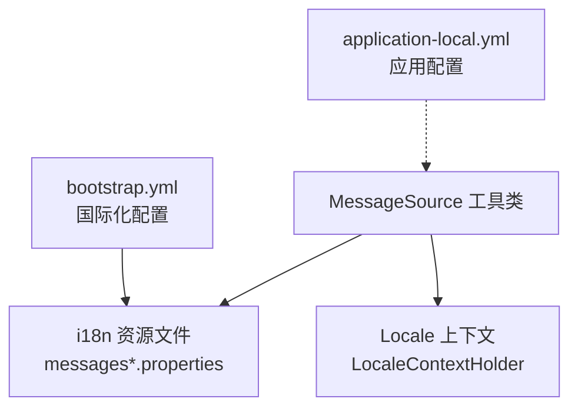

# 国际化配置

<cite>
**本文引用的文件**
- [messages.properties](file://src/main/resources/i18n/messages.properties)
- [messages_zh.properties](file://src/main/resources/i18n/messages_zh.properties)
- [messages_en.properties](file://src/main/resources/i18n/messages_en.properties)
- [MessageSource.java](file://src/main/java/cn/staitech/fr/utils/MessageSource.java)
- [bootstrap.yml](file://src/main/resources/bootstrap.yml)
- [application-local.yml](file://src/main/resources/application-local.yml)
</cite>

## 目录
1. [简介](#简介)
2. [项目结构](#项目结构)
3. [核心组件](#核心组件)
4. [架构总览](#架构总览)
5. [详细组件分析](#详细组件分析)
6. [依赖分析](#依赖分析)
7. [性能考虑](#性能考虑)
8. [故障排查指南](#故障排查指南)
9. [结论](#结论)
10. [附录](#附录)

## 简介
本文件面向需要在本项目中启用或扩展多语言支持的开发者，系统性讲解国际化资源文件的组织方式、命名规则、加载机制与优先级，并提供新增语言支持的操作步骤与最佳实践。同时，结合项目中的国际化工具类，说明在代码中如何使用国际化消息以及如何进行参数化消息渲染。

## 项目结构
国际化相关的核心位置如下：
- 资源文件目录：src/main/resources/i18n/
  - messages.properties：默认语言（通常为中文）的基础键值对
  - messages_zh.properties：中文语言覆盖
  - messages_en.properties：英文语言覆盖
- Spring Boot 配置：src/main/resources/bootstrap.yml
  - 定义了国际化资源的基础名、缓存策略、编码与回退策略
- 应用配置：src/main/resources/application-local.yml
  - 提供本地开发环境下的其他运行参数（与国际化无直接关系）
- 工具类：src/main/java/cn/staitech/fr/utils/MessageSource.java
  - 封装了 Spring MessageSource 的调用，提供便捷的国际化消息读取能力

图表来源
- [bootstrap.yml:12-16](file://src/main/resources/bootstrap.yml#L12-L16)
- [MessageSource.java:17-44](file://src/main/java/cn/staitech/fr/utils/MessageSource.java#L17-L44)

章节来源
- [bootstrap.yml:12-16](file://src/main/resources/bootstrap.yml#L12-L16)
- [messages.properties:1-51](file://src/main/resources/i18n/messages.properties#L1-L51)
- [messages_zh.properties:1-42](file://src/main/resources/i18n/messages_zh.properties#L1-L42)
- [messages_en.properties:1-45](file://src/main/resources/i18n/messages_en.properties#L1-L45)

## 核心组件
- 国际化资源文件
  - 默认资源：messages.properties（作为默认语言的后备与最小集合）
  - 语言覆盖：messages_zh.properties（中文覆盖）、messages_en.properties（英文覆盖）
- 国际化解析配置（bootstrap.yml）
  - basename：i18n/messages
  - cache-seconds：3600（缓存秒数）
  - encoding：UTF-8
  - fallbackToSystemLocale：false（不回退到系统区域）
- 国际化工具类（MessageSource.java）
  - 提供静态方法读取消息，支持无参、带参与带默认值的消息读取
  - 支持基于当前上下文 Locale 的读取
  - 提供自定义语言读取方法（根据登录用户语言偏好）

章节来源
- [bootstrap.yml:12-16](file://src/main/resources/bootstrap.yml#L12-L16)
- [MessageSource.java:17-80](file://src/main/java/cn/staitech/fr/utils/MessageSource.java#L17-L80)

## 架构总览
国际化流程由“配置 → 资源 → 解析 → 返回”四个阶段组成。下图展示了从应用启动到最终返回本地化消息的关键步骤：

图表来源
- [bootstrap.yml:12-16](file://src/main/resources/bootstrap.yml#L12-L16)
- [MessageSource.java:21-44](file://src/main/java/cn/staitech/fr/utils/MessageSource.java#L21-L44)
- [messages.properties:1-51](file://src/main/resources/i18n/messages.properties#L1-L51)

## 详细组件分析

### 资源文件命名规则与优先级
- 命名规则
  - 基础文件：i18n/messages.properties
  - 语言覆盖：i18n/messages_[语言代码].properties
  - 语言+地区：i18n/messages_[语言]_[地区].properties
- 优先级（从高到低）
  - 最具体：messages_[语言]_[地区].properties
  - 语言：messages_[语言].properties
  - 默认：messages.properties
  - 未命中时，若未启用回退则返回键本身或默认消息（取决于调用方）
- 本项目实际使用
  - messages.properties（默认/中文）
  - messages_zh.properties（中文覆盖）
  - messages_en.properties（英文覆盖）

章节来源
- [messages.properties:1-51](file://src/main/resources/i18n/messages.properties#L1-L51)
- [messages_zh.properties:1-42](file://src/main/resources/i18n/messages_zh.properties#L1-L42)
- [messages_en.properties:1-45](file://src/main/resources/i18n/messages_en.properties#L1-L45)

### 加载机制与配置项
- 配置项说明（来自 bootstrap.yml）
  - basename：i18n/messages
  - cache-seconds：3600（缓存资源文件，减少重复 IO）
  - encoding：UTF-8（确保多语言字符正确显示）
  - fallbackToSystemLocale：false（不回退到系统区域）
- 加载顺序
  - 启动时按 basename 定位资源目录
  - 根据当前 Locale 依次匹配具体资源文件
  - 若未找到对应语言资源，则使用默认资源文件

章节来源
- [bootstrap.yml:12-16](file://src/main/resources/bootstrap.yml#L12-L16)

### 参数化消息与默认消息
- 参数化消息
  - 通过传入参数数组，将占位符替换为实际值
- 默认消息
  - 当找不到对应键时，可提供默认消息避免返回键名
- 工具类支持
  - 无参：getMessage(code)
  - 带参：getMessage(code, args)
  - 带默认值：getMessage(code, args, defaultMessage)

章节来源
- [MessageSource.java:21-44](file://src/main/java/cn/staitech/fr/utils/MessageSource.java#L21-L44)

### 自定义语言读取（按用户偏好）
- 用户语言偏好来源：登录用户的语言字段
- 语言映射规则：en-us 映射为 en；否则视为 zh
- 读取策略：根据用户语言构造 Locale 并直接查询对应资源

章节来源
- [MessageSource.java:54-80](file://src/main/java/cn/staitech/fr/utils/MessageSource.java#L54-L80)

### 新增语言支持的操作步骤
- 步骤一：新增资源文件
  - 在 i18n 目录下创建 messages_xx.properties（xx 为新语言代码）
  - 仅需放置与默认语言不同的键值对
- 步骤二：更新用户语言映射
  - 若新语言代码不在现有映射中，需在工具类中补充映射逻辑
- 步骤三：验证加载
  - 启动应用后，通过工具类按用户语言读取消息，确认资源被正确加载
- 步骤四：测试与回归
  - 在不同语言环境下测试关键提示语与错误信息

章节来源
- [messages.properties:1-51](file://src/main/resources/i18n/messages.properties#L1-L51)
- [MessageSource.java:54-80](file://src/main/java/cn/staitech/fr/utils/MessageSource.java#L54-L80)

### 最佳实践
- 键命名规范
  - 使用清晰、稳定的键名，避免频繁变更
  - 按功能域分组（如项目管理、切片管理等），便于维护
- 资源文件维护
  - 默认文件仅保留必要键，其余语言文件覆盖差异部分
  - 保持键的一致性，避免遗漏
- 缓存与性能
  - 合理设置 cache-seconds，平衡热更新与性能
- 参数化与可读性
  - 对动态内容使用参数化消息，提升可读性与可维护性
- 回退策略
  - 明确是否启用回退到系统区域，避免意外的语言切换

章节来源
- [bootstrap.yml:12-16](file://src/main/resources/bootstrap.yml#L12-L16)
- [MessageSource.java:21-44](file://src/main/java/cn/staitech/fr/utils/MessageSource.java#L21-L44)

## 依赖分析
国际化相关组件之间的依赖关系如下：

图表来源
- [bootstrap.yml:12-16](file://src/main/resources/bootstrap.yml#L12-L16)
- [MessageSource.java:17-44](file://src/main/java/cn/staitech/fr/utils/MessageSource.java#L17-L44)
- [application-local.yml:1-311](file://src/main/resources/application-local.yml#L1-L311)

章节来源
- [bootstrap.yml:12-16](file://src/main/resources/bootstrap.yml#L12-L16)
- [MessageSource.java:17-44](file://src/main/java/cn/staitech/fr/utils/MessageSource.java#L17-L44)

## 性能考虑
- 资源缓存
  - 通过 cache-seconds 控制资源文件缓存时间，降低重复加载开销
- 字符集
  - 统一使用 UTF-8，避免乱码与额外转换成本
- Locale 选择
  - 优先使用上下文 Locale，减少不必要的语言切换判断
- 资源体积
  - 将默认资源精简化，仅保留必要键，减少内存占用

章节来源
- [bootstrap.yml:12-16](file://src/main/resources/bootstrap.yml#L12-L16)

## 故障排查指南
- 症状：消息未生效或返回键名
  - 排查点：键是否存在、语言文件是否正确命名、Locale 是否匹配
  - 参考：工具类的默认消息回退策略
- 症状：中文显示乱码
  - 排查点：资源文件编码是否为 UTF-8
- 症状：语言未按用户偏好切换
  - 排查点：用户语言字段是否正确、映射逻辑是否覆盖该语言代码
- 症状：缓存导致更新不生效
  - 排查点：cache-seconds 是否过长，重启应用或调整缓存策略

章节来源
- [MessageSource.java:21-44](file://src/main/java/cn/staitech/fr/utils/MessageSource.java#L21-L44)
- [MessageSource.java:54-80](file://src/main/java/cn/staitech/fr/utils/MessageSource.java#L54-L80)
- [bootstrap.yml:12-16](file://src/main/resources/bootstrap.yml#L12-L16)

## 结论
本项目采用标准的 Spring Boot 国际化方案：通过 bootstrap.yml 配置资源基础名与缓存策略，配合 i18n 目录下的多语言资源文件实现默认与覆盖语言的支持。MessageSource 工具类提供了简洁的 API，既可按上下文 Locale 读取，也可按用户偏好语言读取。遵循本文的命名规则、加载机制与最佳实践，即可高效地扩展新的语言支持并保证良好的用户体验。

## 附录
- 关键配置路径
  - 国际化配置：[bootstrap.yml:12-16](file://src/main/resources/bootstrap.yml#L12-L16)
  - 默认资源：[messages.properties:1-51](file://src/main/resources/i18n/messages.properties#L1-L51)
  - 中文覆盖：[messages_zh.properties:1-42](file://src/main/resources/i18n/messages_zh.properties#L1-L42)
  - 英文覆盖：[messages_en.properties:1-45](file://src/main/resources/i18n/messages_en.properties#L1-L45)
  - 工具类：[MessageSource.java:17-80](file://src/main/java/cn/staitech/fr/utils/MessageSource.java#L17-L80)
  - 应用配置：[application-local.yml:1-311](file://src/main/resources/application-local.yml#L1-L311)