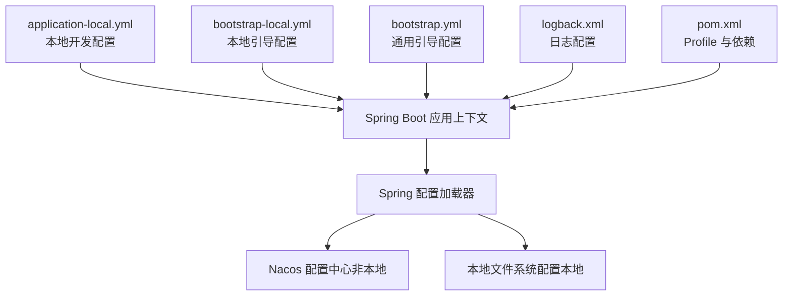
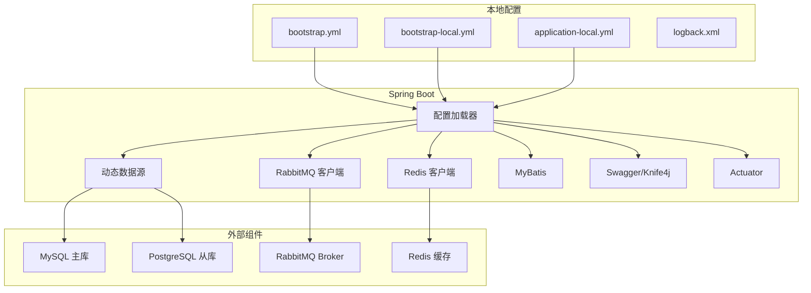
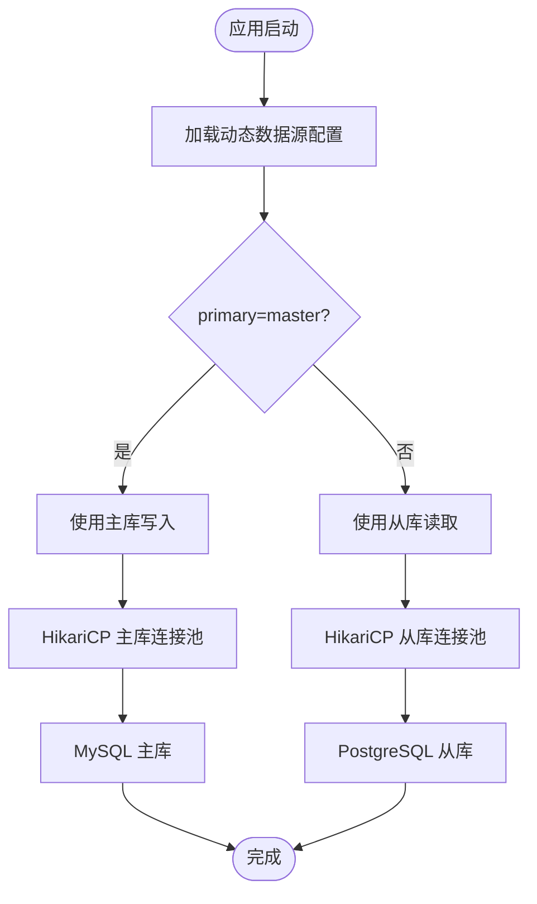
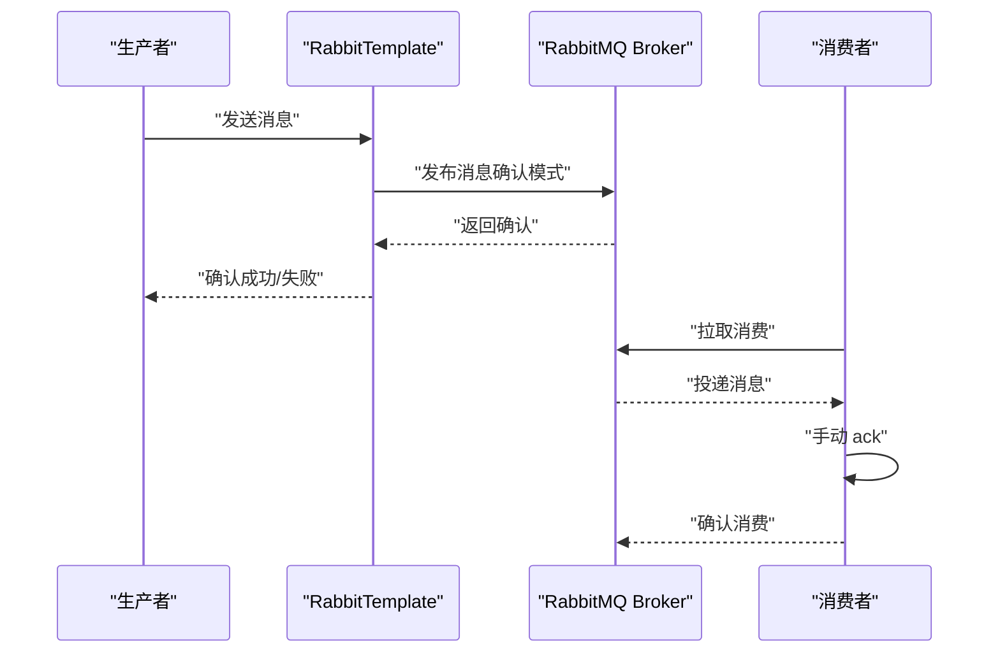
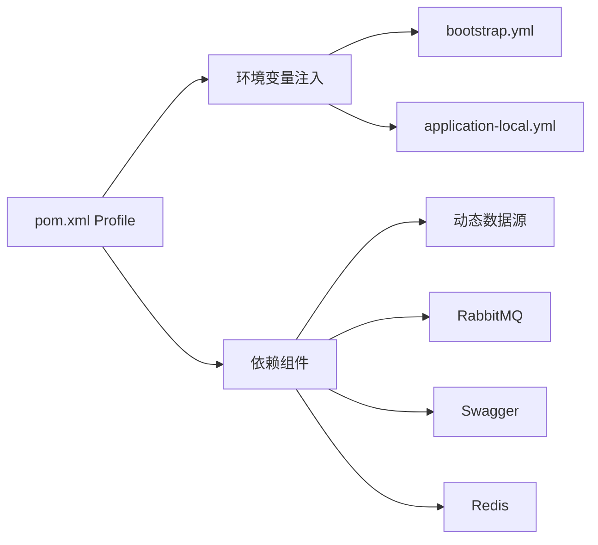

# 应用配置

<cite>
**本文引用的文件**
- [application-local.yml](file://src/main/resources/application-local.yml)
- [bootstrap-local.yml](file://src/main/resources/bootstrap-local.yml)
- [bootstrap.yml](file://src/main/resources/bootstrap.yml)
- [logback.xml](file://src/main/resources/logback.xml)
- [pom.xml](file://pom.xml)
- [DynamicThreadPoolConfig.java](file://src/main/java/cn/staitech/fr/config/DynamicThreadPoolConfig.java)
- [OrganStructureConfig.java](file://src/main/java/cn/staitech/fr/config/OrganStructureConfig.java)
- [SpecialStructureConfig.java](file://src/main/java/cn/staitech/fr/config/SpecialStructureConfig.java)
</cite>

## 目录
1. [简介](#简介)
2. [项目结构](#项目结构)
3. [核心组件](#核心组件)
4. [架构总览](#架构总览)
5. [详细组件分析](#详细组件分析)
6. [依赖关系分析](#依赖关系分析)
7. [性能考量](#性能考量)
8. [故障排查指南](#故障排查指南)
9. [结论](#结论)
10. [附录](#附录)

## 简介
本文件面向应用配置的深入解读，聚焦于 application-local.yml 中的各项配置参数，涵盖 Spring 配置（文件上传大小限制、多环境配置）、Redis 缓存、数据库连接（主从库配置）、RabbitMQ 消息队列、MyBatis、Swagger、日志管理等，并结合 bootstrap.yml 与 pom.xml 的环境与依赖信息，给出配置项的作用、默认值、可选值范围、实际应用场景、不同环境下的配置示例与最佳实践建议，以及配置文件的加载顺序与优先级规则。

## 项目结构
本项目采用 Spring Boot 标准资源目录，配置文件位于 src/main/resources 下，配合 Maven Profile 实现多环境切换。关键文件如下：
- application-local.yml：本地开发环境的完整配置
- bootstrap-local.yml：本地开发环境的引导层配置（关闭 Nacos）
- bootstrap.yml：通用引导层配置（Nacos 注册与配置中心、国际化、端口等）
- logback.xml：日志系统配置
- pom.xml：Maven 依赖与 Profile（local/testpvcmvs/pathmedics）

图表来源
- [application-local.yml:1-311](file://src/main/resources/application-local.yml#L1-L311)
- [bootstrap-local.yml:1-9](file://src/main/resources/bootstrap-local.yml#L1-L9)
- [bootstrap.yml:1-48](file://src/main/resources/bootstrap.yml#L1-L48)
- [logback.xml:1-102](file://src/main/resources/logback.xml#L1-L102)
- [pom.xml:302-366](file://pom.xml#L302-L366)

章节来源
- [application-local.yml:1-311](file://src/main/resources/application-local.yml#L1-L311)
- [bootstrap-local.yml:1-9](file://src/main/resources/bootstrap-local.yml#L1-L9)
- [bootstrap.yml:1-48](file://src/main/resources/bootstrap.yml#L1-L48)
- [logback.xml:1-102](file://src/main/resources/logback.xml#L1-L102)
- [pom.xml:302-366](file://pom.xml#L302-L366)

## 核心组件
本节按模块梳理 application-local.yml 中的关键配置项及其作用、默认值、可选范围与应用场景。

- Spring Servlet 文件上传
  - 配置键：spring.servlet.multipart.max-file-size、spring.servlet.multipart.max-request-size
  - 作用：限制单文件与请求总大小，防止大文件导致内存溢出或拒绝服务
  - 默认值：未显式设置时遵循 Spring Boot 默认；此处本地配置为 500MB
  - 可选范围：建议与服务器磁盘空间、网络带宽匹配，避免过大引发超时或 OOM
  - 应用场景：上传大体积标注数据、图像切片、批量导入等
  - 最佳实践：与网关/反向代理的上传限制保持一致，避免前后端不一致

- Spring Profiles 与多环境
  - 配置键：spring.profiles、spring.profiles.active
  - 作用：激活当前环境配置；本地通过 bootstrap-local.yml 关闭 Nacos
  - 默认值：本地 profile=local；非本地由 Maven Profile 注入
  - 可选范围：local/pacmvsdev/testpvcmvs/pathmedics
  - 应用场景：区分开发、测试、预发、生产环境
  - 最佳实践：所有敏感信息通过 Nacos 或 Vault 管理，本地仅保留最小必要配置

- Redis 缓存
  - 配置键：spring.redis.host、port、password
  - 作用：连接本地 Redis 缓存实例
  - 默认值：未显式设置时遵循 Spring Boot 默认；此处本地配置了 host/port/password
  - 可选范围：IP/域名、端口、密码（建议启用认证）
  - 应用场景：会话缓存、热点数据缓存、分布式锁等
  - 最佳实践：开启连接池与健康检查，设置合理的超时与重试策略

- 数据源与动态数据源（主从库）
  - 配置键：spring.datasource.dynamic.primary、spring.datasource.dynamic.datasource.master、spring.datasource.dynamic.datasource.slave
  - 作用：定义主库与从库数据源，设置 HikariCP 连接池参数
  - 默认值：未显式设置时遵循 HikariCP 默认；此处本地配置了 master 与 slave
  - 可选范围：驱动类名、URL、用户名、密码、连接池大小、生命周期、验证超时等
  - 应用场景：读写分离、高并发读取、灾备容错
  - 最佳实践：主库写、从库读；从库数量与业务读压力匹配；开启连接测试查询与池化监控

- RabbitMQ 消息队列
  - 配置键：spring.rabbitmq.host、port、username、password、virtual-host、publisher-returns、publisher-confirm-type、listener.simple、listener.direct
  - 作用：连接本地 MQ，配置发布确认与手动应答、重试策略
  - 默认值：未显式设置时遵循 Spring AMQP 默认；此处本地配置了基本连接与监听参数
  - 可选范围：acknowledge-mode（auto/manual）、retry 配置、default-requeue-rejected
  - 应用场景：异步任务、算法回调、延迟消息、幂等消费
  - 最佳实践：生产者启用 correlated 确认；消费者手动 ack；合理设置最大重试次数与间隔

- MyBatis
  - 配置键：mybatis.typeAliasesPackage、mybatis.mapperLocations、mybatis.configuration.log-impl
  - 作用：扫描实体别名、Mapper XML、日志实现
  - 默认值：未显式设置时遵循 MyBatis Starter 默认；此处本地启用了标准输出日志
  - 可选范围：包扫描路径、XML 路径模式、日志实现（stdout/no logging）
  - 应用场景：SQL 映射、调试与性能分析
  - 最佳实践：生产环境建议关闭 stdout 日志，使用日志框架统一输出

- Swagger
  - 配置键：swagger.title、swagger.license、swagger.licenseUrl
  - 作用：接口文档标题与许可信息
  - 默认值：未显式设置时为空；此处本地配置了中文标题与许可链接
  - 可选范围：任意字符串
  - 应用场景：本地联调与接口说明
  - 最佳实践：与 Knife4j 配合使用，生产环境谨慎暴露

- 日志管理
  - 配置键：logging.level.*
  - 作用：控制不同包的日志级别，便于调试与定位问题
  - 默认值：未显式设置时遵循 Logback 默认；此处本地开启了多包 DEBUG/TRACE
  - 可选范围：TRACE/DEBUG/INFO/WARN/ERROR/OFF
  - 应用场景：开发调试、性能分析、问题追踪
  - 最佳实践：生产环境降低日志级别，避免 IO 压力；使用异步 Appender 与按文件名分拣

- Actuator 与 Management
  - 配置键：management.endpoints.web.exposure.include、management.endpoint.env.enabled
  - 作用：暴露运行时端点，便于运维与诊断
  - 默认值：未显式设置时遵循 Actuator 默认；此处本地仅暴露 env/health/info
  - 可选范围：逗号分隔的端点名
  - 应用场景：健康检查、环境变量查看
  - 最佳实践：生产环境限制暴露端点并鉴权

- 自定义配置
  - waxPath：本地蜡块文件路径
  - organ-structures：器官-结构映射配置（用于前端展示与校验）
  - queues：消息队列名称与延迟时间
  - dynamic：动态线程池参数（与代码中的线程池 Bean 配置协同）

章节来源
- [application-local.yml:5-106](file://src/main/resources/application-local.yml#L5-L106)
- [application-local.yml:107-311](file://src/main/resources/application-local.yml#L107-L311)

## 架构总览
下图展示了本地开发环境下配置加载与外部组件交互的关系：

图表来源
- [application-local.yml:1-311](file://src/main/resources/application-local.yml#L1-L311)
- [bootstrap-local.yml:1-9](file://src/main/resources/bootstrap-local.yml#L1-L9)
- [bootstrap.yml:1-48](file://src/main/resources/bootstrap.yml#L1-L48)
- [logback.xml:1-102](file://src/main/resources/logback.xml#L1-L102)

## 详细组件分析

### Spring 配置（文件上传与多环境）
- 文件上传大小限制
  - spring.servlet.multipart.max-file-size 与 spring.servlet.multipart.max-request-size
  - 作用：限制上传文件大小，避免内存与网络压力
  - 本地默认：500MB
  - 建议：与网关/反向代理限制一致，避免前后端不一致导致的 413 错误
- 多环境配置
  - spring.profiles.active 由 Maven Profile 注入；本地通过 bootstrap-local.yml 关闭 Nacos
  - 本地 profile=local，非本地由 pom.xml 的 Profile 设置 serverAddr、namespace、group 等

章节来源
- [application-local.yml:5-6](file://src/main/resources/application-local.yml#L5-L6)
- [application-local.yml:8-10](file://src/main/resources/application-local.yml#L8-L10)
- [bootstrap-local.yml:1-9](file://src/main/resources/bootstrap-local.yml#L1-L9)
- [bootstrap.yml:20-22](file://src/main/resources/bootstrap.yml#L20-L22)
- [pom.xml:306-315](file://pom.xml#L306-L315)

### Redis 缓存配置
- 连接参数：host、port、password
- 作用：连接本地 Redis 缓存
- 本地默认：已配置 host/port/password
- 最佳实践：生产环境启用 TLS、只读从库、连接池监控

章节来源
- [application-local.yml:11-14](file://src/main/resources/application-local.yml#L11-L14)

### 数据库连接配置（主从库）
- 主库（MySQL）与从库（PostgreSQL）分别配置
- HikariCP 参数：最大池大小、最小空闲、空闲超时、最大生命周期、连接超时、验证超时、自动提交、连接测试查询、JMX 注册
- 默认值：本地已配置主从库与 HikariCP 参数
- 最佳实践：读写分离、从库数量与业务读压力匹配、开启连接测试与池化监控

图表来源
- [application-local.yml:15-56](file://src/main/resources/application-local.yml#L15-L56)

章节来源
- [application-local.yml:15-56](file://src/main/resources/application-local.yml#L15-L56)

### RabbitMQ 消息队列配置
- 连接参数：host、port、username、password、virtual-host
- 发布确认：publisher-returns=true、publisher-confirm-type=correlated
- 监听器：simple 与 direct 模式，手动应答、重试次数与间隔
- 默认值：本地已配置
- 最佳实践：生产环境开启事务或发布确认，消费者手动 ack，合理设置重试与死信

图表来源
- [application-local.yml:57-75](file://src/main/resources/application-local.yml#L57-L75)

章节来源
- [application-local.yml:57-75](file://src/main/resources/application-local.yml#L57-L75)

### MyBatis 配置
- 类型别名包：扫描实体包
- Mapper XML：扫描 classpath 下的 XML 映射文件
- 日志实现：本地启用标准输出日志
- 默认值：本地已配置
- 最佳实践：生产环境关闭 stdout 日志，使用统一日志框架

章节来源
- [application-local.yml:75-83](file://src/main/resources/application-local.yml#L75-L83)

### Swagger 配置
- 标题、许可与许可链接
- 本地已启用 Knife4j
- 最佳实践：生产环境谨慎暴露接口文档

章节来源
- [application-local.yml:84-89](file://src/main/resources/application-local.yml#L84-L89)
- [bootstrap.yml:4-5](file://src/main/resources/bootstrap.yml#L4-L5)

### 日志管理配置
- 日志级别：针对 Spring、AMQP、Mapper 等包设置 DEBUG/TRACE
- Logback：控制台输出与按文件名分拣的滚动文件输出
- 最佳实践：生产环境降低日志级别，使用异步 Appender

章节来源
- [application-local.yml:90-98](file://src/main/resources/application-local.yml#L90-L98)
- [logback.xml:1-102](file://src/main/resources/logback.xml#L1-L102)

### Actuator 与 Management
- 暴露端点：env、health、info
- 最佳实践：生产环境限制暴露并鉴权

章节来源
- [application-local.yml:98-106](file://src/main/resources/application-local.yml#L98-L106)

### 自定义配置
- waxPath：本地蜡块文件路径
- organ-structures：器官-结构映射（用于前端展示与校验）
- queues：消息队列名称与延迟时间
- dynamic：动态线程池参数（与代码中的线程池 Bean 配置协同）

章节来源
- [application-local.yml:106-106](file://src/main/resources/application-local.yml#L106-L106)
- [application-local.yml:107-303](file://src/main/resources/application-local.yml#L107-L303)
- [application-local.yml:304-311](file://src/main/resources/application-local.yml#L304-L311)

## 依赖关系分析
- Maven Profile 与环境
  - local：激活 local，关闭 Nacos
  - pacmvsdev/testpvcmvs/pathmedics：注入 serverAddr、namespace、group 等，启用 Nacos
- 依赖组件
  - 动态数据源：com.baomidou:dynamic-datasource-spring-boot-starter
  - AMQP：spring-boot-starter-amqp
  - Swagger：knife4j 与 staitech-common-swagger
  - Redis：staitech-common-redis
  - 国际化：i18n/messages

图表来源
- [pom.xml:302-366](file://pom.xml#L302-L366)
- [bootstrap.yml:23-46](file://src/main/resources/bootstrap.yml#L23-L46)
- [application-local.yml:15-14](file://src/main/resources/application-local.yml#L15-L14)

章节来源
- [pom.xml:302-366](file://pom.xml#L302-L366)
- [bootstrap.yml:23-46](file://src/main/resources/bootstrap.yml#L23-L46)

## 性能考量
- 数据库连接池
  - HikariCP 参数需与业务 QPS、读写比例匹配，避免连接不足或过度占用
  - 建议开启连接测试查询与 JMX 监控
- 消息队列
  - 发布确认与手动 ack 提升可靠性；合理设置重试次数与间隔，避免雪崩
- 日志
  - 生产环境避免 stdout 日志与高频 DEBUG，使用异步与按文件名分拣
- 线程池
  - 代码中存在自定义线程池配置，建议与 queues/dynamic 参数协同，避免资源争用

章节来源
- [application-local.yml:25-54](file://src/main/resources/application-local.yml#L25-L54)
- [application-local.yml:309-311](file://src/main/resources/application-local.yml#L309-L311)
- [DynamicThreadPoolConfig.java:14-51](file://src/main/java/cn/staitech/fr/config/DynamicThreadPoolConfig.java#L14-L51)

## 故障排查指南
- 配置加载顺序与优先级
  - bootstrap.yml 先于 application-local.yml 加载
  - 本地通过 bootstrap-local.yml 关闭 Nacos，使用本地配置
  - 非本地由 Maven Profile 注入 Nacos 地址与命名空间
- 常见问题
  - 无法连接数据库：检查主从库 URL、用户名、密码与驱动
  - 上传失败：检查 spring.servlet.multipart.* 限制与网关/反向代理限制
  - 消息未达：检查 publisher-confirm-type、acknowledge-mode、重试配置
  - 日志过多：调整 logging.level 或禁用 stdout 日志
- 排查步骤
  - 查看启动日志与 Nacos 加载日志
  - 使用 Actuator 端点检查运行状态
  - 分模块启用 DEBUG 级别定位问题

章节来源
- [bootstrap.yml:1-48](file://src/main/resources/bootstrap.yml#L1-L48)
- [bootstrap-local.yml:1-9](file://src/main/resources/bootstrap-local.yml#L1-L9)
- [application-local.yml:1-311](file://src/main/resources/application-local.yml#L1-L311)
- [logback.xml:94-94](file://src/main/resources/logback.xml#L94-L94)
- [logback.xml:98-101](file://src/main/resources/logback.xml#L98-L101)

## 结论
application-local.yml 提供了本地开发所需的完整配置模板，覆盖 Spring、Redis、数据库（主从）、RabbitMQ、MyBatis、Swagger、日志与管理端点等关键领域。结合 bootstrap.yml 与 pom.xml 的 Profile 机制，可在不同环境中灵活切换。建议在生产环境严格限制暴露端点、启用 TLS、优化连接池与线程池参数，并通过 Nacos 统一管理敏感配置。

## 附录
- 不同环境下的配置示例与最佳实践
  - local：关闭 Nacos，使用本地 Redis、MySQL 主库、PostgreSQL 从库、本地文件路径
  - pacmvsdev/testpvcmvs/pathmedics：启用 Nacos，注入 serverAddr/namespace/group，连接远程 Redis、MQ、DB
- 配置文件加载顺序与优先级
  - bootstrap.yml → bootstrap-local.yml（或对应 Profile 的 bootstrap.yml）→ application-local.yml（或对应 Profile 的 application.yml）

章节来源
- [bootstrap.yml:20-46](file://src/main/resources/bootstrap.yml#L20-L46)
- [bootstrap-local.yml:1-9](file://src/main/resources/bootstrap-local.yml#L1-L9)
- [pom.xml:306-361](file://pom.xml#L306-L361)