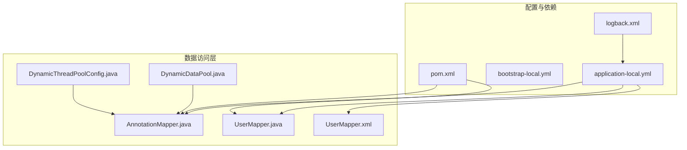
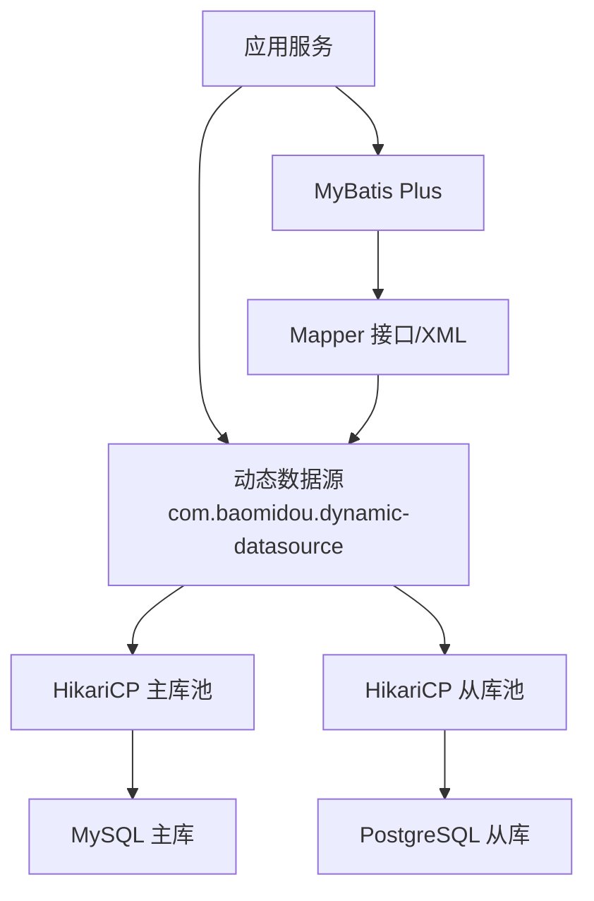
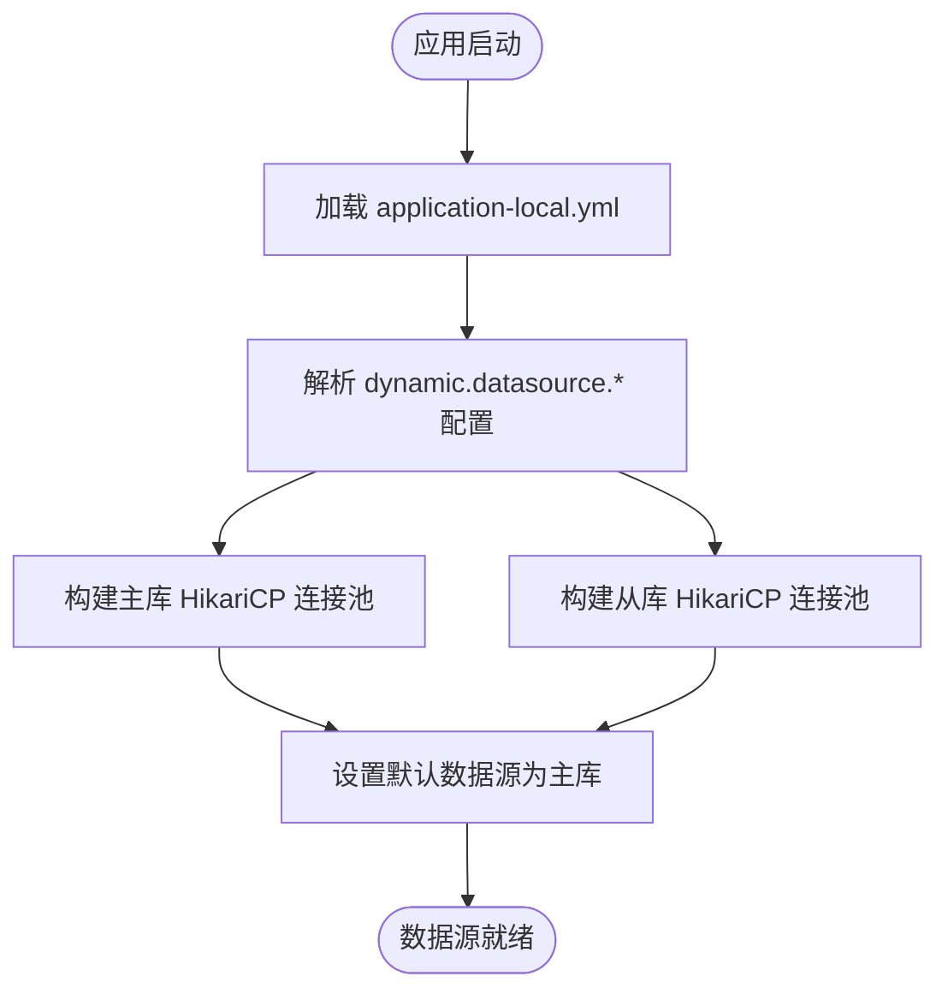
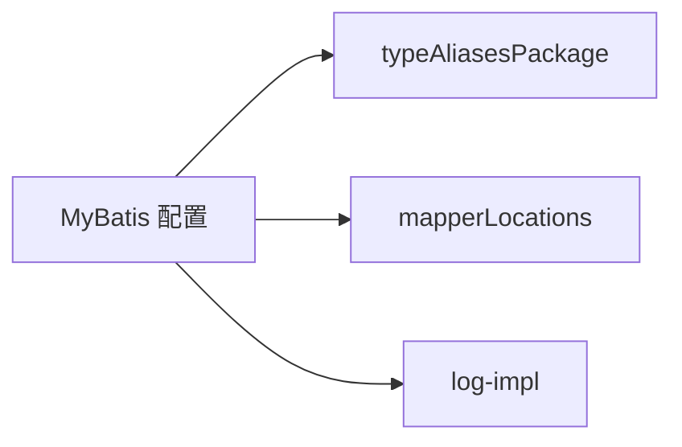
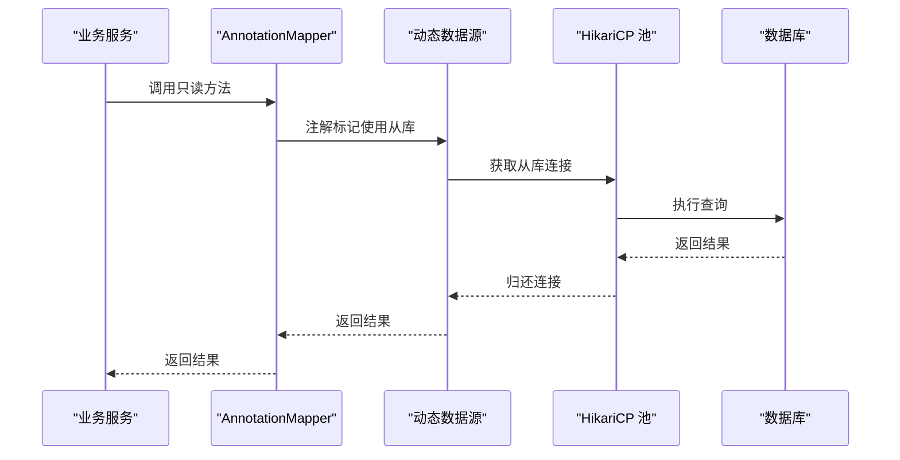
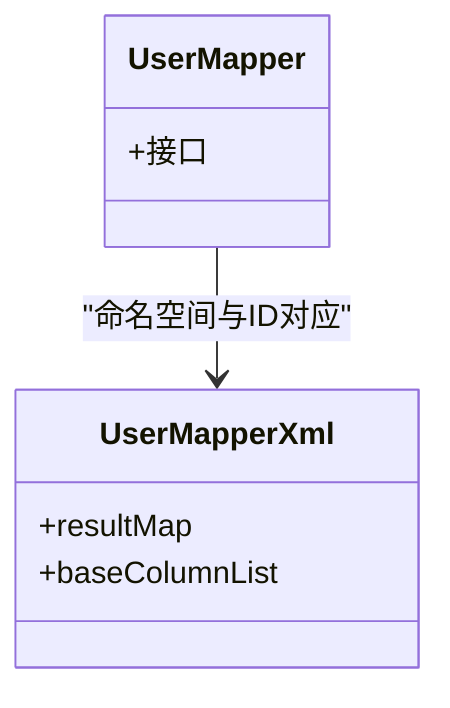
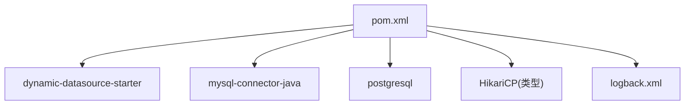
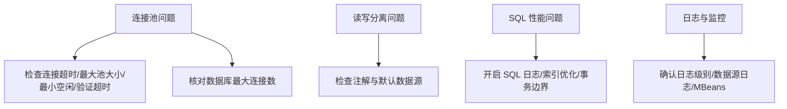

# 数据库配置

<cite>
**本文引用的文件**
- [application-local.yml](file://src/main/resources/application-local.yml)
- [bootstrap-local.yml](file://src/main/resources/bootstrap-local.yml)
- [DynamicDataPool.java](file://src/main/java/cn/staitech/fr/config/DynamicDataPool.java)
- [DynamicThreadPoolConfig.java](file://src/main/java/cn/staitech/fr/config/DynamicThreadPoolConfig.java)
- [logback.xml](file://src/main/resources/logback.xml)
- [pom.xml](file://pom.xml)
- [AnnotationMapper.java](file://src/main/java/cn/staitech/fr/mapper/AnnotationMapper.java)
- [UserMapper.java](file://src/main/java/cn/staitech/fr/mapper/UserMapper.java)
- [UserMapper.xml](file://src/main/resources/mapper/UserMapper.xml)
</cite>

## 目录
1. [简介](#简介)
2. [项目结构](#项目结构)
3. [核心组件](#核心组件)
4. [架构总览](#架构总览)
5. [详细组件分析](#详细组件分析)
6. [依赖分析](#依赖分析)
7. [性能考虑](#性能考虑)
8. [故障排查指南](#故障排查指南)
9. [结论](#结论)
10. [附录](#附录)

## 简介
本文件面向数据库配置与运维人员，系统性阐述本项目的数据库配置要点，包括：
- 数据源配置：主库与从库（MySQL/PostgreSQL）的配置项与差异
- 连接池配置：HikariCP 参数详解与调优建议
- MyBatis 配置：别名扫描、Mapper 映射文件位置与日志配置
- 动态数据源与读写分离：如何通过注解在主从库间切换
- 事务管理与性能优化：结合日志与线程池配置进行问题定位与优化
- 故障排查与性能调优：常见问题定位方法与参数调优建议

## 项目结构
本项目采用 Spring Boot + MyBatis Plus + 动态数据源的方式组织数据库访问层。关键配置集中在资源目录下的 YAML 文件与 Maven 依赖中；Mapper 接口与 XML 映射文件分别位于 Java 与 resources 目录中；日志配置用于输出数据源与 SQL 执行细节。

**图表来源**
- [application-local.yml:15-83](file://src/main/resources/application-local.yml#L15-L83)
- [pom.xml:97-99](file://pom.xml#L97-L99)
- [logback.xml:95-96](file://src/main/resources/logback.xml#L95-L96)
- [DynamicDataPool.java:1-231](file://src/main/java/cn/staitech/fr/config/DynamicDataPool.java#L1-L231)
- [DynamicThreadPoolConfig.java:1-53](file://src/main/java/cn/staitech/fr/config/DynamicThreadPoolConfig.java#L1-L53)
- [AnnotationMapper.java:1-137](file://src/main/java/cn/staitech/fr/mapper/AnnotationMapper.java#L1-L137)
- [UserMapper.java:1-19](file://src/main/java/cn/staitech/fr/mapper/UserMapper.java#L1-L19)
- [UserMapper.xml:1-38](file://src/main/resources/mapper/UserMapper.xml#L1-L38)

**章节来源**
- [application-local.yml:15-83](file://src/main/resources/application-local.yml#L15-L83)
- [pom.xml:97-99](file://pom.xml#L97-L99)
- [logback.xml:95-96](file://src/main/resources/logback.xml#L95-L96)

## 核心组件
- 数据源与连接池
  - 主库（MySQL）与从库（PostgreSQL）均使用 HikariCP 作为连接池类型
  - 主库与从库的驱动类名、URL、用户名、密码、池参数独立配置
  - 默认数据源为主库，可通过注解切换至从库
- MyBatis 配置
  - 类型别名扫描包、Mapper XML 扫描路径、日志实现
- 日志与可观测性
  - 开启数据源与 SQL 日志，便于定位连接池与查询问题
- 线程池与并发
  - 提供多个线程池 Bean，用于异步任务与 IO 密集型处理，间接影响数据库并发与吞吐

**章节来源**
- [application-local.yml:15-83](file://src/main/resources/application-local.yml#L15-L83)
- [logback.xml:95-96](file://src/main/resources/logback.xml#L95-L96)
- [DynamicDataPool.java:1-231](file://src/main/java/cn/staitech/fr/config/DynamicDataPool.java#L1-L231)
- [DynamicThreadPoolConfig.java:1-53](file://src/main/java/cn/staitech/fr/config/DynamicThreadPoolConfig.java#L1-L53)

## 架构总览
下图展示了应用如何通过动态数据源与连接池访问主库与从库，并由 MyBatis 执行 SQL。

**图表来源**
- [application-local.yml:15-56](file://src/main/resources/application-local.yml#L15-L56)
- [pom.xml:97-99](file://pom.xml#L97-L99)
- [AnnotationMapper.java:18-20](file://src/main/java/cn/staitech/fr/mapper/AnnotationMapper.java#L18-L20)

## 详细组件分析

### 数据源与连接池配置
- 主库（MySQL）
  - 驱动类名、JDBC URL、用户名、密码、连接池类型为 HikariCP
  - HikariCP 关键参数：最大池大小、最小空闲、空闲超时、最大生命周期、连接超时、验证超时、自动提交、池名称、连接测试语句、注册 MBeans
- 从库（PostgreSQL）
  - 驱动类名、JDBC URL、用户名、密码、连接池类型为 HikariCP
  - HikariCP 参数与主库一致，便于统一管理
- 默认数据源
  - 指定默认数据源为主库，未显式声明时使用默认数据源

**图表来源**
- [application-local.yml:15-56](file://src/main/resources/application-local.yml#L15-L56)

**章节来源**
- [application-local.yml:15-56](file://src/main/resources/application-local.yml#L15-L56)

### HikariCP 参数详解与建议
- 最大连接数（max-pool-size）
  - 主库与从库均为固定值，建议结合 QPS 与数据库最大连接限制评估
- 最小空闲连接（min-idle）
  - 主库与从库均配置，建议不低于 5，保障热身与突发流量
- 连接超时时间（connection-timeout）
  - 主从库均为固定值，建议在高延迟网络或长事务场景适度提高
- 验证超时时间（validation-timeout）
  - 建议与连接超时一致或略小，避免长时间阻塞
- 空闲超时（idle-timeout）
  - 建议设置为 300000ms（5 分钟），避免连接池过早回收
- 最大生命周期（max-lifetime）
  - 建议设置为 1800000ms（30 分钟），避免连接老化导致的隐性问题
- 自动提交（is_auto-commit）
  - 建议保持开启以简化事务边界，但需注意长事务带来的锁竞争
- 连接测试语句（connection-test-query）
  - 建议使用轻量查询（如 SELECT 1），确保连接可用性
- 注册 MBeans（is_register-mbeans）
  - 建议开启，便于 JMX 监控连接池状态

**章节来源**
- [application-local.yml:25-54](file://src/main/resources/application-local.yml#L25-L54)

### MyBatis 配置
- 类型别名扫描包（typeAliasesPackage）
  - 扫描域模型所在包，减少 XML 中全限定名书写
- Mapper XML 扫描路径（mapperLocations）
  - 扫描 classpath 下的多级 mapper 目录，支持按模块拆分
- 日志实现（log-impl）
  - 开启标准输出日志，便于开发调试；生产环境可切换为 NoLogging 或接入日志系统

**图表来源**
- [application-local.yml:76-83](file://src/main/resources/application-local.yml#L76-L83)

**章节来源**
- [application-local.yml:76-83](file://src/main/resources/application-local.yml#L76-L83)
- [UserMapper.xml:1-38](file://src/main/resources/mapper/UserMapper.xml#L1-L38)

### 动态数据源与读写分离
- 默认数据源
  - 通过 primary 指定默认数据源为主库
- 读写分离策略
  - 在 Mapper 接口或方法上使用注解标注从库，实现只读查询路由至从库
  - 未标注则使用默认数据源（主库）

**图表来源**
- [application-local.yml:55-56](file://src/main/resources/application-local.yml#L55-L56)
- [AnnotationMapper.java:18-20](file://src/main/java/cn/staitech/fr/mapper/AnnotationMapper.java#L18-L20)

**章节来源**
- [application-local.yml:55-56](file://src/main/resources/application-local.yml#L55-L56)
- [AnnotationMapper.java:18-20](file://src/main/java/cn/staitech/fr/mapper/AnnotationMapper.java#L18-L20)

### 事务管理配置
- 事务边界
  - 未见显式声明式事务配置，通常由 MyBatis Plus 的 Service 实现类承担事务控制
- 建议
  - 对跨表写入或批量操作，明确使用 @Transactional 并设定合理的超时与回滚规则
  - 结合连接超时与数据库锁等待时间，避免长事务引发的锁竞争

**章节来源**
- [AnnotationServiceImpl.java:1-79](file://src/main/java/cn/staitech/fr/service/impl/AnnotationServiceImpl.java#L1-L79)

### Mapper 映射文件配置
- 接口与 XML 对应
  - Mapper 接口与 XML 文件通过命名空间与 ID 对应，遵循 MyBatis 约定
- 字段映射
  - XML 中定义基础字段列表与 resultMap，确保查询结果与实体字段正确映射

**图表来源**
- [UserMapper.java:1-19](file://src/main/java/cn/staitech/fr/mapper/UserMapper.java#L1-L19)
- [UserMapper.xml:5-36](file://src/main/resources/mapper/UserMapper.xml#L5-L36)

**章节来源**
- [UserMapper.java:1-19](file://src/main/java/cn/staitech/fr/mapper/UserMapper.java#L1-L19)
- [UserMapper.xml:1-38](file://src/main/resources/mapper/UserMapper.xml#L1-L38)

## 依赖分析
- 动态数据源依赖
  - 引入动态数据源 Starter，启用多数据源能力
- 数据库驱动
  - MySQL Connector 与 PostgreSQL JDBC 驱动
- 连接池
  - HikariCP 作为默认连接池类型
- 日志
  - 开启数据源与 SQL 日志，便于问题定位

**图表来源**
- [pom.xml:97-99](file://pom.xml#L97-L99)
- [pom.xml:50-62](file://pom.xml#L50-L62)
- [logback.xml:95-96](file://src/main/resources/logback.xml#L95-L96)

**章节来源**
- [pom.xml:97-99](file://pom.xml#L97-L99)
- [pom.xml:50-62](file://pom.xml#L50-L62)
- [logback.xml:95-96](file://src/main/resources/logback.xml#L95-L96)

## 性能考虑
- 连接池参数调优
  - 根据 QPS 与数据库最大连接数，合理设置最大池大小与最小空闲
  - 在高延迟网络或长事务场景，适当提高连接超时与验证超时
- 读写分离
  - 将只读查询路由至从库，降低主库压力；写操作使用默认主库
- 日志与监控
  - 开启数据源与 SQL 日志，结合连接池 MBeans 进行监控
- 线程池与并发
  - 合理配置线程池核心与最大线程数、队列容量，避免 OOM 与阻塞

**章节来源**
- [application-local.yml:25-54](file://src/main/resources/application-local.yml#L25-L54)
- [logback.xml:95-96](file://src/main/resources/logback.xml#L95-L96)
- [DynamicDataPool.java:1-231](file://src/main/java/cn/staitech/fr/config/DynamicDataPool.java#L1-L231)
- [DynamicThreadPoolConfig.java:1-53](file://src/main/java/cn/staitech/fr/config/DynamicThreadPoolConfig.java#L1-L53)

## 故障排查指南
- 连接池问题
  - 现象：连接获取超时、连接池耗尽
  - 排查：检查连接超时、最大池大小、最小空闲、验证超时；确认数据库最大连接数上限
- 读写分离问题
  - 现象：只读查询走主库或写操作走从库
  - 排查：确认 Mapper 上的从库注解是否正确；检查默认数据源配置
- SQL 性能问题
  - 现象：慢查询、锁等待
  - 排查：开启 SQL 日志，定位慢查询；结合索引与事务边界优化
- 日志与监控
  - 现象：难以定位连接池与 SQL 执行细节
  - 排查：确认日志级别与数据源日志开关；启用连接池 MBeans 监控

**图表来源**
- [application-local.yml:25-54](file://src/main/resources/application-local.yml#L25-L54)
- [application-local.yml:55-56](file://src/main/resources/application-local.yml#L55-L56)
- [logback.xml:95-96](file://src/main/resources/logback.xml#L95-L96)

**章节来源**
- [application-local.yml:25-54](file://src/main/resources/application-local.yml#L25-L54)
- [application-local.yml:55-56](file://src/main/resources/application-local.yml#L55-L56)
- [logback.xml:95-96](file://src/main/resources/logback.xml#L95-L96)

## 结论
本项目通过动态数据源与 HikariCP 连接池实现了主从分离与高性能数据库访问。配合 MyBatis Plus 的简洁配置与日志监控，能够有效支撑业务的读写分离与性能优化需求。建议在生产环境中持续关注连接池参数、SQL 性能与事务边界，并结合监控指标进行迭代优化。

## 附录
- 配置文件与依赖位置
  - 应用配置：[application-local.yml](file://src/main/resources/application-local.yml)
  - 环境开关：[bootstrap-local.yml](file://src/main/resources/bootstrap-local.yml)
  - 日志配置：[logback.xml](file://src/main/resources/logback.xml)
  - 依赖清单：[pom.xml](file://pom.xml)
- Mapper 示例
  - 读写分离示例：[AnnotationMapper.java](file://src/main/java/cn/staitech/fr/mapper/AnnotationMapper.java)
  - 基础映射示例：[UserMapper.java](file://src/main/java/cn/staitech/fr/mapper/UserMapper.java)、[UserMapper.xml](file://src/main/resources/mapper/UserMapper.xml)
- 线程池配置
  - 动态数据线程池：[DynamicDataPool.java](file://src/main/java/cn/staitech/fr/config/DynamicDataPool.java)
  - JSON 任务线程池：[DynamicThreadPoolConfig.java](file://src/main/java/cn/staitech/fr/config/DynamicThreadPoolConfig.java)