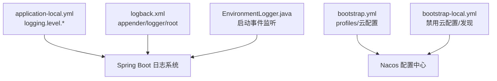
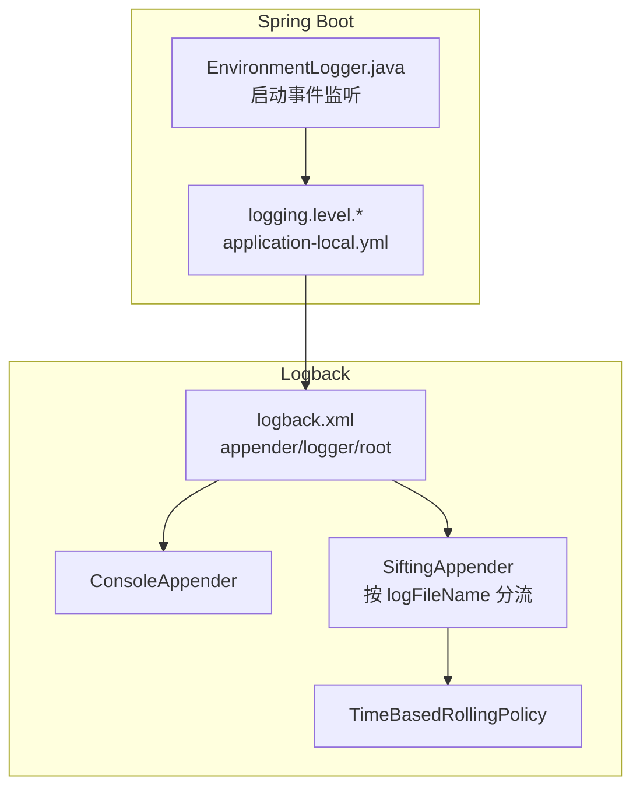
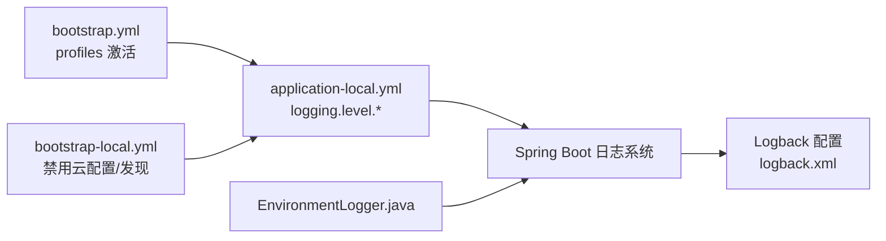

# 日志配置

<cite>
**本文引用的文件**
- [logback.xml](file://src/main/resources/logback.xml)
- [application-local.yml](file://src/main/resources/application-local.yml)
- [bootstrap.yml](file://src/main/resources/bootstrap.yml)
- [bootstrap-local.yml](file://src/main/resources/bootstrap-local.yml)
- [EnvironmentLogger.java](file://src/main/java/cn/staitech/fr/config/EnvironmentLogger.java)
</cite>

## 目录
1. [简介](#简介)
2. [项目结构](#项目结构)
3. [核心组件](#核心组件)
4. [架构总览](#架构总览)
5. [详细组件分析](#详细组件分析)
6. [依赖关系分析](#依赖关系分析)
7. [性能考虑](#性能考虑)
8. [故障排查指南](#故障排查指南)
9. [结论](#结论)
10. [附录](#附录)

## 简介
本文件面向开发与运维人员，系统性解析本项目的日志体系，重点覆盖以下内容：
- Logback 配置文件结构与输出目标
- 日志输出格式与字段含义
- 日志文件路径与轮转策略
- 不同包级别的日志级别设置（DEBUG、INFO、WARN、ERROR）
- application-local.yml 中 logging 的作用与生效范围
- 日志性能优化建议、日志分析方法与常见问题排查

## 项目结构
与日志相关的关键文件位于 resources 目录：
- logback.xml：Logback 核心配置，定义 appender、logger 和 root
- application-local.yml：本地环境下的 Spring Boot 配置，包含 logging.level
- bootstrap.yml / bootstrap-local.yml：Spring Cloud Nacos 集成与环境激活
- EnvironmentLogger.java：应用启动后打印属性来源，辅助定位日志配置来源

图表来源
- [application-local.yml:90-98](file://src/main/resources/application-local.yml#L90-L98)
- [logback.xml:2](file://src/main/resources/logback.xml#L2)
- [bootstrap.yml:20-22](file://src/main/resources/bootstrap.yml#L20-L22)
- [bootstrap-local.yml:1-9](file://src/main/resources/bootstrap-local.yml#L1-L9)
- [EnvironmentLogger.java:17-24](file://src/main/java/cn/staitech/fr/config/EnvironmentLogger.java#L17-L24)

章节来源
- [application-local.yml:90-98](file://src/main/resources/application-local.yml#L90-L98)
- [logback.xml:2-102](file://src/main/resources/logback.xml#L2-L102)
- [bootstrap.yml:20-22](file://src/main/resources/bootstrap.yml#L20-L22)
- [bootstrap-local.yml:1-9](file://src/main/resources/bootstrap-local.yml#L1-L9)
- [EnvironmentLogger.java:17-24](file://src/main/java/cn/staitech/fr/config/EnvironmentLogger.java#L17-L24)

## 核心组件
- Logback 配置文件（logback.xml）
  - 定义日志路径与输出格式
  - 控制台输出与按代码分类的滚动文件输出
  - 针对特定包的 logger 级别
  - root 级别与 appender 绑定
- Spring Boot 配置（application-local.yml）
  - logging.level 下的包级日志级别
  - 与 Spring Boot 日志系统协同工作
- 启动期环境信息输出（EnvironmentLogger.java）
  - 应用启动后打印属性来源，辅助定位日志配置来源

章节来源
- [logback.xml:2-102](file://src/main/resources/logback.xml#L2-L102)
- [application-local.yml:90-98](file://src/main/resources/application-local.yml#L90-L98)
- [EnvironmentLogger.java:17-24](file://src/main/java/cn/staitech/fr/config/EnvironmentLogger.java#L17-L24)

## 架构总览
下图展示日志配置在运行时的交互关系：Spring Boot 的 logging.level 与 Logback 的 logger 层级共同决定最终输出；Logback 的 root 绑定 appender 决定输出到控制台或文件。

图表来源
- [application-local.yml:90-98](file://src/main/resources/application-local.yml#L90-L98)
- [logback.xml:8-13](file://src/main/resources/logback.xml#L8-L13)
- [logback.xml:59-83](file://src/main/resources/logback.xml#L59-L83)
- [logback.xml:71-77](file://src/main/resources/logback.xml#L71-L77)
- [EnvironmentLogger.java:17-24](file://src/main/java/cn/staitech/fr/config/EnvironmentLogger.java#L17-L24)

## 详细组件分析

### Logback 配置文件结构与输出目标
- 日志路径与输出格式
  - 日志目录：通过属性统一管理
  - 输出格式包含时间戳、线程名、链路追踪字段、级别、logger 名称、方法行号、消息等
- 控制台输出
  - ConsoleAppender 使用统一 pattern
- 按代码分类的滚动文件输出
  - SiftingAppender 根据 discriminator 键（如 logFileName）分流到不同子目录
  - 每个分组独立使用 RollingFileAppender + TimeBasedRollingPolicy
- root 级别与绑定
  - root 级别为 info，并同时绑定 console 与 filebycode（即按代码分流的文件输出）

章节来源
- [logback.xml:4-6](file://src/main/resources/logback.xml#L4-L6)
- [logback.xml:8-13](file://src/main/resources/logback.xml#L8-L13)
- [logback.xml:59-83](file://src/main/resources/logback.xml#L59-L83)
- [logback.xml:98-101](file://src/main/resources/logback.xml#L98-L101)

### 日志输出格式与字段说明
- 时间戳：精确到毫秒
- 线程名：便于多线程定位
- 链路追踪字段：traceId、trace_id，用于跨服务链路关联
- 日志级别：%-5level
- Logger 名称：logger{20} 限制长度
- 方法与行号：[%method,%line]
- 消息正文：%msg
- 换行符：%n

章节来源
- [logback.xml:6](file://src/main/resources/logback.xml#L6)

### 日志文件路径与轮转策略
- 文件路径
  - 统一前缀：logs/staitech-fr
  - 控制台输出：无文件输出
  - 按代码分流：${log.path}/${logFileName}/${logFileName}.info.log
- 轮转策略
  - 基于时间的滚动：TimeBasedRollingPolicy
  - 文件名模式：以日期结尾
  - 历史保留：
    - 系统日志（示例）：60 天
    - 启动分流日志：7 天
- 过滤器
  - LevelFilter：仅允许指定级别（例如 ERROR）进入对应文件

章节来源
- [logback.xml:4](file://src/main/resources/logback.xml#L4)
- [logback.xml:19-24](file://src/main/resources/logback.xml#L19-L24)
- [logback.xml:41-46](file://src/main/resources/logback.xml#L41-L46)
- [logback.xml:72-77](file://src/main/resources/logback.xml#L72-L77)
- [logback.xml:28-36](file://src/main/resources/logback.xml#L28-L36)
- [logback.xml:50-58](file://src/main/resources/logback.xml#L50-L58)

### 包级别的日志级别设置
- 自定义业务包（cn.staitech）：debug
- Mapper/Service 示例：info
- Spring 框架：info
- Nacos 客户端：debug
- 动态数据源：info
- 以上设置由 logback.xml 的多个 logger 节点完成

章节来源
- [logback.xml:85-96](file://src/main/resources/logback.xml#L85-L96)

### application-local.yml 中 logging 的作用
- logging.level.*：在 Spring Boot 层面为包设置日志级别
- 在本项目中，application-local.yml 明确设置了若干包的级别（如 DEBUG、TRACE 等）
- Spring Boot 的 logging.level 与 Logback 的 logger 层级共同生效，最终以两者中“更严格”的级别为准（更低的级别被提升）

章节来源
- [application-local.yml:90-98](file://src/main/resources/application-local.yml#L90-L98)

### 启动期环境信息输出与定位
- EnvironmentLogger.java 在应用就绪事件触发时打印所有 PropertySource，有助于确认：
  - 是否正确加载了 application-local.yml
  - 是否受 Nacos 配置覆盖
  - 日志相关配置是否按预期生效

章节来源
- [EnvironmentLogger.java:17-24](file://src/main/java/cn/staitech/fr/config/EnvironmentLogger.java#L17-L24)

## 依赖关系分析
- Spring Boot 与 Logback 的协作
  - Spring Boot 提供 logging.level.* 配置入口
  - Logback 作为底层实现，负责具体输出与轮转
- 配置来源与优先级
  - bootstrap.yml 激活 profiles（如 local）
  - bootstrap-local.yml 可禁用 Nacos 发现与配置
  - application-local.yml 提供本地覆盖
  - EnvironmentLogger.java 辅助验证属性来源

图表来源
- [bootstrap.yml:20-22](file://src/main/resources/bootstrap.yml#L20-L22)
- [bootstrap-local.yml:1-9](file://src/main/resources/bootstrap-local.yml#L1-L9)
- [application-local.yml:90-98](file://src/main/resources/application-local.yml#L90-L98)
- [logback.xml:2-102](file://src/main/resources/logback.xml#L2-L102)
- [EnvironmentLogger.java:17-24](file://src/main/java/cn/staitech/fr/config/EnvironmentLogger.java#L17-L24)

章节来源
- [bootstrap.yml:20-22](file://src/main/resources/bootstrap.yml#L20-L22)
- [bootstrap-local.yml:1-9](file://src/main/resources/bootstrap-local.yml#L1-L9)
- [application-local.yml:90-98](file://src/main/resources/application-local.yml#L90-L98)
- [logback.xml:2-102](file://src/main/resources/logback.xml#L2-L102)
- [EnvironmentLogger.java:17-24](file://src/main/java/cn/staitech/fr/config/EnvironmentLogger.java#L17-L24)

## 性能考虑
- 输出格式与字段
  - 包含 traceId、trace_id、方法行号等字段会增加序列化开销，建议在生产环境根据需要裁剪
- 轮转策略
  - TimeBasedRollingPolicy 依赖磁盘 IO，建议合理设置 maxHistory 与文件大小上限（如需可引入 SizeAndTimeBasedRollingPolicy）
- 控制台输出
  - 控制台输出通常较慢，生产环境建议减少 INFO 级别控制台输出，将高频日志导向文件
- 级别过滤
  - 对高频包使用较高级别（如 info/warn），避免 debug/trace 造成性能损耗
- 异步输出
  - 可引入异步 appender（如 AsyncAppender）降低阻塞，但需注意队列容量与丢弃策略

## 故障排查指南
- 现象：日志未按预期输出到文件
  - 检查 root 是否绑定了 filebycode 或其他文件 appender
  - 检查 log.path 是否存在写权限
  - 检查 SiftingAppender 的 discriminator 键是否正确传递
- 现象：某包日志级别不符合预期
  - 检查 logback.xml 中该包的 logger 级别
  - 检查 application-local.yml 中 logging.level.* 是否覆盖
  - 使用 EnvironmentLogger.java 验证属性来源
- 现象：链路追踪字段为空
  - 确认上游是否正确注入 traceId/trace_id
  - 检查输出格式中是否包含相应占位符
- 现象：日志文件未轮转
  - 检查 TimeBasedRollingPolicy 的 fileNamePattern 与 maxHistory
  - 检查系统时间与时区设置
- 现象：启动阶段日志过多
  - 适当提高根级别（如 info），或临时降低特定包（如 ConfigDataEnvironment、ConfigFileApplicationListener）级别

章节来源
- [logback.xml:98-101](file://src/main/resources/logback.xml#L98-L101)
- [logback.xml:59-83](file://src/main/resources/logback.xml#L59-L83)
- [logback.xml:71-77](file://src/main/resources/logback.xml#L71-L77)
- [application-local.yml:90-98](file://src/main/resources/application-local.yml#L90-L98)
- [EnvironmentLogger.java:17-24](file://src/main/java/cn/staitech/fr/config/EnvironmentLogger.java#L17-L24)

## 结论
本项目的日志体系采用 Spring Boot + Logback 的组合：application-local.yml 提供灵活的包级日志级别配置，logback.xml 提供统一的输出格式、文件路径与轮转策略，并通过 SiftingAppender 实现按代码分类的精细化输出。结合 EnvironmentLogger.java，可在启动阶段快速定位配置来源，提升排障效率。生产环境中建议进一步优化输出格式、轮转策略与异步输出，以平衡可观测性与性能。

## 附录

### 关键配置要点速览
- 日志路径与格式：见 [logback.xml:4-6](file://src/main/resources/logback.xml#L4-L6)
- 控制台输出：见 [logback.xml:8-13](file://src/main/resources/logback.xml#L8-L13)
- 按代码分流输出：见 [logback.xml:59-83](file://src/main/resources/logback.xml#L59-L83)
- 轮转策略：见 [logback.xml:71-77](file://src/main/resources/logback.xml#L71-L77)
- 包级日志级别（Logback）：见 [logback.xml:85-96](file://src/main/resources/logback.xml#L85-L96)
- 包级日志级别（Spring Boot）：见 [application-local.yml:90-98](file://src/main/resources/application-local.yml#L90-L98)
- 环境来源验证：见 [EnvironmentLogger.java:17-24](file://src/main/java/cn/staitech/fr/config/EnvironmentLogger.java#L17-L24)