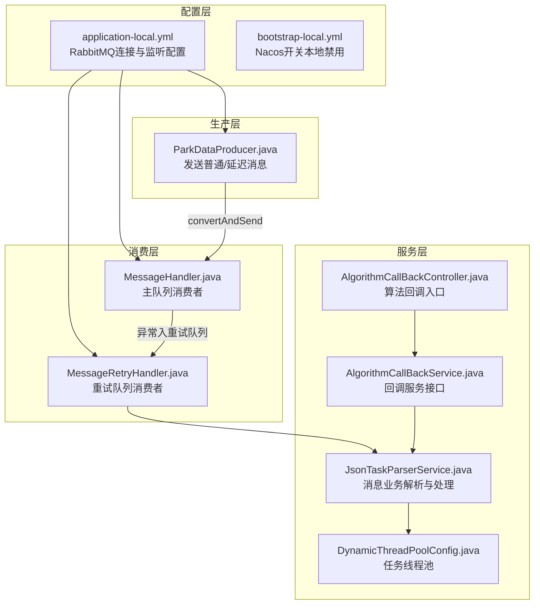
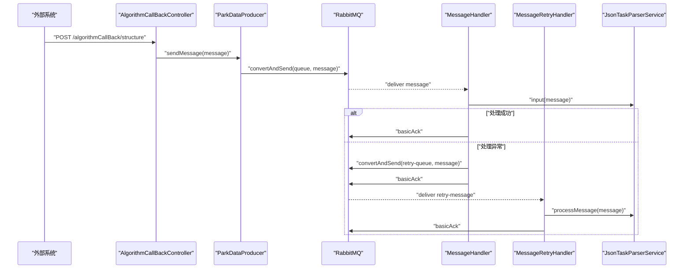
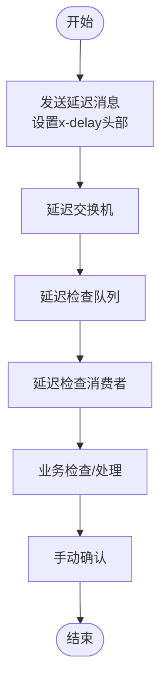
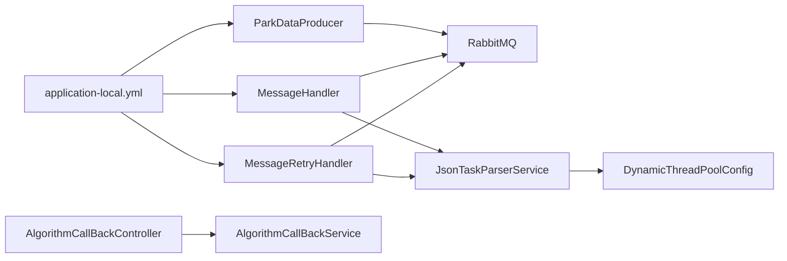

# 消息队列配置

<cite>
**本文引用的文件**
- [application-local.yml](file://src/main/resources/application-local.yml)
- [bootstrap-local.yml](file://src/main/resources/bootstrap-local.yml)
- [MessageHandler.java](file://src/main/java/cn/staitech/fr/config/MessageHandler.java)
- [MessageRetryHandler.java](file://src/main/java/cn/staitech/fr/config/MessageRetryHandler.java)
- [ParkDataProducer.java](file://src/main/java/cn/staitech/fr/config/ParkDataProducer.java)
- [AlgorithmCallBackController.java](file://src/main/java/cn/staitech/fr/controller/AlgorithmCallBackController.java)
- [AlgorithmCallBackService.java](file://src/main/java/cn/staitech/fr/service/AlgorithmCallBackService.java)
- [JsonTaskParserService.java](file://src/main/java/cn/staitech/fr/service/strategy/json/JsonTaskParserService.java)
- [DynamicThreadPoolConfig.java](file://src/main/java/cn/staitech/fr/config/DynamicThreadPoolConfig.java)
</cite>

## 目录
1. [简介](#简介)
2. [项目结构](#项目结构)
3. [核心组件](#核心组件)
4. [架构总览](#架构总览)
5. [组件详细分析](#组件详细分析)
6. [依赖关系分析](#依赖关系分析)
7. [性能考量](#性能考量)
8. [故障排查指南](#故障排查指南)
9. [结论](#结论)
10. [附录](#附录)

## 简介
本文件面向消息队列与RabbitMQ配置的深入解读，覆盖以下主题：
- RabbitMQ连接配置（主机、端口、虚拟主机、用户名密码）
- 消息确认机制（publisher-returns、publisher-confirm-type）
- 消费者配置（simple、direct模式）
- 消息重试配置（最大重试次数、重试间隔）
- AI算法回调与异步任务处理中的消息队列应用
- 消息队列监控与故障排查

## 项目结构
本项目的消息队列相关能力由配置文件与若干核心组件协同实现：
- 配置层：通过Spring Boot配置文件定义RabbitMQ连接与监听参数
- 生产层：生产者组件负责向队列发送消息与延迟消息
- 消费层：消费者组件负责接收消息、业务处理、手动确认、异常重试
- 服务层：业务解析服务承接消息内容，执行结构化处理与指标计算

图表来源
- [application-local.yml:57-75](file://src/main/resources/application-local.yml#L57-L75)
- [ParkDataProducer.java:21-44](file://src/main/java/cn/staitech/fr/config/ParkDataProducer.java#L21-L44)
- [MessageHandler.java:43-75](file://src/main/java/cn/staitech/fr/config/MessageHandler.java#L43-L75)
- [MessageRetryHandler.java:25-42](file://src/main/java/cn/staitech/fr/config/MessageRetryHandler.java#L25-L42)
- [AlgorithmCallBackController.java:76-79](file://src/main/java/cn/staitech/fr/controller/AlgorithmCallBackController.java#L76-L79)
- [JsonTaskParserService.java:174-263](file://src/main/java/cn/staitech/fr/service/strategy/json/JsonTaskParserService.java#L174-L263)
- [DynamicThreadPoolConfig.java:14-51](file://src/main/java/cn/staitech/fr/config/DynamicThreadPoolConfig.java#L14-L51)

章节来源
- [application-local.yml:57-75](file://src/main/resources/application-local.yml#L57-L75)
- [bootstrap-local.yml:1-9](file://src/main/resources/bootstrap-local.yml#L1-L9)

## 核心组件
- RabbitMQ连接与监听配置
  - 连接参数：host、port、username、password、virtual-host
  - 发布确认：publisher-returns、publisher-confirm-type
  - 消费者：simple与direct模式，手动确认，重试策略
- 生产者：ParkDataProducer，支持普通消息与延迟消息发送
- 消费者：MessageHandler，负责主队列消息处理、异常入重试队列、手动确认
- 重试消费者：MessageRetryHandler，负责重试队列消息处理
- 回调入口：AlgorithmCallBackController，接收外部回调并转发给服务层
- 业务解析：JsonTaskParserService，解析消息、校验、结构化处理、指标计算
- 线程池：DynamicThreadPoolConfig，为复杂任务提供线程池支撑

章节来源
- [application-local.yml:57-75](file://src/main/resources/application-local.yml#L57-L75)
- [ParkDataProducer.java:27-44](file://src/main/java/cn/staitech/fr/config/ParkDataProducer.java#L27-L44)
- [MessageHandler.java:43-75](file://src/main/java/cn/staitech/fr/config/MessageHandler.java#L43-L75)
- [MessageRetryHandler.java:25-42](file://src/main/java/cn/staitech/fr/config/MessageRetryHandler.java#L25-L42)
- [AlgorithmCallBackController.java:76-79](file://src/main/java/cn/staitech/fr/controller/AlgorithmCallBackController.java#L76-L79)
- [JsonTaskParserService.java:174-263](file://src/main/java/cn/staitech/fr/service/strategy/json/JsonTaskParserService.java#L174-L263)
- [DynamicThreadPoolConfig.java:14-51](file://src/main/java/cn/staitech/fr/config/DynamicThreadPoolConfig.java#L14-L51)

## 架构总览
消息从外部回调进入，经生产者投递到RabbitMQ，消费者拉取消息后交由业务解析服务处理。异常时消息进入重试队列，由重试消费者再次尝试处理。延迟消息通过延迟交换机与路由键投递至延迟检查队列，由专门消费者定期检查并触发业务逻辑。

图表来源
- [AlgorithmCallBackController.java:76-79](file://src/main/java/cn/staitech/fr/controller/AlgorithmCallBackController.java#L76-L79)
- [ParkDataProducer.java:27-36](file://src/main/java/cn/staitech/fr/config/ParkDataProducer.java#L27-L36)
- [MessageHandler.java:43-75](file://src/main/java/cn/staitech/fr/config/MessageHandler.java#L43-L75)
- [MessageRetryHandler.java:25-42](file://src/main/java/cn/staitech/fr/config/MessageRetryHandler.java#L25-L42)
- [JsonTaskParserService.java:174-263](file://src/main/java/cn/staitech/fr/service/strategy/json/JsonTaskParserService.java#L174-L263)

## 组件详细分析

### RabbitMQ连接与监听配置
- 连接参数
  - 主机与端口：用于建立与RabbitMQ的TCP连接
  - 虚拟主机：隔离不同环境或租户的资源
  - 用户名与密码：认证凭据
- 发布确认
  - publisher-returns：开启消息返回，便于捕获不可路由消息
  - publisher-confirm-type：correlated，启用相关性确认，可按消息粒度确认发布成功
- 消费者配置
  - simple模式：manual确认，default-requeue-rejected=false，避免重复投递导致的无限循环
  - direct模式：manual确认，配合路由键精确投递
  - retry.enabled：开启重试
  - max-attempts：最大重试次数
  - initial-interval：初始重试间隔

章节来源
- [application-local.yml:57-75](file://src/main/resources/application-local.yml#L57-L75)

### 生产者：ParkDataProducer
- 功能
  - 普通消息发送：convertAndSend(queue, message)
  - 延迟消息发送：通过延迟交换机与路由键，设置x-delay头部
- 关键点
  - 队列名称来自配置项
  - 延迟时间以毫秒为单位

章节来源
- [ParkDataProducer.java:21-44](file://src/main/java/cn/staitech/fr/config/ParkDataProducer.java#L21-L44)

### 消费者：MessageHandler
- 功能
  - 监听主队列消息，解析并调用业务解析服务
  - 成功处理后手动确认消息
  - 异常时将消息发送至重试队列并确认原消息
  - 若发送重试失败，则拒绝原消息并重新入队
- 关键点
  - 使用Channel进行手动确认
  - 重试队列名称来自配置项
  - 延迟检查队列的消息同样采用手动确认

章节来源
- [MessageHandler.java:43-75](file://src/main/java/cn/staitech/fr/config/MessageHandler.java#L43-L75)
- [MessageHandler.java:102-127](file://src/main/java/cn/staitech/fr/config/MessageHandler.java#L102-L127)

### 重试消费者：MessageRetryHandler
- 功能
  - 接收重试队列消息，调用业务解析服务进行重试处理
  - 记录异常日志，不进行二次重试（由RabbitMQ重试机制控制）

章节来源
- [MessageRetryHandler.java:25-42](file://src/main/java/cn/staitech/fr/config/MessageRetryHandler.java#L25-L42)

### 回调入口：AlgorithmCallBackController
- 功能
  - 接收外部算法回调请求，记录日志并调用AlgorithmCallBackService
  - 返回统一响应

章节来源
- [AlgorithmCallBackController.java:76-79](file://src/main/java/cn/staitech/fr/controller/AlgorithmCallBackController.java#L76-L79)

### 业务解析：JsonTaskParserService
- 功能
  - 解析消息内容，构建任务并写入数据库
  - 校验脏器结构完整性，必要时异步执行结构化处理与指标计算
  - 通过线程池执行耗时任务，保证主线程快速返回
- 关键点
  - 输入方法input负责消息解析与任务创建
  - 结构化处理与指标计算在独立线程池中执行
  - 异常封装为业务异常，便于上层处理

章节来源
- [JsonTaskParserService.java:174-263](file://src/main/java/cn/staitech/fr/service/strategy/json/JsonTaskParserService.java#L174-L263)
- [JsonTaskParserService.java:265-286](file://src/main/java/cn/staitech/fr/service/strategy/json/JsonTaskParserService.java#L265-L286)

### 线程池：DynamicThreadPoolConfig
- 功能
  - 提供可监控的线程池，用于执行结构化与指标计算等耗时任务
  - 输出线程池提交、开始、完成阶段的日志，便于性能观测

章节来源
- [DynamicThreadPoolConfig.java:14-51](file://src/main/java/cn/staitech/fr/config/DynamicThreadPoolConfig.java#L14-L51)

### 延迟消息流程

图表来源
- [ParkDataProducer.java:38-44](file://src/main/java/cn/staitech/fr/config/ParkDataProducer.java#L38-L44)
- [MessageHandler.java:102-127](file://src/main/java/cn/staitech/fr/config/MessageHandler.java#L102-L127)

## 依赖关系分析
- 配置文件驱动：application-local.yml集中定义RabbitMQ连接、发布确认与消费者重试策略
- 控制器依赖服务：AlgorithmCallBackController依赖AlgorithmCallBackService与多个业务服务
- 生产者依赖模板：ParkDataProducer依赖RabbitTemplate进行消息发送
- 消费者依赖服务：MessageHandler与MessageRetryHandler依赖RabbitTemplate与JsonTaskParserService
- 业务解析依赖线程池：JsonTaskParserService依赖DynamicThreadPoolConfig提供的线程池

图表来源
- [application-local.yml:57-75](file://src/main/resources/application-local.yml#L57-L75)
- [ParkDataProducer.java:21-44](file://src/main/java/cn/staitech/fr/config/ParkDataProducer.java#L21-L44)
- [MessageHandler.java:43-75](file://src/main/java/cn/staitech/fr/config/MessageHandler.java#L43-L75)
- [MessageRetryHandler.java:25-42](file://src/main/java/cn/staitech/fr/config/MessageRetryHandler.java#L25-L42)
- [AlgorithmCallBackController.java:76-79](file://src/main/java/cn/staitech/fr/controller/AlgorithmCallBackController.java#L76-L79)
- [JsonTaskParserService.java:174-263](file://src/main/java/cn/staitech/fr/service/strategy/json/JsonTaskParserService.java#L174-L263)
- [DynamicThreadPoolConfig.java:14-51](file://src/main/java/cn/staitech/fr/config/DynamicThreadPoolConfig.java#L14-L51)

## 性能考量
- 消费者确认模式
  - manual确认确保消息处理的可靠性，避免重复消费
  - default-requeue-rejected=false降低重试风暴风险
- 重试策略
  - max-attempts限制最大重试次数，防止无限循环
  - initial-interval设置合理的初始重试间隔，避免瞬时拥塞
- 线程池
  - 动态线程池提供任务监控与限流保护，建议结合业务峰值评估核心与最大线程数
- 日志与监控
  - application-local.yml中对RabbitTemplate与相关包开启DEBUG级别日志，便于问题定位
  - management.endpoint.env.enabled与management.endpoints.web.exposure.include暴露运行时环境与健康信息

章节来源
- [application-local.yml:65-75](file://src/main/resources/application-local.yml#L65-L75)
- [application-local.yml:90-106](file://src/main/resources/application-local.yml#L90-L106)
- [DynamicThreadPoolConfig.java:14-51](file://src/main/java/cn/staitech/fr/config/DynamicThreadPoolConfig.java#L14-L51)

## 故障排查指南
- 发布失败或不可路由
  - 检查publisher-returns与publisher-confirm-type配置
  - 查看RabbitTemplate相关日志，定位消息返回原因
- 消费异常未确认
  - 确认消费者是否使用manual确认
  - 检查basicAck/basicNack调用是否正确
- 重试队列堆积
  - 核对max-attempts与initial-interval配置
  - 检查MessageRetryHandler处理逻辑与业务异常类型
- 延迟消息未到达
  - 确认延迟交换机与路由键配置
  - 检查x-delay头部设置与延迟队列绑定
- 线程池阻塞
  - 关注DynamicThreadPoolConfig输出的日志，观察队列长度与活跃线程数
  - 调整线程池参数以适配业务负载

章节来源
- [application-local.yml:63-64](file://src/main/resources/application-local.yml#L63-L64)
- [application-local.yml:96](file://src/main/resources/application-local.yml#L96)
- [MessageHandler.java:54-71](file://src/main/java/cn/staitech/fr/config/MessageHandler.java#L54-L71)
- [MessageRetryHandler.java:34-42](file://src/main/java/cn/staitech/fr/config/MessageRetryHandler.java#L34-L42)
- [ParkDataProducer.java:38-44](file://src/main/java/cn/staitech/fr/config/ParkDataProducer.java#L38-L44)
- [DynamicThreadPoolConfig.java:31-45](file://src/main/java/cn/staitech/fr/config/DynamicThreadPoolConfig.java#L31-L45)

## 结论
本项目通过明确的RabbitMQ配置与消费者重试策略，结合生产者与消费者的职责划分，实现了AI算法回调与异步任务处理的可靠消息传递。配合线程池与可观测日志，能够在高并发场景下保持稳定与可维护性。建议在生产环境中进一步完善监控指标与告警策略，并根据实际负载动态调整重试参数与线程池规模。

## 附录
- 配置项速览
  - RabbitMQ连接：host、port、username、password、virtual-host
  - 发布确认：publisher-returns、publisher-confirm-type
  - 消费者：simple与direct模式，manual确认，default-requeue-rejected=false
  - 重试：retry.enabled、max-attempts、initial-interval
  - 延迟消息：延迟交换机、路由键、x-delay头部
- 相关文件路径
  - [application-local.yml](file://src/main/resources/application-local.yml)
  - [bootstrap-local.yml](file://src/main/resources/bootstrap-local.yml)
  - [MessageHandler.java](file://src/main/java/cn/staitech/fr/config/MessageHandler.java)
  - [MessageRetryHandler.java](file://src/main/java/cn/staitech/fr/config/MessageRetryHandler.java)
  - [ParkDataProducer.java](file://src/main/java/cn/staitech/fr/config/ParkDataProducer.java)
  - [AlgorithmCallBackController.java](file://src/main/java/cn/staitech/fr/controller/AlgorithmCallBackController.java)
  - [AlgorithmCallBackService.java](file://src/main/java/cn/staitech/fr/service/AlgorithmCallBackService.java)
  - [JsonTaskParserService.java](file://src/main/java/cn/staitech/fr/service/strategy/json/JsonTaskParserService.java)
  - [DynamicThreadPoolConfig.java](file://src/main/java/cn/staitech/fr/config/DynamicThreadPoolConfig.java)