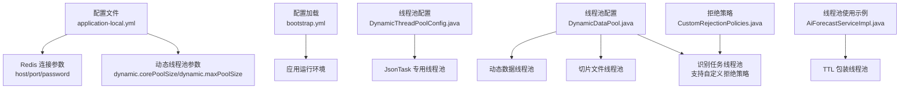
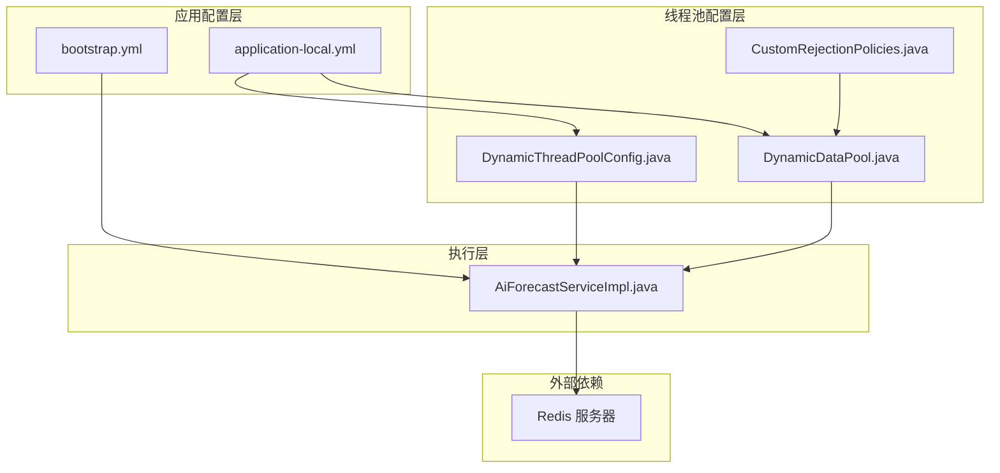
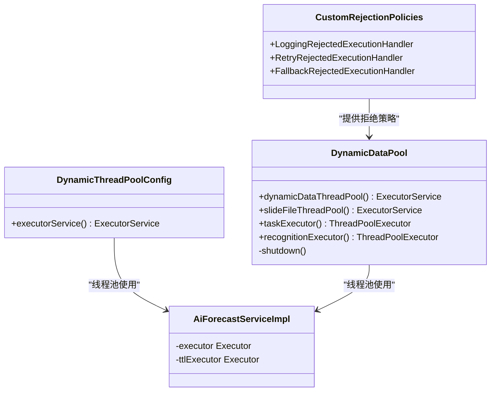
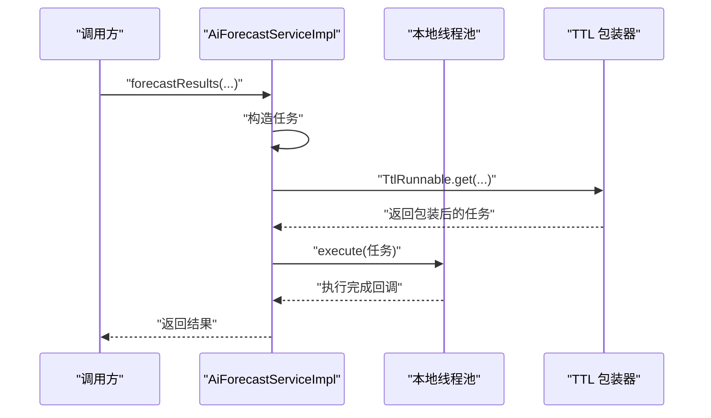
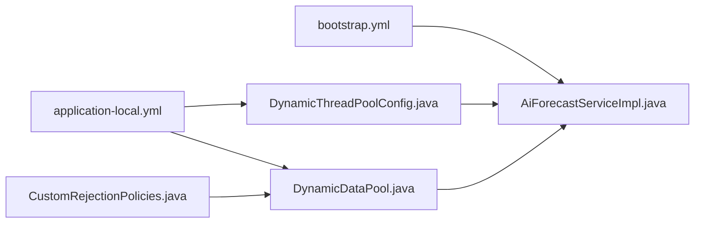

# 缓存配置

<cite>
**本文引用的文件**
- [application-local.yml](file://src/main/resources/application-local.yml)
- [bootstrap.yml](file://src/main/resources/bootstrap.yml)
- [DynamicThreadPoolConfig.java](file://src/main/java/cn/staitech/fr/config/DynamicThreadPoolConfig.java)
- [DynamicDataPool.java](file://src/main/java/cn/staitech/fr/config/DynamicDataPool.java)
- [CustomRejectionPolicies.java](file://src/main/java/cn/staitech/fr/config/CustomRejectionPolicies.java)
- [AiForecastServiceImpl.java](file://src/main/java/cn/staitech/fr/service/impl/AiForecastServiceImpl.java)
</cite>

## 目录
1. [简介](#简介)
2. [项目结构](#项目结构)
3. [核心组件](#核心组件)
4. [架构总览](#架构总览)
5. [详细组件分析](#详细组件分析)
6. [依赖分析](#依赖分析)
7. [性能考虑](#性能考虑)
8. [故障排除指南](#故障排除指南)
9. [结论](#结论)
10. [附录](#附录)

## 简介
本文件聚焦于系统的缓存配置与动态线程池配置，目标是帮助读者理解：
- Redis 缓存连接与序列化配置要点（基于现有配置文件）
- 动态线程池参数与调优策略（核心线程数、最大线程数、队列长度、拒绝策略）
- 缓存性能监控与常见问题（穿透、雪崩）的排查思路与应对建议

说明：仓库中未发现显式的 Redis 缓存配置类或序列化配置代码片段；本文依据现有配置文件进行解读，并结合线程池配置给出可落地的优化建议与排障路径。

## 项目结构
与缓存与线程池相关的关键位置如下：
- 配置文件：application-local.yml（包含 Redis 连接与动态线程池参数）、bootstrap.yml（应用基础环境）
- 线程池配置：DynamicThreadPoolConfig.java、DynamicDataPool.java、CustomRejectionPolicies.java
- 线程池使用示例：AiForecastServiceImpl.java（演示线程池包装与使用）

图表来源
- [application-local.yml:11-14](file://src/main/resources/application-local.yml#L11-L14)
- [application-local.yml:309-311](file://src/main/resources/application-local.yml#L309-L311)
- [bootstrap.yml:1-48](file://src/main/resources/bootstrap.yml#L1-L48)
- [DynamicThreadPoolConfig.java:13-51](file://src/main/java/cn/staitech/fr/config/DynamicThreadPoolConfig.java#L13-L51)
- [DynamicDataPool.java:29-64](file://src/main/java/cn/staitech/fr/config/DynamicDataPool.java#L29-L64)
- [DynamicDataPool.java:177-229](file://src/main/java/cn/staitech/fr/config/DynamicDataPool.java#L177-L229)
- [CustomRejectionPolicies.java:18-102](file://src/main/java/cn/staitech/fr/config/CustomRejectionPolicies.java#L18-L102)
- [AiForecastServiceImpl.java:54-57](file://src/main/java/cn/staitech/fr/service/impl/AiForecastServiceImpl.java#L54-L57)

章节来源
- [application-local.yml:1-311](file://src/main/resources/application-local.yml#L1-L311)
- [bootstrap.yml:1-48](file://src/main/resources/bootstrap.yml#L1-L48)
- [DynamicThreadPoolConfig.java:1-53](file://src/main/java/cn/staitech/fr/config/DynamicThreadPoolConfig.java#L1-L53)
- [DynamicDataPool.java:1-231](file://src/main/java/cn/staitech/fr/config/DynamicDataPool.java#L1-L231)
- [CustomRejectionPolicies.java:1-102](file://src/main/java/cn/staitech/fr/config/CustomRejectionPolicies.java#L1-L102)
- [AiForecastServiceImpl.java:1-372](file://src/main/java/cn/staitech/fr/service/impl/AiForecastServiceImpl.java#L1-L372)

## 核心组件
- Redis 连接配置（来自 application-local.yml）
  - 主机与端口：host、port
  - 认证：password
  - 数据库选择：未在该文件中出现（通常通过客户端配置或连接串参数指定）
- 线程池配置
  - JsonTask 专用线程池：核心线程数、最大线程数、队列长度、拒绝策略、线程命名与监控日志
  - 动态数据线程池：支持从配置注入核心/最大线程数，具备关闭钩子与自定义拒绝策略
  - 识别任务线程池：按 CPU 倍数动态计算核心/最大线程数，支持兜底校验与自定义拒绝策略
  - 自定义拒绝策略：记录日志、等待重试、降级执行等

章节来源
- [application-local.yml:11-14](file://src/main/resources/application-local.yml#L11-L14)
- [application-local.yml:309-311](file://src/main/resources/application-local.yml#L309-L311)
- [DynamicThreadPoolConfig.java:13-51](file://src/main/java/cn/staitech/fr/config/DynamicThreadPoolConfig.java#L13-L51)
- [DynamicDataPool.java:29-64](file://src/main/java/cn/staitech/fr/config/DynamicDataPool.java#L29-L64)
- [DynamicDataPool.java:177-229](file://src/main/java/cn/staitech/fr/config/DynamicDataPool.java#L177-L229)
- [CustomRejectionPolicies.java:18-102](file://src/main/java/cn/staitech/fr/config/CustomRejectionPolicies.java#L18-L102)

## 架构总览
系统在“应用配置层”与“执行层”之间通过线程池解耦，提升吞吐与稳定性；Redis 作为外部缓存存储，连接参数由配置文件提供。

图表来源
- [application-local.yml:1-311](file://src/main/resources/application-local.yml#L1-L311)
- [bootstrap.yml:1-48](file://src/main/resources/bootstrap.yml#L1-L48)
- [DynamicThreadPoolConfig.java:1-53](file://src/main/java/cn/staitech/fr/config/DynamicThreadPoolConfig.java#L1-L53)
- [DynamicDataPool.java:1-231](file://src/main/java/cn/staitech/fr/config/DynamicDataPool.java#L1-L231)
- [CustomRejectionPolicies.java:1-102](file://src/main/java/cn/staitech/fr/config/CustomRejectionPolicies.java#L1-L102)
- [AiForecastServiceImpl.java:1-372](file://src/main/java/cn/staitech/fr/service/impl/AiForecastServiceImpl.java#L1-L372)

## 详细组件分析

### Redis 连接与序列化配置
- 连接参数
  - 主机与端口：在 application-local.yml 的 spring.redis 节点下定义
  - 认证：通过 password 字段配置
  - 数据库选择：当前配置文件未体现数据库索引字段；如需选择数据库，请在客户端或连接串中补充
- 序列化配置
  - 当前仓库未提供显式序列化配置代码；请在 Redis 客户端配置中明确键值序列化策略（如 JSON、JDK、String 等），并确保与业务读写一致

章节来源
- [application-local.yml:11-14](file://src/main/resources/application-local.yml#L11-L14)

### 动态线程池配置（核心线程数、最大线程数、队列长度、拒绝策略）
- JsonTask 专用线程池
  - 参数：核心线程数、最大线程数、空闲存活时间、有界队列长度、自定义线程命名、CallerRunsPolicy 拒绝策略
  - 监控：在 execute/beforeExecute/afterExecute 中输出队列长度、线程池规模与活跃线程数，便于运行期观测
- 动态数据线程池
  - 参数：核心/最大线程数可由配置注入；队列容量固定；提供优雅关闭流程
  - 拒绝策略：默认 CallerRunsPolicy；可扩展自定义策略
- 识别任务线程池
  - 参数：核心/最大线程数按 CPU 倍数动态计算，支持兜底校验（若配置值过小则回退到默认值）
  - 队列：无界队列；拒绝策略为自定义实现，记录详细日志并抛出异常，便于上层感知失败并处理同步计数
- 自定义拒绝策略
  - 记录日志的拒绝策略：统一记录池大小、活跃线程、队列状态与已完成任务数
  - 等待重试的拒绝策略：在限定时间内尝试将任务重新入队，超时后执行降级
  - 降级策略处理器：对实现了特定接口的任务执行降级逻辑

图表来源
- [DynamicThreadPoolConfig.java:13-51](file://src/main/java/cn/staitech/fr/config/DynamicThreadPoolConfig.java#L13-L51)
- [DynamicDataPool.java:29-64](file://src/main/java/cn/staitech/fr/config/DynamicDataPool.java#L29-L64)
- [DynamicDataPool.java:177-229](file://src/main/java/cn/staitech/fr/config/DynamicDataPool.java#L177-L229)
- [CustomRejectionPolicies.java:18-102](file://src/main/java/cn/staitech/fr/config/CustomRejectionPolicies.java#L18-L102)
- [AiForecastServiceImpl.java:54-57](file://src/main/java/cn/staitech/fr/service/impl/AiForecastServiceImpl.java#L54-L57)

章节来源
- [DynamicThreadPoolConfig.java:13-51](file://src/main/java/cn/staitech/fr/config/DynamicThreadPoolConfig.java#L13-L51)
- [DynamicDataPool.java:29-64](file://src/main/java/cn/staitech/fr/config/DynamicDataPool.java#L29-L64)
- [DynamicDataPool.java:177-229](file://src/main/java/cn/staitech/fr/config/DynamicDataPool.java#L177-L229)
- [CustomRejectionPolicies.java:18-102](file://src/main/java/cn/staitech/fr/config/CustomRejectionPolicies.java#L18-L102)
- [AiForecastServiceImpl.java:54-57](file://src/main/java/cn/staitech/fr/service/impl/AiForecastServiceImpl.java#L54-L57)

### 线程池使用示例（TTL 包装与执行）
- 在 AiForecastServiceImpl 中，定义了本地线程池并使用 TTL 包装器传递上下文，然后在执行阶段提交任务
- 该模式适合需要跨线程传递上下文的场景，有助于保证日志与追踪的一致性

图表来源
- [AiForecastServiceImpl.java:85-157](file://src/main/java/cn/staitech/fr/service/impl/AiForecastServiceImpl.java#L85-L157)

章节来源
- [AiForecastServiceImpl.java:85-157](file://src/main/java/cn/staitech/fr/service/impl/AiForecastServiceImpl.java#L85-L157)

## 依赖分析
- 配置文件依赖
  - application-local.yml 提供 Redis 连接参数与动态线程池参数
  - bootstrap.yml 提供应用运行环境（端口、Nacos 等）
- 组件依赖
  - DynamicThreadPoolConfig 与 DynamicDataPool 通过 @Bean 注册线程池，供业务使用
  - CustomRejectionPolicies 为 DynamicDataPool 的识别任务线程池提供拒绝策略
  - AiForecastServiceImpl 直接使用线程池并进行 TTL 包装

图表来源
- [application-local.yml:1-311](file://src/main/resources/application-local.yml#L1-L311)
- [bootstrap.yml:1-48](file://src/main/resources/bootstrap.yml#L1-L48)
- [DynamicThreadPoolConfig.java:1-53](file://src/main/java/cn/staitech/fr/config/DynamicThreadPoolConfig.java#L1-L53)
- [DynamicDataPool.java:1-231](file://src/main/java/cn/staitech/fr/config/DynamicDataPool.java#L1-L231)
- [CustomRejectionPolicies.java:1-102](file://src/main/java/cn/staitech/fr/config/CustomRejectionPolicies.java#L1-L102)
- [AiForecastServiceImpl.java:1-372](file://src/main/java/cn/staitech/fr/service/impl/AiForecastServiceImpl.java#L1-L372)

章节来源
- [application-local.yml:1-311](file://src/main/resources/application-local.yml#L1-L311)
- [bootstrap.yml:1-48](file://src/main/resources/bootstrap.yml#L1-L48)
- [DynamicThreadPoolConfig.java:1-53](file://src/main/java/cn/staitech/fr/config/DynamicThreadPoolConfig.java#L1-L53)
- [DynamicDataPool.java:1-231](file://src/main/java/cn/staitech/fr/config/DynamicDataPool.java#L1-L231)
- [CustomRejectionPolicies.java:1-102](file://src/main/java/cn/staitech/fr/config/CustomRejectionPolicies.java#L1-L102)
- [AiForecastServiceImpl.java:1-372](file://src/main/java/cn/staitech/fr/service/impl/AiForecastServiceImpl.java#L1-L372)

## 性能考虑
- Redis 连接
  - 优先在客户端或连接串中明确数据库索引，避免默认库带来的资源竞争
  - 如使用连接池，请确保连接数与业务峰值相匹配，避免连接抖动
- 线程池参数调优
  - 核心/最大线程数：根据 CPU 与任务类型（IO 密集/计算密集）设定；识别任务线程池已按 CPU 倍数动态计算
  - 队列长度：有界队列可防 OOM，但需配合合适的拒绝策略；无界队列需谨慎评估内存占用
  - 拒绝策略：快速失败（抛异常）便于上层感知；等待重试/降级策略适用于可恢复场景
- 监控与可观测性
  - JsonTask 线程池已在执行前后输出关键指标，建议结合日志采集与告警完善监控
  - 对 Redis 读写延迟、命中率、内存使用等建立指标监控

[本节为通用指导，不直接分析具体文件]

## 故障排除指南
- 缓存穿透
  - 现象：请求落到后端导致空值缓存，放大后端压力
  - 排查：确认是否存在未命中即写入空值的逻辑；检查 Redis 是否存在大量空值键
  - 解决：布隆过滤器拦截不存在的 Key；对空值设置短 TTL 或统一缓存结构
- 缓存雪崩
  - 现象：大量缓存同时失效，瞬时流量冲击后端
  - 排查：核对缓存过期时间是否集中；检查热点 Key 是否集中过期
  - 解决：为过期时间增加随机抖动；热点 Key 永不过期或异步刷新
- 线程池相关问题
  - 队列积压：观察 JsonTask 线程池日志中的队列长度与活跃线程数，必要时扩容核心/最大线程数或调整队列容量
  - 拒绝策略触发：识别任务线程池采用自定义拒绝策略并抛出异常，上层应捕获并处理 CountDownLatch 等同步逻辑
  - 关闭流程：DynamicDataPool 提供优雅关闭流程，确保在应用停止时释放线程池资源

章节来源
- [DynamicThreadPoolConfig.java:13-51](file://src/main/java/cn/staitech/fr/config/DynamicThreadPoolConfig.java#L13-L51)
- [DynamicDataPool.java:69-95](file://src/main/java/cn/staitech/fr/config/DynamicDataPool.java#L69-L95)
- [DynamicDataPool.java:101-115](file://src/main/java/cn/staitech/fr/config/DynamicDataPool.java#L101-L115)

## 结论
- Redis 配置在 application-local.yml 中提供了基本连接参数，数据库选择与序列化需在客户端或连接串中补齐
- 线程池配置覆盖了多种场景：专用 JsonTask 线程池、动态数据线程池、识别任务线程池，并提供了自定义拒绝策略
- 建议结合监控指标与业务负载持续调优线程池参数，完善缓存层面的防护策略以应对穿透与雪崩

[本节为总结性内容，不直接分析具体文件]

## 附录
- 配置项速览
  - Redis 连接：spring.redis.host、spring.redis.port、spring.redis.password
  - 动态线程池：dynamic.corePoolSize、dynamic.maxPoolSize
- 关键实现路径
  - 线程池注册与监控：[DynamicThreadPoolConfig.java:13-51](file://src/main/java/cn/staitech/fr/config/DynamicThreadPoolConfig.java#L13-L51)
  - 动态线程池与拒绝策略：[DynamicDataPool.java:29-64](file://src/main/java/cn/staitech/fr/config/DynamicDataPool.java#L29-L64)、[DynamicDataPool.java:177-229](file://src/main/java/cn/staitech/fr/config/DynamicDataPool.java#L177-L229)
  - 拒绝策略工具：[CustomRejectionPolicies.java:18-102](file://src/main/java/cn/staitech/fr/config/CustomRejectionPolicies.java#L18-L102)
  - 线程池使用示例：[AiForecastServiceImpl.java:54-57](file://src/main/java/cn/staitech/fr/service/impl/AiForecastServiceImpl.java#L54-L57)