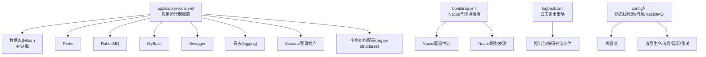
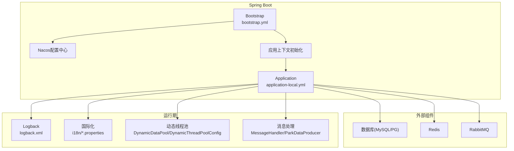
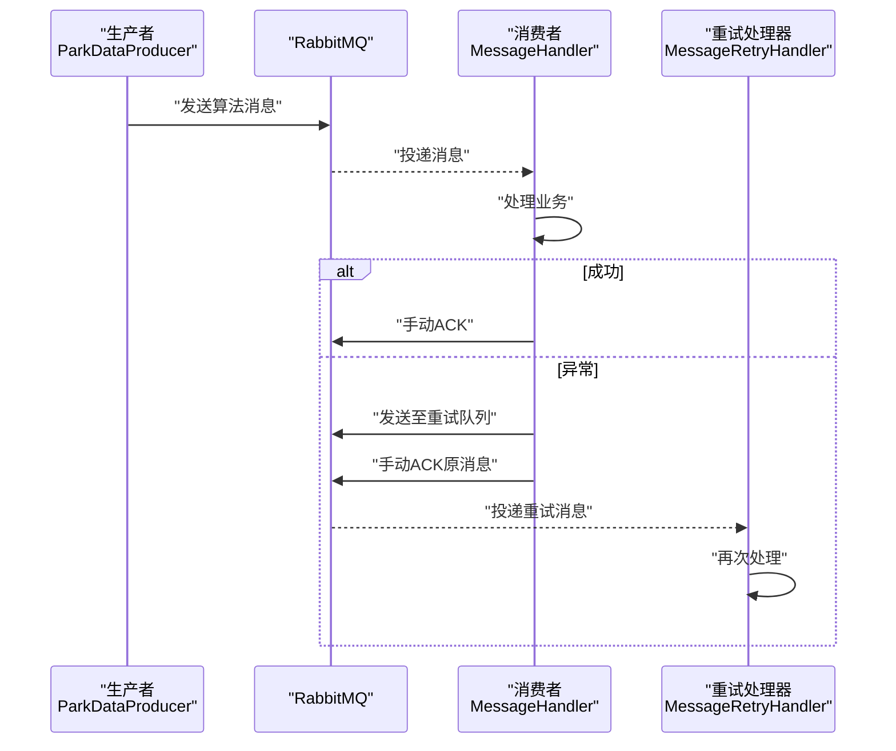
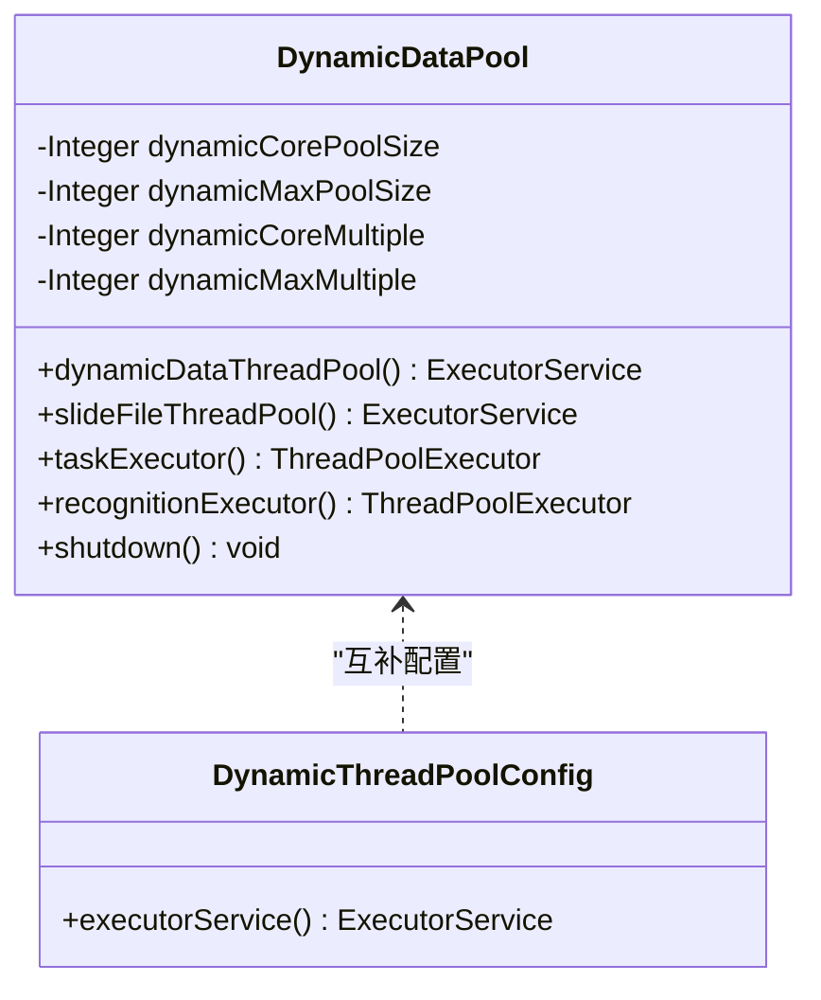
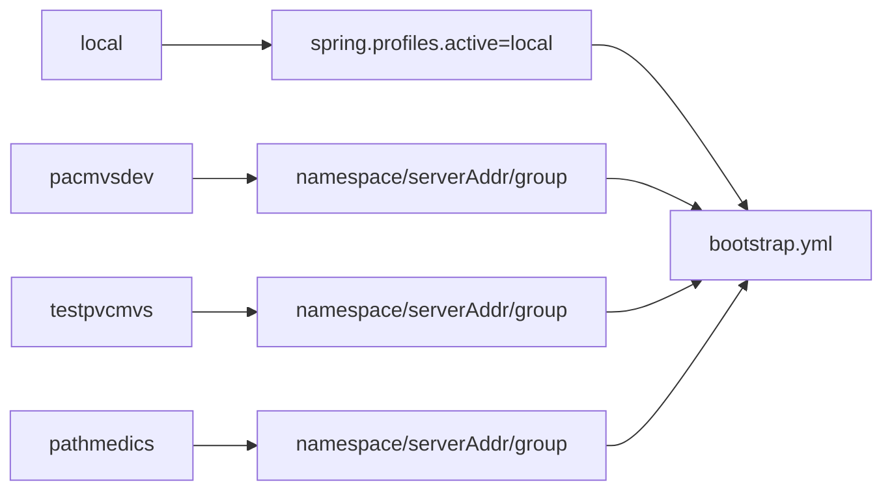

# 配置详解

<cite>
**本文引用的文件**   
- [application-local.yml](file://src/main/resources/application-local.yml)
- [bootstrap.yml](file://src/main/resources/bootstrap.yml)
- [bootstrap-local.yml](file://src/main/resources/bootstrap-local.yml)
- [logback.xml](file://src/main/resources/logback.xml)
- [DynamicDataPool.java](file://src/main/java/cn/staitech/fr/config/DynamicDataPool.java)
- [DynamicThreadPoolConfig.java](file://src/main/java/cn/staitech/fr/config/DynamicThreadPoolConfig.java)
- [ParkDataProducer.java](file://src/main/java/cn/staitech/fr/config/ParkDataProducer.java)
- [MessageHandler.java](file://src/main/java/cn/staitech/fr/config/MessageHandler.java)
- [MessageRetryHandler.java](file://src/main/java/cn/staitech/fr/config/MessageRetryHandler.java)
- [InitializinConfig.java](file://src/main/java/cn/staitech/fr/config/InitializinConfig.java)
- [messages.properties](file://src/main/resources/i18n/messages.properties)
- [messages_en.properties](file://src/main/resources/i18n/messages_en.properties)
- [messages_zh.properties](file://src/main/resources/i18n/messages_zh.properties)
- [pom.xml](file://pom.xml)
</cite>

## 目录
1. [简介](#简介)
2. [项目结构](#项目结构)
3. [核心组件](#核心组件)
4. [架构总览](#架构总览)
5. [详细组件分析](#详细组件分析)
6. [依赖关系分析](#依赖关系分析)
7. [性能考量](#性能考量)
8. [故障排除指南](#故障排除指南)
9. [结论](#结论)
10. [附录](#附录)

## 简介
本文件面向FR模块的配置管理，系统性梳理应用配置参数、数据库连接配置、缓存配置、日志配置与国际化配置，并深入解释application-local.yml与bootstrap.yml中的关键项。同时覆盖动态线程池、消息队列（RabbitMQ）配置、延迟消息与重试机制、以及多环境（开发、测试、生产）的配置示例与最佳实践。最后给出配置文件优先级与覆盖规则、配置验证方法与常见问题排查建议。

## 项目结构
FR模块的配置主要集中在resources目录下的YAML与XML配置文件，以及若干Java配置类。核心位置如下：
- application-local.yml：应用运行期配置（数据库、Redis、RabbitMQ、MyBatis、Swagger、日志、管理端点、业务结构配置等）
- bootstrap.yml：Spring Cloud与Nacos集成配置（应用名、激活环境、Nacos服务发现与配置中心）
- bootstrap-local.yml：本地开发禁用Nacos开关
- logback.xml：日志输出与滚动策略
- config包：动态线程池、消息生产与消费、Redis初始化等配置类
- i18n：国际化消息资源

图表来源
- [application-local.yml:1-311](file://src/main/resources/application-local.yml#L1-L311)
- [bootstrap.yml:1-48](file://src/main/resources/bootstrap.yml#L1-L48)
- [logback.xml:1-102](file://src/main/resources/logback.xml#L1-L102)

章节来源
- [application-local.yml:1-311](file://src/main/resources/application-local.yml#L1-L311)
- [bootstrap.yml:1-48](file://src/main/resources/bootstrap.yml#L1-L48)
- [bootstrap-local.yml:1-9](file://src/main/resources/bootstrap-local.yml#L1-L9)
- [logback.xml:1-102](file://src/main/resources/logback.xml#L1-L102)

## 核心组件
- 应用配置参数
  - 应用端口、Knife4j开关、管理端点暴露范围
  - 国际化基础名、编码、缓存秒数、回退策略
  - 应用名称、激活的profile占位符
  - Nacos服务发现与配置中心地址、命名空间、分组、共享配置
- 数据库连接配置
  - 动态数据源（主/从库）、Hikari连接池参数、连接校验语句
  - MyBatis别名包、Mapper扫描路径、日志实现
- 缓存配置
  - Redis主机、端口、密码
  - Lettuce连接工厂校验启用
- 消息队列配置
  - RabbitMQ主机、端口、虚拟主机、认证信息
  - 生产者返回与发布确认、消费者手动确认、重试次数与间隔
  - 队列名称、延迟交换机与路由键
- 日志配置
  - 控制台输出、按码分流文件、错误级别过滤、模块日志级别
- 国际化配置
  - i18n资源文件、语言切换、缓存与编码

章节来源
- [application-local.yml:1-311](file://src/main/resources/application-local.yml#L1-L311)
- [bootstrap.yml:1-48](file://src/main/resources/bootstrap.yml#L1-L48)
- [logback.xml:1-102](file://src/main/resources/logback.xml#L1-L102)
- [InitializinConfig.java:1-26](file://src/main/java/cn/staitech/fr/config/InitializinConfig.java#L1-L26)

## 架构总览
下图展示配置在系统中的作用域与交互：

图表来源
- [bootstrap.yml:1-48](file://src/main/resources/bootstrap.yml#L1-L48)
- [application-local.yml:1-311](file://src/main/resources/application-local.yml#L1-L311)
- [logback.xml:1-102](file://src/main/resources/logback.xml#L1-L102)
- [DynamicDataPool.java:1-231](file://src/main/java/cn/staitech/fr/config/DynamicDataPool.java#L1-L231)
- [DynamicThreadPoolConfig.java:1-53](file://src/main/java/cn/staitech/fr/config/DynamicThreadPoolConfig.java#L1-L53)
- [MessageHandler.java:1-128](file://src/main/java/cn/staitech/fr/config/MessageHandler.java#L1-L128)
- [ParkDataProducer.java:1-48](file://src/main/java/cn/staitech/fr/config/ParkDataProducer.java#L1-L48)

## 详细组件分析

### 应用配置参数详解（bootstrap.yml）
- server.port：应用监听端口
- knife4j.enable：在线文档开关
- management.health.elasticsearch.enabled：健康检查中禁用Elasticsearch探测
- spring.application.name：应用名
- spring.profiles.active：激活的profile占位符（由Maven profile注入）
- spring.cloud.nacos.discovery/config：服务发现与配置中心地址、命名空间、分组、共享配置、超时
- spring.messages：国际化基础名、缓存秒数、编码、回退策略

章节来源
- [bootstrap.yml:1-48](file://src/main/resources/bootstrap.yml#L1-L48)
- [pom.xml:302-366](file://pom.xml#L302-L366)

### 应用运行期配置详解（application-local.yml）
- feign.httpclient.connection-timeout：Feign客户端连接超时
- spring.servlet.multipart：上传文件大小限制
- spring.redis：Redis连接参数
- spring.datasource.dynamic：动态数据源
  - master/slave：主从库配置、驱动、URL、用户名、密码、Hikari池参数、连接测试语句
  - primary：默认数据源
- rabbitmq：RabbitMQ连接与消费者策略
  - publisher-returns、publisher-confirm-type：发布确认与返回
  - listener.simple：手动确认、重试次数、初始间隔、拒绝后不再入队
  - listener.direct：手动确认
- mybatis：别名包、Mapper扫描、日志实现
- swagger：标题、许可信息
- logging.level：调试配置数据加载、AMQP模板、Mapper日志级别
- management.endpoints.web.exposure.include：暴露的管理端点
- waxPath：业务路径
- organ-structures：脏器与结构映射、轮廓定义
- queues：算法消息队列名、重试队列名、延迟时间
- dynamic：动态线程池核心/最大线程数

章节来源
- [application-local.yml:1-311](file://src/main/resources/application-local.yml#L1-L311)

### 数据库连接配置（动态数据源 + Hikari）
- 主库与从库分别配置，驱动、URL、用户名、密码
- Hikari池参数：最大/最小空闲、空闲超时、最大生存时间、连接超时、验证超时、自动提交、池名、连接测试查询、JMX注册
- 默认数据源primary=master
- MyBatis配置：typeAliasesPackage、mapperLocations、日志实现

章节来源
- [application-local.yml:15-83](file://src/main/resources/application-local.yml#L15-L83)

### 缓存配置（Redis）
- Redis主机、端口、密码
- Lettuce连接工厂启用连接校验，提升连接稳定性

章节来源
- [application-local.yml:11-15](file://src/main/resources/application-local.yml#L11-L15)
- [InitializinConfig.java:18-24](file://src/main/java/cn/staitech/fr/config/InitializinConfig.java#L18-L24)

### 消息队列配置（RabbitMQ）
- 连接参数：host/port/virtual-host/认证
- 发布确认与返回：publisher-returns、publisher-confirm-type
- 消费者策略：simple/direct手动确认；simple重试次数与间隔；default-requeue-rejected=false
- 队列与交换机：queues.algoMsg、queues.algoMsgRetry、延迟交换机与路由键
- 生产者：通过RabbitTemplate发送消息与延迟消息
- 消费者：@RabbitListener监听队列，手动ACK/NACK；异常时入重试队列或拒绝后重入队；延迟消息队列处理

图表来源
- [ParkDataProducer.java:21-44](file://src/main/java/cn/staitech/fr/config/ParkDataProducer.java#L21-L44)
- [MessageHandler.java:43-75](file://src/main/java/cn/staitech/fr/config/MessageHandler.java#L43-L75)
- [MessageRetryHandler.java:25-42](file://src/main/java/cn/staitech/fr/config/MessageRetryHandler.java#L25-L42)

章节来源
- [application-local.yml:57-75](file://src/main/resources/application-local.yml#L57-L75)
- [ParkDataProducer.java:1-48](file://src/main/java/cn/staitech/fr/config/ParkDataProducer.java#L1-L48)
- [MessageHandler.java:1-128](file://src/main/java/cn/staitech/fr/config/MessageHandler.java#L1-L128)
- [MessageRetryHandler.java:1-44](file://src/main/java/cn/staitech/fr/config/MessageRetryHandler.java#L1-L44)

### 动态线程池配置
- application-local.yml：dynamic.corePoolSize、dynamic.maxPoolSize
- DynamicDataPool：按CPU核数动态计算核心/最大线程数，带命名线程工厂与拒绝策略；提供多个线程池Bean与优雅关闭
- DynamicThreadPoolConfig：固定线程池定义（用于特定任务）

图表来源
- [DynamicDataPool.java:14-231](file://src/main/java/cn/staitech/fr/config/DynamicDataPool.java#L14-L231)
- [DynamicThreadPoolConfig.java:12-53](file://src/main/java/cn/staitech/fr/config/DynamicThreadPoolConfig.java#L12-L53)

章节来源
- [application-local.yml:309-311](file://src/main/resources/application-local.yml#L309-L311)
- [DynamicDataPool.java:14-231](file://src/main/java/cn/staitech/fr/config/DynamicDataPool.java#L14-L231)
- [DynamicThreadPoolConfig.java:12-53](file://src/main/java/cn/staitech/fr/config/DynamicThreadPoolConfig.java#L12-L53)

### 国际化支持配置
- bootstrap.yml：spring.messages.basename、cache-seconds、encoding、fallbackToSystemLocale
- i18n资源：messages.properties（默认）、messages_en.properties（英文）、messages_zh.properties（简中）
- 语言切换：通过basename与编码控制，fallbackToSystemLocale=false以避免回退系统区域

章节来源
- [bootstrap.yml:12-17](file://src/main/resources/bootstrap.yml#L12-L17)
- [messages.properties:1-51](file://src/main/resources/i18n/messages.properties#L1-L51)
- [messages_en.properties:1-45](file://src/main/resources/i18n/messages_en.properties#L1-L45)
- [messages_zh.properties:1-42](file://src/main/resources/i18n/messages_zh.properties#L1-L42)

### 日志配置（Logback）
- 控制台输出与按码分流文件（startup、info/error等）
- 模块日志级别：cn.staitech、org.springframework、Nacos客户端、动态数据源等
- 日志模式包含traceId、trace_id、方法行号等上下文字段

章节来源
- [logback.xml:1-102](file://src/main/resources/logback.xml#L1-L102)

## 依赖关系分析
- Maven Profile与Nacos集成
  - pom.xml定义了local、pacmvsdev、testpvcmvs、pathmedics四套profile，分别注入spring.profiles.active、nacosNamespace、serverAddr、group等
  - bootstrap.yml通过占位符引用上述属性，实现不同环境的Nacos接入

图表来源
- [pom.xml:302-366](file://pom.xml#L302-L366)
- [bootstrap.yml:20-46](file://src/main/resources/bootstrap.yml#L20-L46)

章节来源
- [pom.xml:302-366](file://pom.xml#L302-L366)
- [bootstrap.yml:20-46](file://src/main/resources/bootstrap.yml#L20-L46)

## 性能考量
- 数据库连接池
  - Hikari池参数合理设置最大/最小空闲、空闲超时、最大生存时间，有助于降低连接抖动与GC压力
  - 主从分离与读写分离策略可提升吞吐
- 缓存
  - Redis连接工厂开启连接校验，减少失效连接带来的重试开销
- 线程池
  - DynamicDataPool按CPU核数动态计算线程数，避免过度并发导致资源争用
  - 自定义拒绝策略快速失败，防止队列无限增长导致内存溢出
- 消息队列
  - 手动确认与重试策略结合，保证消息可靠传递；拒绝后不再入队避免重复风暴
- 日志
  - 按模块分级输出，避免全量DEBUG造成I/O瓶颈

[本节为通用指导，无需列出具体文件来源]

## 故障排除指南
- Nacos未生效或报错
  - 检查bootstrap.yml中serverAddr、namespace、group是否与pom profile一致
  - 确认spring.profiles.active占位符已被Maven正确替换
- RabbitMQ消息堆积或重复
  - 检查listener.simple.manual ack与重试次数配置
  - 确认重试队列与延迟队列绑定正确
- Redis连接异常
  - 校验application-local.yml中的host/port/password
  - 确认Lettuce连接工厂校验已启用
- 数据库连接失败
  - 校验主从库URL、驱动、用户名、密码
  - 检查Hikari池参数与连接测试查询
- 线程池拒绝任务
  - 查看拒绝策略日志，评估队列容量与线程上限是否合理
- 国际化不生效
  - 确认messages.basename、编码与缓存秒数配置
  - 检查资源文件命名与内容编码

章节来源
- [bootstrap.yml:20-46](file://src/main/resources/bootstrap.yml#L20-L46)
- [application-local.yml:11-15](file://src/main/resources/application-local.yml#L11-L15)
- [application-local.yml:57-75](file://src/main/resources/application-local.yml#L57-L75)
- [DynamicDataPool.java:101-115](file://src/main/java/cn/staitech/fr/config/DynamicDataPool.java#L101-L115)
- [logback.xml:90-98](file://src/main/resources/logback.xml#L90-L98)

## 结论
FR模块的配置围绕“应用参数、数据库、缓存、消息、日志、国际化”六大维度展开。通过application-local.yml与bootstrap.yml的协同，配合动态线程池与消息队列策略，可在不同环境下稳定运行。建议在生产环境严格校验Nacos接入、线程池与连接池参数，并完善日志与监控覆盖，以保障高可用与可观测性。

[本节为总结性内容，无需列出具体文件来源]

## 附录

### 不同环境（开发/测试/生产）配置示例与最佳实践
- 开发（local）
  - 禁用Nacos：bootstrap-local.yml中discovery/config.enabled=false
  - 本地数据库/Redis/RabbitMQ地址与凭据
  - 适当放宽日志级别便于调试
- 测试（testpvcmvs）
  - 使用测试Nacos命名空间与地址
  - 数据库采用独立实例，连接池参数适中
- 生产（pathmedics）
  - 使用生产Nacos命名空间与地址
  - 数据库主从分离、连接池参数严格优化
  - 禁用不必要的管理端点暴露，仅保留必要指标

章节来源
- [bootstrap-local.yml:1-9](file://src/main/resources/bootstrap-local.yml#L1-L9)
- [pom.xml:302-366](file://pom.xml#L302-L366)
- [application-local.yml:11-15](file://src/main/resources/application-local.yml#L11-L15)

### 配置文件优先级与覆盖规则
- bootstrap.yml：先于application-local.yml加载，决定Nacos与环境激活
- application-local.yml：覆盖bootstrap.yml中的默认值，适用于本地开发
- Maven Profile：通过占位符注入spring.profiles.active与Nacos参数，最终决定运行环境
- Nacos共享配置：bootstrap.yml中shared-configs会拉取远端配置，与本地配置合并

章节来源
- [bootstrap.yml:20-46](file://src/main/resources/bootstrap.yml#L20-L46)
- [application-local.yml:5-6](file://src/main/resources/application-local.yml#L5-L6)
- [pom.xml:302-366](file://pom.xml#L302-L366)

### 配置验证清单
- 环境变量与Maven Profile：spring.profiles.active、nacosNamespace、serverAddr、group
- 外部组件连通性：Redis、数据库、RabbitMQ
- 线程池与队列：核心/最大线程数、队列容量、拒绝策略
- 日志级别与输出：模块日志、控制台与文件输出
- 国际化资源：basename、编码、缓存秒数

[本节为通用指导，无需列出具体文件来源]