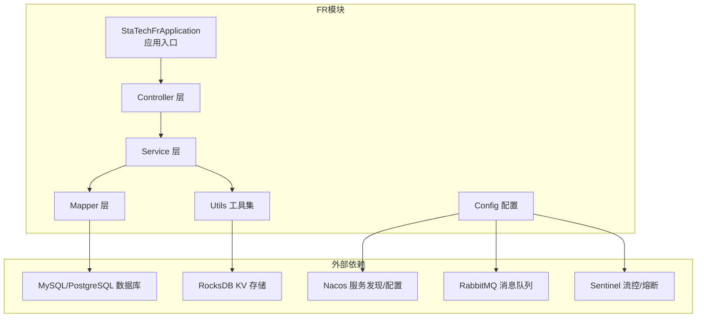
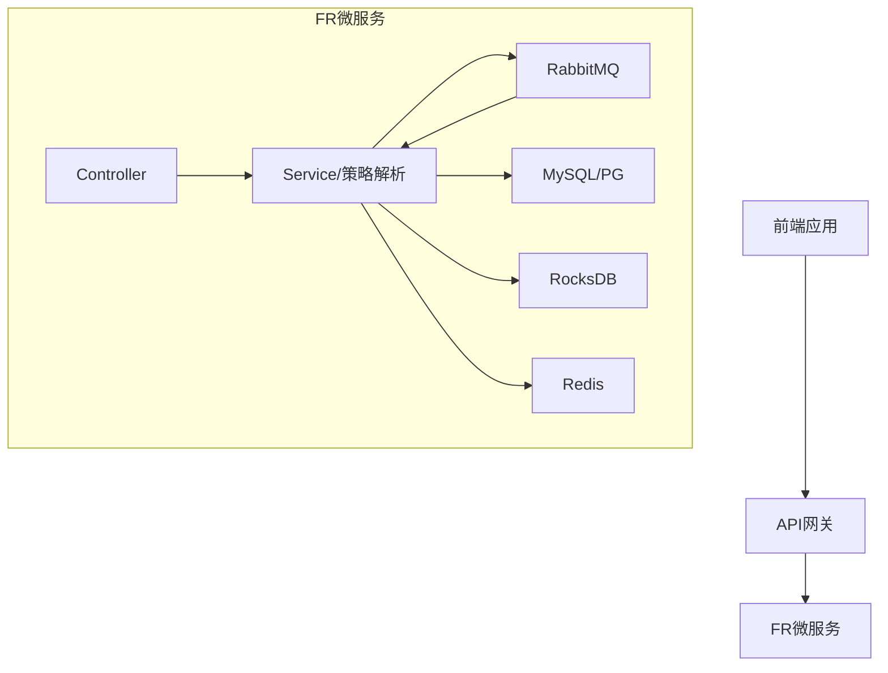
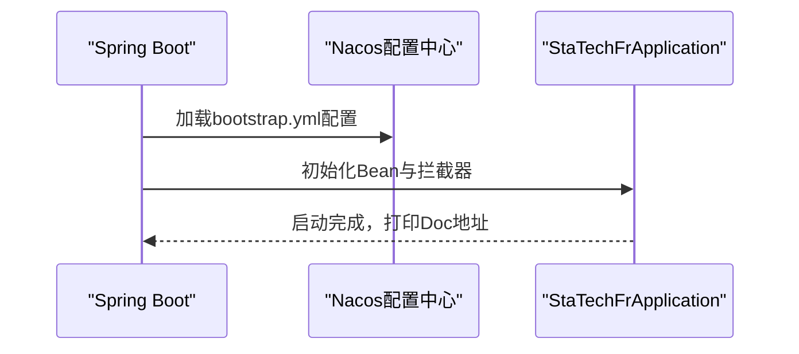
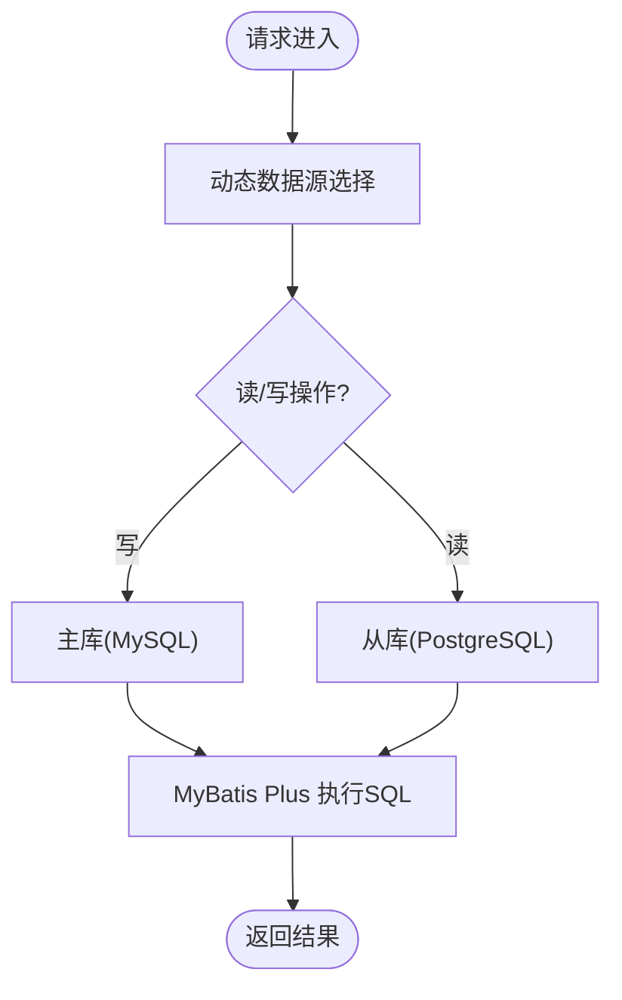
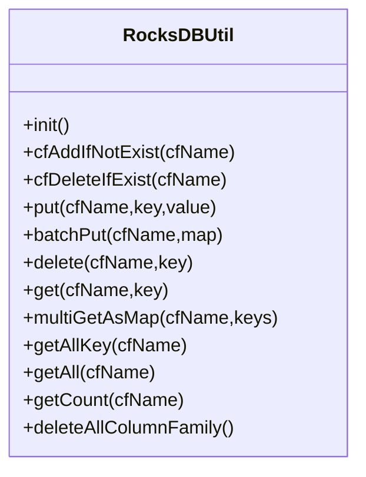
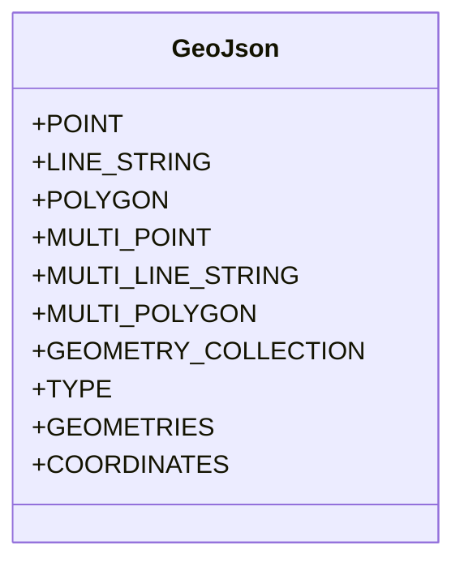
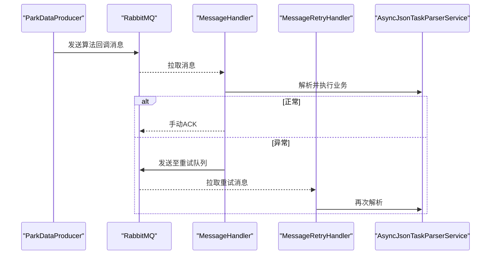
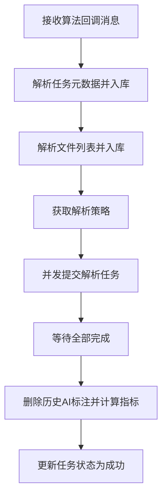
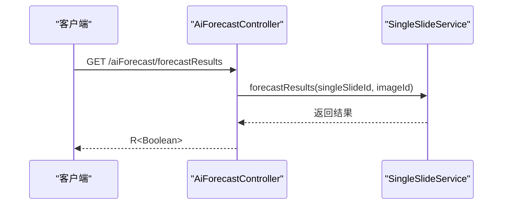
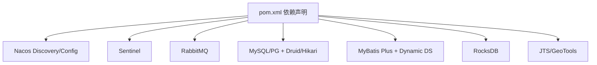

# 技术架构概览

<cite>
**本文引用的文件**
- [StaTechFrApplication.java](file://src/main/java/cn/staitech/fr/StaTechFrApplication.java)
- [pom.xml](file://pom.xml)
- [bootstrap.yml](file://src/main/resources/bootstrap.yml)
- [application-local.yml](file://src/main/resources/application-local.yml)
- [DynamicThreadPoolConfig.java](file://src/main/java/cn/staitech/fr/config/DynamicThreadPoolConfig.java)
- [RocksDBUtil.java](file://src/main/java/cn/staitech/fr/utils/RocksDBUtil.java)
- [GeoJson.java](file://src/main/java/cn/staitech/fr/utils/geo/GeoJson.java)
- [ParkDataProducer.java](file://src/main/java/cn/staitech/fr/config/ParkDataProducer.java)
- [AsyncJsonTaskParserService.java](file://src/main/java/cn/staitech/fr/service/strategy/json/AsyncJsonTaskParserService.java)
- [AiForecastController.java](file://src/main/java/cn/staitech/fr/controller/AiForecastController.java)
- [JsonTaskServiceImpl.java](file://src/main/java/cn/staitech/fr/service/impl/JsonTaskServiceImpl.java)
- [MessageHandler.java](file://src/main/java/cn/staitech/fr/config/MessageHandler.java)
- [MessageRetryHandler.java](file://src/main/java/cn/staitech/fr/config/MessageRetryHandler.java)
- [JsonTaskStatusEnum.java](file://src/main/java/cn/staitech/fr/enums/JsonTaskStatusEnum.java)
</cite>

## 目录
1. [引言](#引言)
2. [项目结构](#项目结构)
3. [核心组件](#核心组件)
4. [架构总览](#架构总览)
5. [详细组件分析](#详细组件分析)
6. [依赖分析](#依赖分析)
7. [性能考虑](#性能考虑)
8. [故障排查指南](#故障排查指南)
9. [结论](#结论)
10. [附录](#附录)

## 引言
本文件面向FR（数字阅片）模块，提供基于Spring Boot的微服务架构技术概览。重点涵盖：
- Spring Cloud Alibaba生态集成：Nacos服务注册与配置中心、Sentinel限流与熔断
- 核心技术栈：MyBatis Plus ORM、RocksDB高性能KV存储、JTS地理空间数据处理、消息队列异步处理
- 微服务拆分策略、数据一致性与分布式事务处理思路、监控与告警
- 前后端分离、API网关集成与安全认证体系
- 系统整体架构图与组件交互关系，帮助开发者快速理解与落地

## 项目结构
FR模块采用标准Spring Boot工程结构，按领域/层次组织代码：
- config：应用配置、线程池、消息生产与消费、动态数据源等
- controller：对外HTTP接口层
- service：业务服务层，含策略模式解析JSON标注任务
- mapper：MyBatis Mapper接口与XML
- utils：工具类，含RocksDB操作、几何解析、国际化等
- domain/dto/vo：实体、输入输出对象
- resources：配置文件、Mapper XML、国际化资源

图表来源
- [StaTechFrApplication.java:39-62](file://src/main/java/cn/staitech/fr/StaTechFrApplication.java#L39-L62)
- [bootstrap.yml:23-46](file://src/main/resources/bootstrap.yml#L23-L46)
- [application-local.yml:5-62](file://src/main/resources/application-local.yml#L5-L62)

章节来源
- [StaTechFrApplication.java:39-62](file://src/main/java/cn/staitech/fr/StaTechFrApplication.java#L39-L62)
- [bootstrap.yml:11-46](file://src/main/resources/bootstrap.yml#L11-L46)
- [application-local.yml:5-106](file://src/main/resources/application-local.yml#L5-L106)

## 核心组件
- 应用入口与装配
  - 启用服务发现、异步、事务管理、MyBatis Plus分页插件、Swagger、自定义安全与Feign客户端
- 配置中心与服务发现
  - 通过Nacos配置中心加载共享配置，按环境profile切换
- 数据访问与多数据源
  - MyBatis Plus + 动态数据源（MySQL主库、PostgreSQL从库）
- 缓存与KV存储
  - Redis缓存、RocksDB列族KV存储
- 地理空间处理
  - JTS/GeoTools处理GeoJSON几何
- 消息队列与异步处理
  - RabbitMQ生产/消费、延迟队列、重试队列
- 线程池与并发
  - 自定义线程池与有界阻塞队列，保障异步解析稳定性

章节来源
- [StaTechFrApplication.java:39-62](file://src/main/java/cn/staitech/fr/StaTechFrApplication.java#L39-L62)
- [bootstrap.yml:23-46](file://src/main/resources/bootstrap.yml#L23-L46)
- [application-local.yml:15-54](file://src/main/resources/application-local.yml#L15-L54)
- [RocksDBUtil.java:26-82](file://src/main/java/cn/staitech/fr/utils/RocksDBUtil.java#L26-L82)
- [GeoJson.java:4-20](file://src/main/java/cn/staitech/fr/utils/geo/GeoJson.java#L4-L20)
- [ParkDataProducer.java:19-47](file://src/main/java/cn/staitech/fr/config/ParkDataProducer.java#L19-L47)
- [DynamicThreadPoolConfig.java:12-51](file://src/main/java/cn/staitech/fr/config/DynamicThreadPoolConfig.java#L12-L51)

## 架构总览
FR模块采用“微服务 + 分布式”架构，围绕“标注与AI预测”业务闭环构建：
- 控制层：REST API暴露业务能力，统一鉴权与安全控制
- 业务层：异步解析算法回调JSON标注，落库并触发指标计算
- 数据层：关系型数据库（MySQL/PG）、KV存储（RocksDB）、缓存（Redis）
- 通信层：消息队列解耦异步任务，Nacos统一治理，Sentinel保障流量
- 监控：Actuator + 日志 + 链路追踪（TraceContext）

图表来源
- [AiForecastController.java:21-30](file://src/main/java/cn/staitech/fr/controller/AiForecastController.java#L21-L30)
- [AsyncJsonTaskParserService.java:28-306](file://src/main/java/cn/staitech/fr/service/strategy/json/AsyncJsonTaskParserService.java#L28-L306)
- [MessageHandler.java:30-86](file://src/main/java/cn/staitech/fr/config/MessageHandler.java#L30-L86)
- [application-local.yml:57-75](file://src/main/resources/application-local.yml#L57-L75)

## 详细组件分析

### 应用入口与装配（Spring Boot + Nacos + Sentinel）
- 启用服务注册与发现、异步、事务、MyBatis Plus分页
- 通过Nacos配置中心加载共享配置，支持多环境profile
- Sentinel接入以实现限流与熔断保护

图表来源
- [StaTechFrApplication.java:39-62](file://src/main/java/cn/staitech/fr/StaTechFrApplication.java#L39-L62)
- [bootstrap.yml:23-46](file://src/main/resources/bootstrap.yml#L23-L46)

章节来源
- [StaTechFrApplication.java:39-62](file://src/main/java/cn/staitech/fr/StaTechFrApplication.java#L39-L62)
- [bootstrap.yml:11-46](file://src/main/resources/bootstrap.yml#L11-L46)

### 数据访问与多数据源（MyBatis Plus + 动态数据源）
- MyBatis Plus分页插件启用
- 动态数据源配置MySQL主库与PostgreSQL从库，读写分离
- Mapper扫描与XML路径配置

图表来源
- [application-local.yml:15-54](file://src/main/resources/application-local.yml#L15-L54)
- [StaTechFrApplication.java:54-60](file://src/main/java/cn/staitech/fr/StaTechFrApplication.java#L54-L60)

章节来源
- [application-local.yml:15-54](file://src/main/resources/application-local.yml#L15-L54)
- [StaTechFrApplication.java:54-60](file://src/main/java/cn/staitech/fr/StaTechFrApplication.java#L54-L60)

### RocksDB高性能KV存储
- 支持列族（表）动态创建与删除
- 提供增删改查、批量写入、全量扫描、分片取键等能力
- 生产环境路径按操作系统自动适配

图表来源
- [RocksDBUtil.java:26-320](file://src/main/java/cn/staitech/fr/utils/RocksDBUtil.java#L26-L320)

章节来源
- [RocksDBUtil.java:26-320](file://src/main/java/cn/staitech/fr/utils/RocksDBUtil.java#L26-L320)

### 地理空间数据处理（JTS）
- 定义常用几何类型常量（点、线、面、集合等）
- 结合GeoJSON坐标字段进行几何解析与处理

图表来源
- [GeoJson.java:4-20](file://src/main/java/cn/staitech/fr/utils/geo/GeoJson.java#L4-L20)

章节来源
- [GeoJson.java:4-20](file://src/main/java/cn/staitech/fr/utils/geo/GeoJson.java#L4-L20)

### 消息队列异步处理（RabbitMQ）
- 生产者：向算法回调队列发送消息，支持延迟消息
- 消费者：监听算法回调队列，手动ACK；异常入重试队列；支持延迟检查队列
- 重试机制：重试队列二次消费，失败兜底

图表来源
- [ParkDataProducer.java:27-44](file://src/main/java/cn/staitech/fr/config/ParkDataProducer.java#L27-L44)
- [MessageHandler.java:43-86](file://src/main/java/cn/staitech/fr/config/MessageHandler.java#L43-L86)
- [MessageRetryHandler.java:25-42](file://src/main/java/cn/staitech/fr/config/MessageRetryHandler.java#L25-L42)
- [AsyncJsonTaskParserService.java:68-213](file://src/main/java/cn/staitech/fr/service/strategy/json/AsyncJsonTaskParserService.java#L68-L213)

章节来源
- [ParkDataProducer.java:19-47](file://src/main/java/cn/staitech/fr/config/ParkDataProducer.java#L19-L47)
- [MessageHandler.java:30-127](file://src/main/java/cn/staitech/fr/config/MessageHandler.java#L30-L127)
- [MessageRetryHandler.java:18-43](file://src/main/java/cn/staitech/fr/config/MessageRetryHandler.java#L18-L43)
- [AsyncJsonTaskParserService.java:28-306](file://src/main/java/cn/staitech/fr/service/strategy/json/AsyncJsonTaskParserService.java#L28-L306)

### 并发与线程池（异步JSON任务解析）
- 自定义线程池：核心/最大线程数、有界阻塞队列、拒绝策略
- 异步解析：按JsonFile并发执行策略解析，完成后统一计算指标并更新任务状态

图表来源
- [AsyncJsonTaskParserService.java:68-213](file://src/main/java/cn/staitech/fr/service/strategy/json/AsyncJsonTaskParserService.java#L68-L213)
- [DynamicThreadPoolConfig.java:12-51](file://src/main/java/cn/staitech/fr/config/DynamicThreadPoolConfig.java#L12-L51)

章节来源
- [AsyncJsonTaskParserService.java:28-306](file://src/main/java/cn/staitech/fr/service/strategy/json/AsyncJsonTaskParserService.java#L28-L306)
- [DynamicThreadPoolConfig.java:12-51](file://src/main/java/cn/staitech/fr/config/DynamicThreadPoolConfig.java#L12-L51)

### 控制器与API示例（AI预测结果）
- 提供查询接口，返回单切片预测结果状态

图表来源
- [AiForecastController.java:21-30](file://src/main/java/cn/staitech/fr/controller/AiForecastController.java#L21-L30)

章节来源
- [AiForecastController.java:21-30](file://src/main/java/cn/staitech/fr/controller/AiForecastController.java#L21-L30)

### 数据一致性与分布式事务处理
- 读写分离：写操作走主库，读操作走从库
- 消息驱动：异步解析与落库，结合延迟检查队列保障最终一致性
- 重试与死信：异常消息进入重试队列，避免丢失
- 建议：跨服务事务可引入TCC/ Saga或可靠消息最终一致性方案（当前模块内以消息队列为主）

章节来源
- [application-local.yml:15-54](file://src/main/resources/application-local.yml#L15-L54)
- [MessageHandler.java:43-86](file://src/main/java/cn/staitech/fr/config/MessageHandler.java#L43-L86)
- [JsonTaskServiceImpl.java:31-52](file://src/main/java/cn/staitech/fr/service/impl/JsonTaskServiceImpl.java#L31-L52)

### 监控与告警机制
- Actuator端点暴露运行时信息
- 日志级别与关键包日志开关便于问题定位
- 建议：结合链路追踪（TraceContext）与APM平台实现统一监控与告警

章节来源
- [application-local.yml:98-106](file://src/main/resources/application-local.yml#L98-L106)
- [MessageHandler.java:44-74](file://src/main/java/cn/staitech/fr/config/MessageHandler.java#L44-L74)

### 前后端分离、API网关与安全认证
- 前后端分离：后端提供REST API，前端通过网关访问
- API网关：统一路由、鉴权、限流与监控
- 安全认证：结合通用安全组件启用鉴权注解与Feign客户端安全配置

章节来源
- [StaTechFrApplication.java:29-36](file://src/main/java/cn/staitech/fr/StaTechFrApplication.java#L29-L36)
- [bootstrap.yml:11-22](file://src/main/resources/bootstrap.yml#L11-L22)

## 依赖分析
- Spring Cloud Alibaba：Nacos（注册/配置）、Sentinel（流控/熔断）
- 数据库与连接池：MySQL/PG、Druid/Hikari
- 消息队列：RabbitMQ
- ORM：MyBatis Plus + 动态数据源
- KV存储：RocksDB
- 地理空间：JTS/GeoTools
- 文档与安全：Swagger、通用安全组件

图表来源
- [pom.xml:25-121](file://pom.xml#L25-L121)

章节来源
- [pom.xml:19-211](file://pom.xml#L19-L211)

## 性能考虑
- 线程池与队列：合理设置核心/最大线程与队列容量，避免内存溢出
- IO密集场景：RocksDB列族与批量写入提升吞吐
- 数据库：读写分离、连接池参数优化、慢查询监控
- 消息：合理分区与消费者数量，避免堆积；延迟队列与重试策略降低失败率
- 监控：开启Actuator与关键日志，结合APM实现性能可观测性

## 故障排查指南
- 消息消费异常
  - 检查消费者手动ACK逻辑与异常分支重试队列发送
  - 关注延迟检查队列对未完成任务的兜底校验
- 任务状态不一致
  - 校验任务状态枚举与服务实现，确保失败时单切片状态同步更新
- 数据库连接问题
  - 核对动态数据源配置与连接池参数，关注主从切换与健康检查
- RocksDB异常
  - 检查列族创建与路径权限，确认批量写入与迭代器使用

章节来源
- [MessageHandler.java:43-127](file://src/main/java/cn/staitech/fr/config/MessageHandler.java#L43-L127)
- [JsonTaskServiceImpl.java:31-52](file://src/main/java/cn/staitech/fr/service/impl/JsonTaskServiceImpl.java#L31-L52)
- [JsonTaskStatusEnum.java:6-14](file://src/main/java/cn/staitech/fr/enums/JsonTaskStatusEnum.java#L6-L14)
- [application-local.yml:15-54](file://src/main/resources/application-local.yml#L15-L54)
- [RocksDBUtil.java:125-153](file://src/main/java/cn/staitech/fr/utils/RocksDBUtil.java#L125-L153)

## 结论
FR模块以Spring Boot为基础，结合Nacos与Sentinel实现服务治理与流量防护，采用消息队列解耦异步任务，配合RocksDB与JTS满足高吞吐与地理空间处理需求。通过动态数据源与完善的监控告警，保障系统在高并发与复杂业务场景下的稳定性与可维护性。

## 附录
- 环境配置：通过Nacos命名空间、地址与组区分不同环境
- 端口与文档：应用启动后输出文档地址，便于调试与联调

章节来源
- [bootstrap.yml:23-46](file://src/main/resources/bootstrap.yml#L23-L46)
- [StaTechFrApplication.java:45-51](file://src/main/java/cn/staitech/fr/StaTechFrApplication.java#L45-L51)