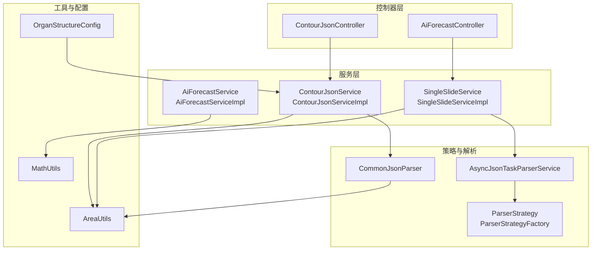
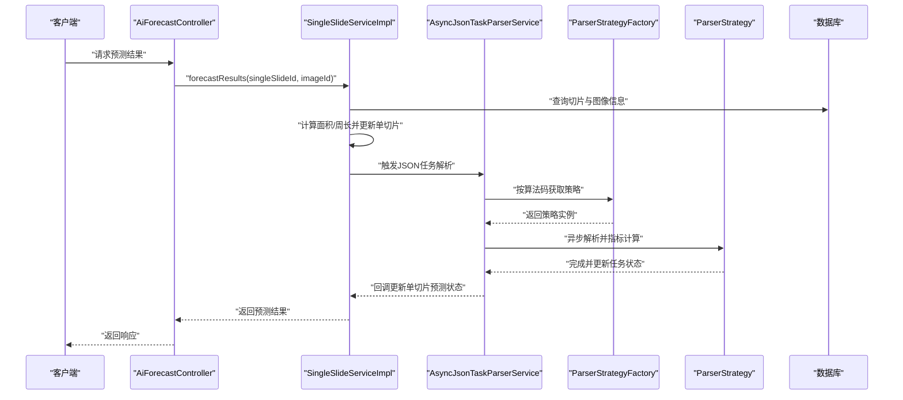
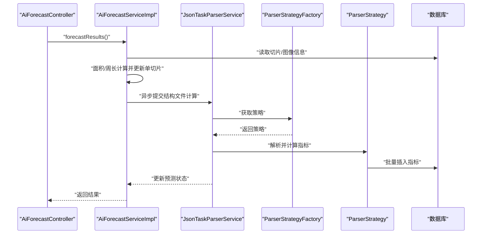
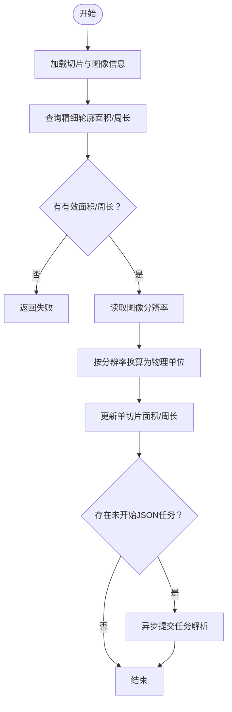
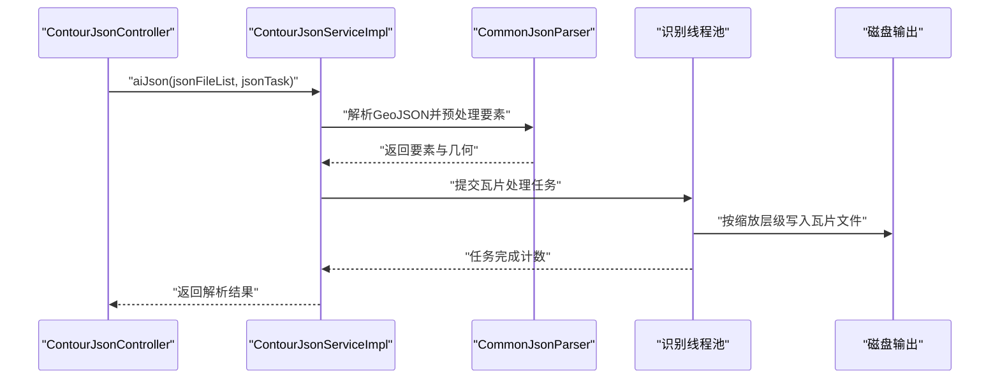
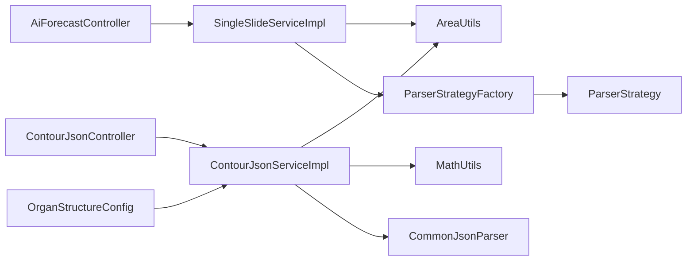

# 核心特性说明

<cite>
**本文引用的文件**
- [AiForecastController.java](file://src/main/java/cn/staitech/fr/controller/AiForecastController.java)
- [AiForecastService.java](file://src/main/java/cn/staitech/fr/service/AiForecastService.java)
- [AiForecastServiceImpl.java](file://src/main/java/cn/staitech/fr/service/impl/AiForecastServiceImpl.java)
- [ContourJsonController.java](file://src/main/java/cn/staitech/fr/controller/ContourJsonController.java)
- [ContourJsonService.java](file://src/main/java/cn/staitech/fr/service/ContourJsonService.java)
- [ContourJsonServiceImpl.java](file://src/main/java/cn/staitech/fr/service/impl/ContourJsonServiceImpl.java)
- [SingleSlideService.java](file://src/main/java/cn/staitech/fr/service/SingleSlideService.java)
- [SingleSlideServiceImpl.java](file://src/main/java/cn/staitech/fr/service/impl/SingleSlideServiceImpl.java)
- [AsyncJsonTaskParserService.java](file://src/main/java/cn/staitech/fr/service/strategy/json/AsyncJsonTaskParserService.java)
- [ParserStrategy.java](file://src/main/java/cn/staitech/fr/service/strategy/json/ParserStrategy.java)
- [ParserStrategyFactory.java](file://src/main/java/cn/staitech/fr/service/strategy/json/ParserStrategyFactory.java)
- [CommonJsonParser.java](file://src/main/java/cn/staitech/fr/service/strategy/json/CommonJsonParser.java)
- [MathUtils.java](file://src/main/java/cn/staitech/fr/utils/MathUtils.java)
- [AreaUtils.java](file://src/main/java/cn/staitech/fr/utils/AreaUtils.java)
- [OrganStructureConfig.java](file://src/main/java/cn/staitech/fr/config/OrganStructureConfig.java)
</cite>

## 目录
1. [简介](#简介)
2. [项目结构](#项目结构)
3. [核心组件](#核心组件)
4. [架构总览](#架构总览)
5. [详细组件分析](#详细组件分析)
6. [依赖分析](#依赖分析)
7. [性能考量](#性能考量)
8. [故障排查指南](#故障排查指南)
9. [结论](#结论)
10. [附录](#附录)

## 简介
本文件面向FR模块的核心特性，围绕三大能力展开：AI预测分析（多算法支持的预测结果查询与指标计算）、单切片处理（精确面积与周长测量）、JSON解析引擎（多算法支持的结构识别与瓦片化输出）。文档同时阐述多物种解剖学支持机制、高精度测量算法、异步处理架构与批量处理能力，给出性能优化策略、扩展性设计与可维护性建议，并提供典型使用场景与预期效果，帮助读者快速理解并高效应用。

## 项目结构
FR模块采用分层与职责分离的设计，控制器层负责对外接口，服务层承载业务逻辑，策略层支持多算法扩展，工具层提供数学与几何计算支撑，配置层管理多物种结构映射。核心流程从控制器入口触发，经服务层协调解析与测量，再由策略层执行具体算法，最终落库并返回结果。

图表来源
- [AiForecastController.java:1-31](file://src/main/java/cn/staitech/fr/controller/AiForecastController.java#L1-31)
- [ContourJsonController.java:1-93](file://src/main/java/cn/staitech/fr/controller/ContourJsonController.java#L1-93)
- [AiForecastServiceImpl.java:1-372](file://src/main/java/cn/staitech/fr/service/impl/AiForecastServiceImpl.java#L1-372)
- [SingleSlideServiceImpl.java:1-223](file://src/main/java/cn/staitech/fr/service/impl/SingleSlideServiceImpl.java#L1-223)
- [ContourJsonServiceImpl.java:1-1213](file://src/main/java/cn/staitech/fr/service/impl/ContourJsonServiceImpl.java#L1-1213)
- [AsyncJsonTaskParserService.java:1-306](file://src/main/java/cn/staitech/fr/service/strategy/json/AsyncJsonTaskParserService.java#L1-306)
- [ParserStrategyFactory.java:1-44](file://src/main/java/cn/staitech/fr/service/strategy/json/ParserStrategyFactory.java#L1-44)
- [CommonJsonParser.java:1-1415](file://src/main/java/cn/staitech/fr/service/strategy/json/CommonJsonParser.java#L1-1415)
- [MathUtils.java:1-360](file://src/main/java/cn/staitech/fr/utils/MathUtils.java#L1-360)
- [AreaUtils.java:1-208](file://src/main/java/cn/staitech/fr/utils/AreaUtils.java#L1-208)
- [OrganStructureConfig.java:1-45](file://src/main/java/cn/staitech/fr/config/OrganStructureConfig.java#L1-45)

章节来源
- [AiForecastController.java:1-31](file://src/main/java/cn/staitech/fr/controller/AiForecastController.java#L1-31)
- [ContourJsonController.java:1-93](file://src/main/java/cn/staitech/fr/controller/ContourJsonController.java#L1-93)

## 核心组件
- AI预测分析：提供预测结果查询与指标计算，支持批量插入、控制组范围计算与正态分布区间生成。
- 单切片处理：基于精细轮廓计算面积与周长，结合图像分辨率进行物理单位换算，支持多物种与特殊脏器（如甲状腺、甲状旁腺）的差异化处理。
- JSON解析引擎：多算法策略支持，异步解析GeoJSON，瓦片化输出，按缩放层级与结构大小进行过滤与写盘，支持动态数据聚合与批量更新。

章节来源
- [AiForecastService.java:1-29](file://src/main/java/cn/staitech/fr/service/AiForecastService.java#L1-29)
- [AiForecastServiceImpl.java:1-372](file://src/main/java/cn/staitech/fr/service/impl/AiForecastServiceImpl.java#L1-372)
- [SingleSlideService.java:1-15](file://src/main/java/cn/staitech/fr/service/SingleSlideService.java#L1-15)
- [SingleSlideServiceImpl.java:1-223](file://src/main/java/cn/staitech/fr/service/impl/SingleSlideServiceImpl.java#L1-223)
- [ContourJsonService.java:1-29](file://src/main/java/cn/staitech/fr/service/ContourJsonService.java#L1-29)
- [ContourJsonServiceImpl.java:1-1213](file://src/main/java/cn/staitech/fr/service/impl/ContourJsonServiceImpl.java#L1-1213)

## 架构总览
FR模块采用“控制器-服务-策略-工具-配置”的分层架构，配合异步线程池与工厂模式实现多算法扩展，通过几何与数学工具保证高精度测量与统计分析。

图表来源
- [AiForecastController.java:26-30](file://src/main/java/cn/staitech/fr/controller/AiForecastController.java#L26-L30)
- [SingleSlideServiceImpl.java:64-138](file://src/main/java/cn/staitech/fr/service/impl/SingleSlideServiceImpl.java#L64-L138)
- [AsyncJsonTaskParserService.java:68-213](file://src/main/java/cn/staitech/fr/service/strategy/json/AsyncJsonTaskParserService.java#L68-L213)
- [ParserStrategyFactory.java:39-41](file://src/main/java/cn/staitech/fr/service/strategy/json/ParserStrategyFactory.java#L39-L41)

## 详细组件分析

### AI预测分析（多算法支持的预测结果查询）
- 实现原理
  - 控制器接收单切片与图像ID，调用单切片服务进行面积/周长计算并回写单切片表。
  - 若存在未开始的JSON任务，则异步提交至JSON任务解析服务，触发策略解析与指标计算。
  - 指标计算支持批量插入、控制组范围与正态分布区间生成，并将元数据文件地址以“@”形式附加。
- 技术优势
  - 异步线程池隔离，避免阻塞主线程；TTL线程池包装保障跨线程传递上下文。
  - 多算法策略工厂按算法码动态选择解析器，便于扩展新算法。
  - 数学工具提供高精度均值、方差、标准差与置信区间计算，支持元数据落盘。
- 应用场景
  - 病理学研究中的定量指标提取与统计分析。
  - 多组织、多算法对比实验的数据一致性保障。
- 性能与可维护性
  - 通过批量插入与异步处理提升吞吐；工厂模式降低耦合，便于新增策略。
  - 统一的指标输出格式与元数据落盘，便于审计与溯源。

图表来源
- [AiForecastController.java:26-30](file://src/main/java/cn/staitech/fr/controller/AiForecastController.java#L26-L30)
- [AiForecastServiceImpl.java:85-157](file://src/main/java/cn/staitech/fr/service/impl/AiForecastServiceImpl.java#L85-L157)
- [AsyncJsonTaskParserService.java:105-196](file://src/main/java/cn/staitech/fr/service/strategy/json/AsyncJsonTaskParserService.java#L105-L196)

章节来源
- [AiForecastController.java:26-30](file://src/main/java/cn/staitech/fr/controller/AiForecastController.java#L26-L30)
- [AiForecastService.java:16-28](file://src/main/java/cn/staitech/fr/service/AiForecastService.java#L16-L28)
- [AiForecastServiceImpl.java:159-239](file://src/main/java/cn/staitech/fr/service/impl/AiForecastServiceImpl.java#L159-L239)
- [MathUtils.java:174-249](file://src/main/java/cn/staitech/fr/utils/MathUtils.java#L174-L249)

### 单切片处理（精确面积与周长计算）
- 实现原理
  - 通过精细轮廓查询切片面积与周长，结合图像分辨率进行物理单位换算（平方毫米/毫米）。
  - 特殊脏器（如甲状腺、甲状旁腺）采用合并几何或特定处理逻辑，确保结果准确性。
  - 支持按结构ID进行定向面积/周长计算，便于多结构对比。
- 技术优势
  - 高精度浮点运算与四舍五入策略，保证结果稳定。
  - 多物种结构映射配置，支持不同物种的解剖学差异。
- 应用场景
  - 病理切片的形态学测量与标准化报告生成。
  - 多动物模型实验的统一测量口径。
- 性能与可维护性
  - 单切片服务封装了测量与更新流程，便于复用与扩展。
  - 配置化结构映射降低硬编码耦合。

图表来源
- [SingleSlideServiceImpl.java:64-138](file://src/main/java/cn/staitech/fr/service/impl/SingleSlideServiceImpl.java#L64-L138)
- [AreaUtils.java:154-158](file://src/main/java/cn/staitech/fr/utils/AreaUtils.java#L154-L158)

章节来源
- [SingleSlideService.java:7-14](file://src/main/java/cn/staitech/fr/service/SingleSlideService.java#L7-L14)
- [SingleSlideServiceImpl.java:64-223](file://src/main/java/cn/staitech/fr/service/impl/SingleSlideServiceImpl.java#L64-L223)
- [OrganStructureConfig.java:14-44](file://src/main/java/cn/staitech/fr/config/OrganStructureConfig.java#L14-L44)

### JSON解析引擎（多算法支持的结构识别）
- 实现原理
  - 异步任务解析服务接收算法码与文件列表，工厂模式选择策略，逐文件异步解析。
  - 通用解析器负责GeoJSON字段抽取、几何转换、分辨率换算与动态数据聚合。
  - 瓦片化引擎按缩放层级与结构大小过滤要素，多线程并发写盘，支持批量提交与重试。
- 技术优势
  - 多算法策略解耦，易于扩展新算法；异步线程池与队列控制背压。
  - STR树空间索引加速要素匹配，批量处理与分片写盘提升吞吐。
  - 动态数据聚合与批量更新，减少数据库往返。
- 应用场景
  - 大规模病理标注数据的结构识别与量化分析。
  - 多算法对比与版本演进的兼容性管理。
- 性能与可维护性
  - 线程池监控日志与拒绝策略，保障稳定性；批量写盘与原子计数器减少锁竞争。

图表来源
- [ContourJsonController.java:82-91](file://src/main/java/cn/staitech/fr/controller/ContourJsonController.java#L82-L91)
- [ContourJsonServiceImpl.java:132-186](file://src/main/java/cn/staitech/fr/service/impl/ContourJsonServiceImpl.java#L132-L186)
- [CommonJsonParser.java:209-297](file://src/main/java/cn/staitech/fr/service/strategy/json/CommonJsonParser.java#L209-L297)

章节来源
- [ContourJsonService.java:20-28](file://src/main/java/cn/staitech/fr/service/ContourJsonService.java#L20-L28)
- [ContourJsonServiceImpl.java:132-800](file://src/main/java/cn/staitech/fr/service/impl/ContourJsonServiceImpl.java#L132-L800)
- [AsyncJsonTaskParserService.java:105-213](file://src/main/java/cn/staitech/fr/service/strategy/json/AsyncJsonTaskParserService.java#L105-L213)
- [ParserStrategy.java:14-32](file://src/main/java/cn/staitech/fr/service/strategy/json/ParserStrategy.java#L14-L32)
- [ParserStrategyFactory.java:39-41](file://src/main/java/cn/staitech/fr/service/strategy/json/ParserStrategyFactory.java#L39-L41)

## 依赖分析
- 控制器依赖服务接口，服务实现依赖策略工厂与工具类。
- JSON解析引擎内部通过通用解析器与线程池协作，策略工厂按算法码选择具体实现。
- 工具类（数学与面积）贯穿测量与统计环节，配置类提供多物种结构映射。

图表来源
- [AiForecastController.java:23-30](file://src/main/java/cn/staitech/fr/controller/AiForecastController.java#L23-L30)
- [ContourJsonController.java:36-41](file://src/main/java/cn/staitech/fr/controller/ContourJsonController.java#L36-L41)
- [SingleSlideServiceImpl.java:40-61](file://src/main/java/cn/staitech/fr/service/impl/SingleSlideServiceImpl.java#L40-L61)
- [ContourJsonServiceImpl.java:62-83](file://src/main/java/cn/staitech/fr/service/impl/ContourJsonServiceImpl.java#L62-L83)
- [ParserStrategyFactory.java:30-41](file://src/main/java/cn/staitech/fr/service/strategy/json/ParserStrategyFactory.java#L30-L41)
- [CommonJsonParser.java:48-66](file://src/main/java/cn/staitech/fr/service/strategy/json/CommonJsonParser.java#L48-L66)
- [OrganStructureConfig.java:14-35](file://src/main/java/cn/staitech/fr/config/OrganStructureConfig.java#L14-L35)

章节来源
- [ParserStrategyFactory.java:14-43](file://src/main/java/cn/staitech/fr/service/strategy/json/ParserStrategyFactory.java#L14-L43)
- [CommonJsonParser.java:1-1415](file://src/main/java/cn/staitech/fr/service/strategy/json/CommonJsonParser.java#L1-L1415)

## 性能考量
- 异步与并发
  - 使用线程池与CountDownLatch协调任务提交与完成，避免阻塞；识别线程池按CPU核数动态调整容量。
  - 瓦片化处理采用批量提交与分片写盘，减少IO压力。
- 批量处理
  - GeoJSON解析采用批量读取与并行流处理，数据库批量写入减少往返。
  - 指标计算与动态数据聚合采用批量更新策略。
- 精度与稳定性
  - 高精度浮点运算与固定小数位舍入，避免累积误差。
  - 拒绝策略与队列监控，防止系统过载。
- 可扩展性
  - 策略工厂按算法码动态绑定，新增算法无需改动主流程。
  - 配置化结构映射，支持多物种与多机构定制。

## 故障排查指南
- 预测结果为空
  - 检查切片是否存在、精细轮廓是否有效、图像分辨率是否缺失。
  - 关注单切片服务异常日志与状态更新。
- JSON解析失败
  - 核对算法码是否正确、文件列表是否为空、文件路径是否以.json结尾。
  - 查看识别线程池拒绝日志与任务计数器。
- 指标计算异常
  - 检查控制组数据是否存在、性别标志与结构类型是否匹配。
  - 关注数学工具的均值/方差/标准差计算与元数据落盘路径。

章节来源
- [SingleSlideServiceImpl.java:132-137](file://src/main/java/cn/staitech/fr/service/impl/SingleSlideServiceImpl.java#L132-L137)
- [AsyncJsonTaskParserService.java:194-202](file://src/main/java/cn/staitech/fr/service/strategy/json/AsyncJsonTaskParserService.java#L194-L202)
- [MathUtils.java:257-294](file://src/main/java/cn/staitech/fr/utils/MathUtils.java#L257-L294)

## 结论
FR模块通过AI预测分析、单切片高精度测量与JSON解析引擎三者协同，构建了覆盖“数据采集—结构识别—量化分析—统计汇总”的完整链路。多算法策略与配置化结构映射提供了良好的扩展性，异步与批量处理保障了性能与稳定性。结合高精度测量与统计工具，能够满足复杂病理研究与多动物模型实验的高质量需求。

## 附录
- 使用场景示例
  - 多算法对比：上传同一切片的多套标注结果，分别解析并对比指标一致性。
  - 多物种研究：通过结构映射配置不同物种的解剖学差异，统一测量口径。
  - 批量报告：基于控制组范围与正态分布区间，自动生成标准化报告。
- 实际效果
  - 显著缩短指标提取与统计周期，提高实验复现性与可比性。
  - 通过元数据落盘与@分隔格式，便于后续溯源与二次分析。