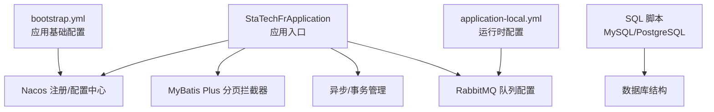
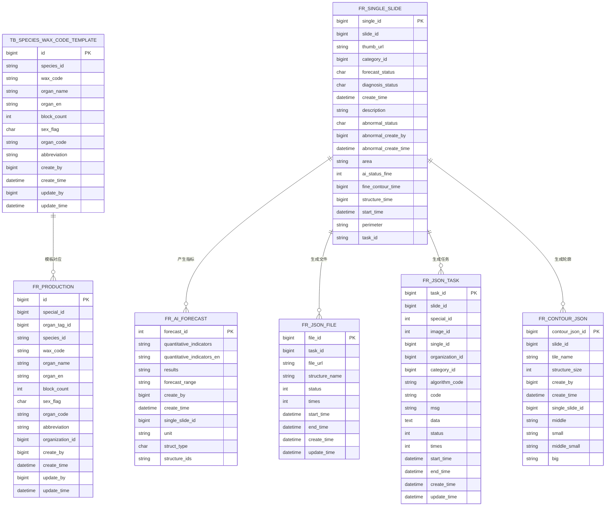
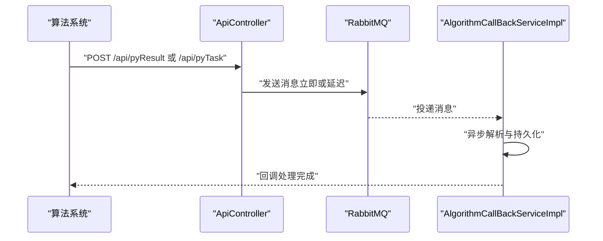
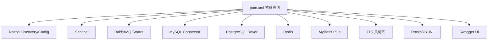

# 系统边界与约束

<cite>
**本文引用的文件**
- [StaTechFrApplication.java](file://src/main/java/cn/staitech/fr/StaTechFrApplication.java)
- [pom.xml](file://pom.xml)
- [application-local.yml](file://src/main/resources/application-local.yml)
- [bootstrap.yml](file://src/main/resources/bootstrap.yml)
- [V2.6.1-Mysql.sql](file://sql/V2.6.1-Mysql.sql)
- [V2.6.1-PostgreSQL.sql](file://sql/V2.6.1-PostgreSQL.sql)
- [ApiController.java](file://src/main/java/cn/staitech/fr/controller/ApiController.java)
- [AlgorithmCallBackServiceImpl.java](file://src/main/java/cn/staitech/fr/service/impl/AlgorithmCallBackServiceImpl.java)
- [DynamicThreadPoolConfig.java](file://src/main/java/cn/staitech/fr/config/DynamicThreadPoolConfig.java)
- [dockerfile](file://docker/staitech/modules/fr/dockerfile)
- [jmx_config.yaml](file://docker/staitech/modules/fr/jmx_config.yaml)
</cite>

## 目录
1. [引言](#引言)
2. [项目结构](#项目结构)
3. [核心组件](#核心组件)
4. [架构总览](#架构总览)
5. [详细组件分析](#详细组件分析)
6. [依赖分析](#依赖分析)
7. [性能考虑](#性能考虑)
8. [故障排查指南](#故障排查指南)
9. [结论](#结论)
10. [附录](#附录)

## 引言
本文件面向FR（数字阅片）模块，系统性给出功能边界、业务范围、技术约束、系统集成边界、外部依赖关系、性能基准、可用性标准与扩展性限制，为系统设计与部署提供明确的约束条件。

## 项目结构
FR模块采用Spring Boot微服务架构，核心入口类负责应用启动、MyBatis Plus分页拦截器装配、异步与事务管理启用，并通过Nacos进行服务注册与配置中心接入。资源配置文件定义了数据库连接池、Redis、RabbitMQ、队列与线程池等运行时参数；SQL脚本定义了MySQL与PostgreSQL的数据库结构与索引策略。



**图表来源**
- [StaTechFrApplication.java:39-62](file://src/main/java/cn/staitech/fr/StaTechFrApplication.java#L39-L62)
- [bootstrap.yml:19-46](file://src/main/resources/bootstrap.yml#L19-L46)
- [application-local.yml:15-75](file://src/main/resources/application-local.yml#L15-L75)
- [V2.6.1-Mysql.sql:1-242](file://sql/V2.6.1-Mysql.sql#L1-L242)
- [V2.6.1-PostgreSQL.sql:1-48](file://sql/V2.6.1-PostgreSQL.sql#L1-L48)

**章节来源**
- [StaTechFrApplication.java:39-62](file://src/main/java/cn/staitech/fr/StaTechFrApplication.java#L39-L62)
- [bootstrap.yml:19-46](file://src/main/resources/bootstrap.yml#L19-L46)
- [application-local.yml:15-75](file://src/main/resources/application-local.yml#L15-L75)
- [V2.6.1-Mysql.sql:1-242](file://sql/V2.6.1-Mysql.sql#L1-L242)
- [V2.6.1-PostgreSQL.sql:1-48](file://sql/V2.6.1-PostgreSQL.sql#L1-L48)

## 核心组件
- 应用入口与配置
  - 启用服务注册、异步、事务、MyBatis Plus分页拦截器、Swagger文档。
  - 默认时区设置为“亚洲/上海”，启动后输出文档地址。
- 数据库与连接池
  - 支持MySQL与PostgreSQL双数据库，动态数据源切换；Hikari连接池参数可配置。
- 消息与队列
  - RabbitMQ配置、队列名称与重试机制、延迟队列参数。
- 线程池与并发
  - 自定义线程池与动态线程池配置，用于异步解析与处理AI回调任务。
- 外部接口
  - 对外API接口接收算法回调与任务推送，基于消息中间件异步处理。

**章节来源**
- [StaTechFrApplication.java:39-62](file://src/main/java/cn/staitech/fr/StaTechFrApplication.java#L39-L62)
- [application-local.yml:15-75](file://src/main/resources/application-local.yml#L15-L75)
- [application-local.yml:305-311](file://src/main/resources/application-local.yml#L305-L311)
- [DynamicThreadPoolConfig.java:10-52](file://src/main/java/cn/staitech/fr/config/DynamicThreadPoolConfig.java#L10-L52)
- [ApiController.java:30-60](file://src/main/java/cn/staitech/fr/controller/ApiController.java#L30-L60)

## 架构总览
FR模块作为PACMVS主系统的一个子模块，通过Nacos进行服务发现与配置下发，使用RabbitMQ实现与外部算法系统的异步消息交互。数据库层支持MySQL与PostgreSQL，配合动态数据源与连接池实现高可用与可扩展的数据访问。

```mermaid
graph TB
subgraph "FR模块"
APP["应用入口<br/>StaTechFrApplication"]
CFG["配置中心<br/>bootstrap.yml / application-local.yml"]
MQ["消息中间件<br/>RabbitMQ"]
DB["数据库<br/>MySQL/PostgreSQL"]
API["对外接口<br/>ApiController"]
TH["线程池<br/>动态线程池配置"]
end
subgraph "PACMVS主系统"
DISC["服务注册/发现<br/>Nacos"]
SYS["其他子系统"]
end
APP --> CFG
APP --> MQ
APP --> DB
APP --> TH
API --> MQ
MQ --> SYS
DISC <- --> APP
DISC <- --> SYS
```

**图表来源**
- [StaTechFrApplication.java:39-62](file://src/main/java/cn/staitech/fr/StaTechFrApplication.java#L39-L62)
- [bootstrap.yml:23-46](file://src/main/resources/bootstrap.yml#L23-L46)
- [application-local.yml:57-75](file://src/main/resources/application-local.yml#L57-L75)
- [ApiController.java:30-60](file://src/main/java/cn/staitech/fr/controller/ApiController.java#L30-L60)

## 详细组件分析

### 功能边界与业务范围
- 支持的医学影像类型
  - 切片（Slide）与单脏器切片（Single Slide）管理，支持AI识别状态、结构化状态、诊断状态等字段，覆盖粗/精细轮廓与量化指标。
- 适用的实验动物种类
  - 种属（Species）与蜡块模板（Species Wax Code Template）配置，支持多物种（如鼠、犬、猴等）的组织结构映射与标签体系。
- 病理分析场景
  - 脏器识别、结构化标注、筛差分析、量化指标计算、AI任务调度与回调处理。



**图表来源**
- [V2.6.1-Mysql.sql:20-122](file://sql/V2.6.1-Mysql.sql#L20-L122)
- [V2.6.1-Mysql.sql:47-143](file://sql/V2.6.1-Mysql.sql#L47-L143)
- [V2.6.1-Mysql.sql:109-122](file://sql/V2.6.1-Mysql.sql#L109-L122)
- [V2.6.1-Mysql.sql:129-143](file://sql/V2.6.1-Mysql.sql#L129-L143)

**章节来源**
- [V2.6.1-Mysql.sql:20-122](file://sql/V2.6.1-Mysql.sql#L20-L122)
- [V2.6.1-Mysql.sql:47-143](file://sql/V2.6.1-Mysql.sql#L47-L143)
- [V2.6.1-Mysql.sql:109-122](file://sql/V2.6.1-Mysql.sql#L109-L122)
- [V2.6.1-Mysql.sql:129-143](file://sql/V2.6.1-Mysql.sql#L129-L143)

### 技术约束条件
- 数据库支持
  - MySQL与PostgreSQL双数据库支持；PostgreSQL引入几何类型（geometry）以支撑轮廓存储与查询。
- 内存限制
  - 未在配置中显式设置JVM堆大小，需结合容器资源限制与实际负载评估。
- 并发处理能力
  - 自定义线程池与动态线程池配置，核心线程数与最大线程数随CPU核数动态调整；队列长度与拒绝策略可配置。
- 网络带宽要求
  - 未在配置中显式设置网络带宽阈值，需结合切片分辨率、并发任务量与消息吞吐量评估。

**章节来源**
- [pom.xml:49-62](file://pom.xml#L49-L62)
- [V2.6.1-PostgreSQL.sql:10-26](file://sql/V2.6.1-PostgreSQL.sql#L10-L26)
- [DynamicThreadPoolConfig.java:14-51](file://src/main/java/cn/staitech/fr/config/DynamicThreadPoolConfig.java#L14-L51)
- [application-local.yml:305-311](file://src/main/resources/application-local.yml#L305-L311)

### 系统集成边界
- 与PACMVS主系统的接口规范
  - 通过Nacos进行服务注册与配置中心接入，统一端口与命名。
  - 对外API接口接收算法回调与任务推送，消息通过RabbitMQ异步投递。
- 数据交换格式
  - JSON格式的消息体，包含任务ID、算法返回状态与数据。
- 消息传递协议
  - RabbitMQ，支持确认模式、重试与延迟队列。



**图表来源**
- [ApiController.java:30-60](file://src/main/java/cn/staitech/fr/controller/ApiController.java#L30-L60)
- [AlgorithmCallBackServiceImpl.java:23-57](file://src/main/java/cn/staitech/fr/service/impl/AlgorithmCallBackServiceImpl.java#L23-L57)
- [application-local.yml:57-75](file://src/main/resources/application-local.yml#L57-L75)

**章节来源**
- [bootstrap.yml:23-46](file://src/main/resources/bootstrap.yml#L23-L46)
- [ApiController.java:30-60](file://src/main/java/cn/staitech/fr/controller/ApiController.java#L30-L60)
- [AlgorithmCallBackServiceImpl.java:23-57](file://src/main/java/cn/staitech/fr/service/impl/AlgorithmCallBackServiceImpl.java#L23-L57)
- [application-local.yml:57-75](file://src/main/resources/application-local.yml#L57-L75)

### 外部依赖关系
- 第三方AI算法提供商
  - 通过对外API接收算法回调与任务推送，消息格式为JSON。
- 云服务集成
  - Nacos服务注册与配置中心；Prometheus监控（JMX Exporter）。
- 硬件设备兼容性
  - 未在配置中显式声明硬件设备兼容性要求。

**章节来源**
- [pom.xml:25-41](file://pom.xml#L25-L41)
- [jmx_config.yaml:1-125](file://docker/staitech/modules/fr/jmx_config.yaml#L1-L125)
- [dockerfile:1-22](file://docker/staitech/modules/fr/dockerfile#L1-L22)

## 依赖分析
FR模块依赖Spring Cloud Alibaba（Nacos、Sentinel）、MyBatis Plus、RabbitMQ、MySQL与PostgreSQL驱动、Redis、JTS几何库、RocksDB等组件；构建产物包含模板与本地lib目录资源。



**图表来源**
- [pom.xml:19-211](file://pom.xml#L19-L211)

**章节来源**
- [pom.xml:19-211](file://pom.xml#L19-L211)

## 性能考虑
- 线程池与队列
  - 自定义线程池与动态线程池均具备可观测性日志，便于监控队列长度、活跃线程数与完成任务数。
- 数据库连接池
  - Hikari连接池参数可调，建议结合峰值并发与查询复杂度进行压测优化。
- 监控与可观测性
  - Docker镜像内置JMX Exporter，可对接Prometheus采集JVM指标。

**章节来源**
- [DynamicThreadPoolConfig.java:14-51](file://src/main/java/cn/staitech/fr/config/DynamicThreadPoolConfig.java#L14-L51)
- [application-local.yml:25-54](file://src/main/resources/application-local.yml#L25-L54)
- [jmx_config.yaml:18-125](file://docker/staitech/modules/fr/jmx_config.yaml#L18-L125)

## 故障排查指南
- 启动与端口
  - 应用启动后输出文档地址与端口，默认端口由bootstrap.yml配置。
- 配置中心与注册
  - 检查Nacos地址、命名空间与分组配置是否正确。
- 数据库连接
  - 核对主从库URL、用户名密码与驱动类名；关注连接池超时与校验查询。
- 消息队列
  - 关注发布确认、手动ACK与重试次数；检查延迟队列参数。
- 线程池
  - 观察线程池日志，定位队列积压与拒绝策略触发原因。

**章节来源**
- [StaTechFrApplication.java:45-51](file://src/main/java/cn/staitech/fr/StaTechFrApplication.java#L45-L51)
- [bootstrap.yml:23-46](file://src/main/resources/bootstrap.yml#L23-L46)
- [application-local.yml:15-75](file://src/main/resources/application-local.yml#L15-L75)
- [DynamicThreadPoolConfig.java:27-45](file://src/main/java/cn/staitech/fr/config/DynamicThreadPoolConfig.java#L27-L45)

## 结论
FR模块在功能上聚焦于数字阅片、脏器识别与结构化分析，支持MySQL与PostgreSQL数据库，通过RabbitMQ与外部算法系统进行异步交互。技术约束方面，模块具备动态线程池与可观测性能力，但未在配置中显式设定内存上限与网络带宽阈值，建议结合实际负载进行压测与容量规划。系统集成边界清晰，依赖Nacos与RabbitMQ，满足PACMVS主系统的微服务架构要求。

## 附录
- 部署与监控
  - Docker镜像使用OpenJDK 8，内置JMX Exporter与Arthas工具，便于远程诊断与监控。
- 版本与升级
  - SQL脚本包含MySQL与PostgreSQL两套初始化与变更脚本，升级时需按数据库类型选择对应脚本。

**章节来源**
- [dockerfile:1-22](file://docker/staitech/modules/fr/dockerfile#L1-L22)
- [jmx_config.yaml:1-125](file://docker/staitech/modules/fr/jmx_config.yaml#L1-L125)
- [V2.6.1-Mysql.sql:1-242](file://sql/V2.6.1-Mysql.sql#L1-L242)
- [V2.6.1-PostgreSQL.sql:1-48](file://sql/V2.6.1-PostgreSQL.sql#L1-L48)