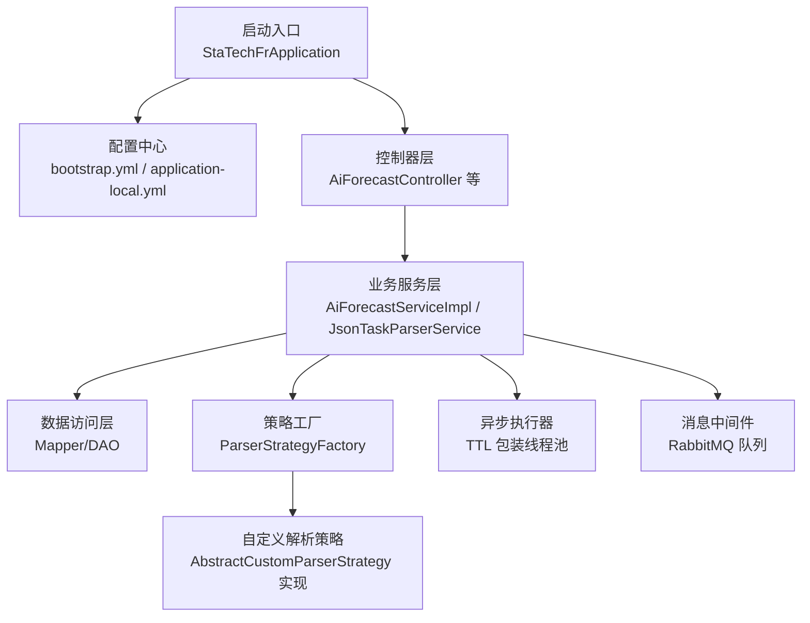
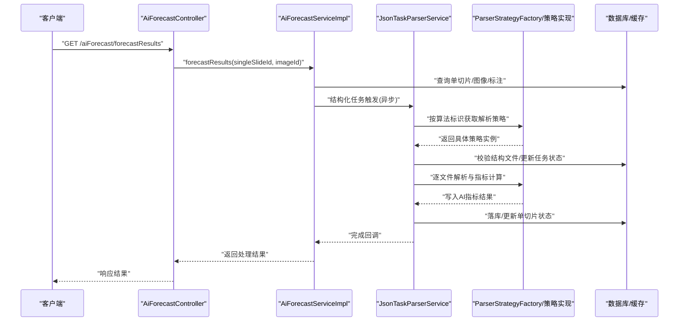
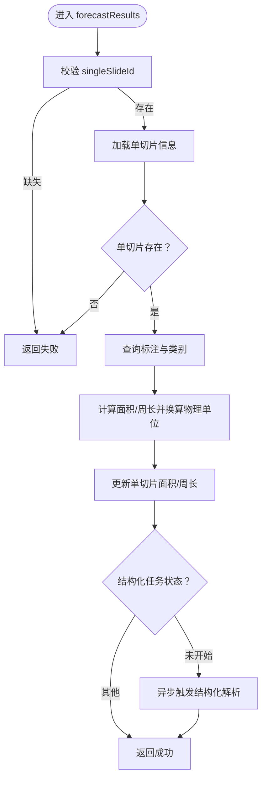
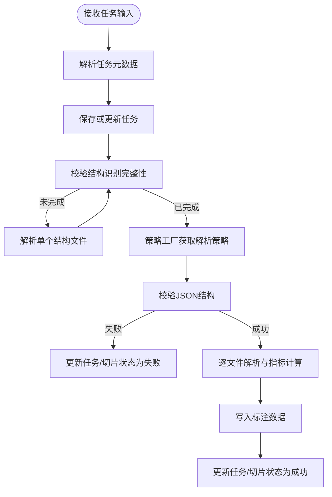
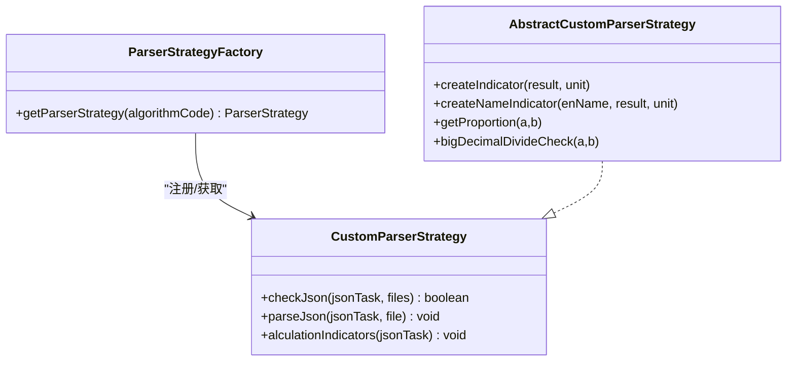
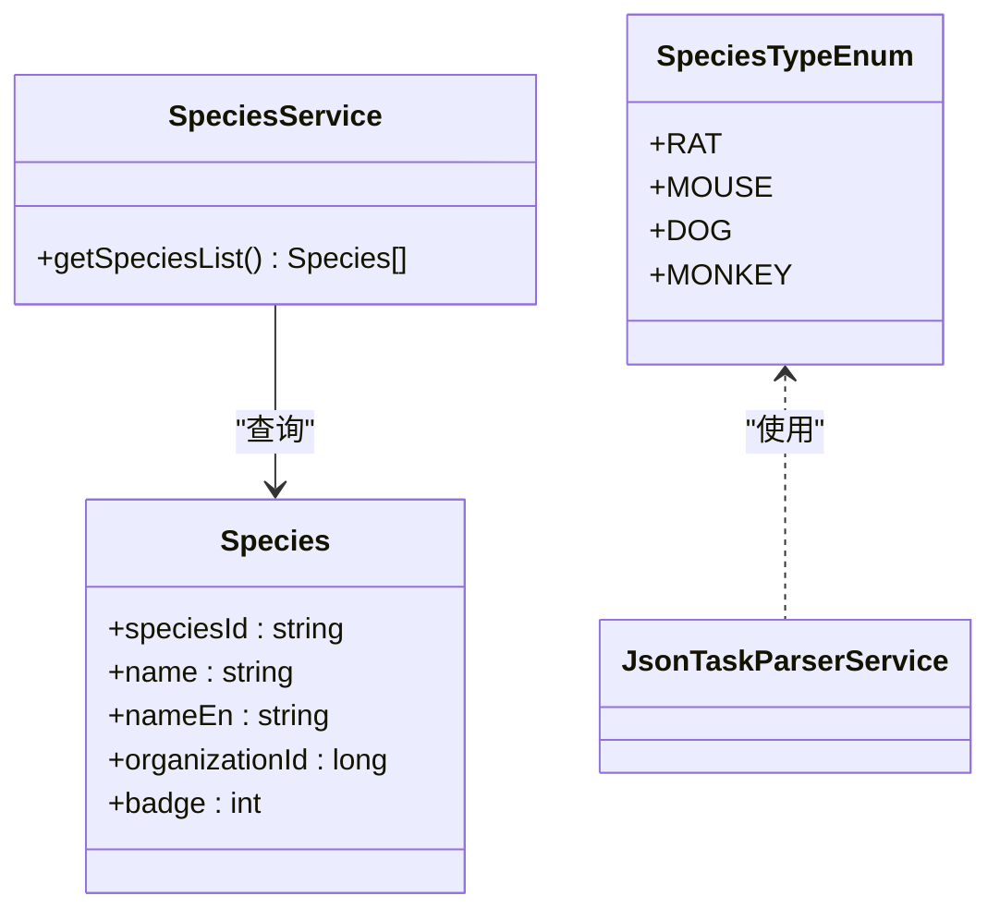
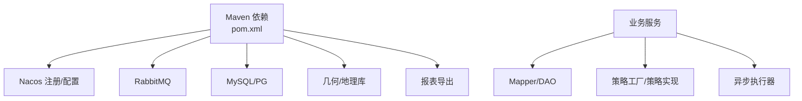

# 项目介绍

<cite>
**本文引用的文件**
- [StaTechFrApplication.java](file://src/main/java/cn/staitech/fr/StaTechFrApplication.java)
- [pom.xml](file://pom.xml)
- [application-local.yml](file://src/main/resources/application-local.yml)
- [bootstrap.yml](file://src/main/resources/bootstrap.yml)
- [AiForecastService.java](file://src/main/java/cn/staitech/fr/service/AiForecastService.java)
- [AiForecastServiceImpl.java](file://src/main/java/cn/staitech/fr/service/impl/AiForecastServiceImpl.java)
- [AiForecastController.java](file://src/main/java/cn/staitech/fr/controller/AiForecastController.java)
- [AiForecast.java](file://src/main/java/cn/staitech/fr/domain/AiForecast.java)
- [JsonTaskParserService.java](file://src/main/java/cn/staitech/fr/service/strategy/json/JsonTaskParserService.java)
- [AbstractCustomParserStrategy.java](file://src/main/java/cn/staitech/fr/service/strategy/json/AbstractCustomParserStrategy.java)
- [ParserStrategyFactory.java](file://src/main/java/cn/staitech/fr/service/strategy/json/ParserStrategyFactory.java)
- [Species.java](file://src/main/java/cn/staitech/fr/domain/Species.java)
- [SpeciesService.java](file://src/main/java/cn/staitech/fr/service/SpeciesService.java)
- [SpeciesTypeEnum.java](file://src/main/java/cn/staitech/fr/enmu/SpeciesTypeEnum.java)
</cite>

## 目录
1. [引言](#引言)
2. [项目结构](#项目结构)
3. [核心组件](#核心组件)
4. [架构总览](#架构总览)
5. [详细组件分析](#详细组件分析)
6. [依赖关系分析](#依赖关系分析)
7. [性能考量](#性能考量)
8. [故障排查指南](#故障排查指南)
9. [结论](#结论)

## 引言
本项目为 PACMVS 数字阅片平台 FR 模块，作为 PathMedics Advanced Computational Medical Visualization System 的核心子系统之一，面向医学影像分析与病理学研究场景，提供基于 AI 算法的数字阅片分析能力。FR 模块聚焦于“AI 算法分析”与“结构化指标产出”，覆盖多物种（犬、鼠、猴等实验动物）的解剖结构识别与量化分析，支持高精度测量、批量处理与异步处理机制，满足科研与药理毒理研究对自动化、可复现性与规模化的需求。

FR 模块的价值主张：
- 基于 AI 算法的医学影像分析：通过结构化 JSON 输出驱动指标计算，实现对解剖结构的自动识别与量化。
- 高精度测量：结合图像分辨率，将像素单位换算为真实物理尺寸（面积、周长等），并保留合理精度。
- 批量处理与异步处理：采用线程池与 TTL 线程上下文传递，异步执行结构文件解析与指标计算，提升吞吐与稳定性。
- 多物种支持：内置种属枚举与结构配置，适配不同物种的解剖结构差异，确保指标计算一致性。

## 项目结构
FR 模块遵循 Spring Boot + MyBatis-Plus 的分层架构，主要包含以下层次：
- 启动入口与配置：应用启动类、Spring Cloud Nacos 配置与发现、Actuator、Swagger、动态数据源、线程池与 RabbitMQ 集成。
- 控制器层：REST 接口暴露，如 AI 预测结果查询、结构化 JSON 回调处理等。
- 业务服务层：AI 预测结果聚合、指标计算、结构化 JSON 解析与策略调度。
- 数据访问层：MyBatis Mapper 与 XML 映射，支撑单切片、图像、标注、任务与指标等实体。
- 领域模型：单切片、图像、标注、结构标签、AI 指标、任务与文件等实体定义。
- 工具与配置：几何解析工具、国际化消息、组织结构配置、队列与线程池配置等。

图表来源
- [StaTechFrApplication.java:1-63](file://src/main/java/cn/staitech/fr/StaTechFrApplication.java#L1-L63)
- [bootstrap.yml:1-48](file://src/main/resources/bootstrap.yml#L1-L48)
- [application-local.yml:1-311](file://src/main/resources/application-local.yml#L1-L311)
- [JsonTaskParserService.java:1-760](file://src/main/java/cn/staitech/fr/service/strategy/json/JsonTaskParserService.java#L1-L760)
- [ParserStrategyFactory.java:1-44](file://src/main/java/cn/staitech/fr/service/strategy/json/ParserStrategyFactory.java#L1-L44)
- [AbstractCustomParserStrategy.java:1-211](file://src/main/java/cn/staitech/fr/service/strategy/json/AbstractCustomParserStrategy.java#L1-L211)

章节来源
- [StaTechFrApplication.java:1-63](file://src/main/java/cn/staitech/fr/StaTechFrApplication.java#L1-L63)
- [pom.xml:1-366](file://pom.xml#L1-L366)
- [bootstrap.yml:1-48](file://src/main/resources/bootstrap.yml#L1-L48)
- [application-local.yml:1-311](file://src/main/resources/application-local.yml#L1-L311)

## 核心组件
- 启动与配置
  - 应用启动类启用 Spring Util、Swagger、Feign 客户端、Nacos 注册与配置、异步与事务管理，并配置 MyBatis Plus 分页拦截器。
  - 配置文件定义 Redis、数据源（MySQL/PG）、RabbitMQ、动态数据源、Swagger 文档、日志与管理端点等。
- 控制器
  - 提供 AI 预测结果查询接口，接收单切片 ID 与图像 ID，触发指标计算与结构化 JSON 解析流程。
- 业务服务
  - AI 预测服务：负责面积/周长换算、结构化 JSON 任务触发、批量写入指标结果、按结构类型筛选与参考范围计算。
  - JSON 任务解析服务：负责任务元数据解析、结构文件校验、策略分发、指标计算、结果落库与异步执行。
- 领域模型与枚举
  - AI 指标实体：承载定量指标、单位、结构类型、文件链接等字段。
  - 种属枚举与服务：支持大鼠、小鼠、犬、猴等种属，用于结构识别与指标计算的差异化处理。
- 解析策略
  - 策略工厂：集中注册与获取解析策略，支持通用与自定义策略。
  - 自定义解析策略：封装指标单位、几何计算、比例与除法运算等通用能力，面向不同结构与种属。

章节来源
- [AiForecastController.java:1-31](file://src/main/java/cn/staitech/fr/controller/AiForecastController.java#L1-L31)
- [AiForecastService.java:1-29](file://src/main/java/cn/staitech/fr/service/AiForecastService.java#L1-L29)
- [AiForecastServiceImpl.java:1-372](file://src/main/java/cn/staitech/fr/service/impl/AiForecastServiceImpl.java#L1-L372)
- [AiForecast.java:1-84](file://src/main/java/cn/staitech/fr/domain/AiForecast.java#L1-L84)
- [JsonTaskParserService.java:1-760](file://src/main/java/cn/staitech/fr/service/strategy/json/JsonTaskParserService.java#L1-L760)
- [AbstractCustomParserStrategy.java:1-211](file://src/main/java/cn/staitech/fr/service/strategy/json/AbstractCustomParserStrategy.java#L1-L211)
- [ParserStrategyFactory.java:1-44](file://src/main/java/cn/staitech/fr/service/strategy/json/ParserStrategyFactory.java#L1-L44)
- [Species.java:1-49](file://src/main/java/cn/staitech/fr/domain/Species.java#L1-L49)
- [SpeciesService.java:1-20](file://src/main/java/cn/staitech/fr/service/SpeciesService.java#L1-L20)
- [SpeciesTypeEnum.java:1-25](file://src/main/java/cn/staitech/fr/enmu/SpeciesTypeEnum.java#L1-L25)

## 架构总览
FR 模块采用“控制器 → 业务服务 → 策略分发 → 异步执行”的处理链路，结合 RabbitMQ 队列与 TTL 线程池，实现高并发与可扩展的异步处理。结构化 JSON 由外部算法生成，经任务解析服务校验后，交由具体解析策略计算指标并落库。

图表来源
- [AiForecastController.java:26-30](file://src/main/java/cn/staitech/fr/controller/AiForecastController.java#L26-L30)
- [AiForecastServiceImpl.java:85-157](file://src/main/java/cn/staitech/fr/service/impl/AiForecastServiceImpl.java#L85-L157)
- [JsonTaskParserService.java:265-452](file://src/main/java/cn/staitech/fr/service/strategy/json/JsonTaskParserService.java#L265-L452)
- [ParserStrategyFactory.java:39-41](file://src/main/java/cn/staitech/fr/service/strategy/json/ParserStrategyFactory.java#L39-L41)

## 详细组件分析

### 组件一：AI 预测与指标聚合（AiForecast）
- 职责
  - 对单切片进行面积/周长换算，结合图像分辨率将像素转换为真实物理单位。
  - 当结构化任务处于“未开始”时，触发结构文件解析与指标计算。
  - 批量写入算法输出与产品呈现指标，支持按结构类型筛选与控制组参考范围计算。
- 关键流程
  - 输入单切片与图像 ID，查询标注与图像信息，计算面积与周长并更新单切片。
  - 若结构化任务未开始，提交至异步执行器，调用 JSON 任务解析服务进行指标计算。
  - 指标写入时区分“算法输出”与“产品呈现”，并记录单位与结构 ID 集合。
- 性能与可靠性
  - 使用 TTL 包装线程池，保证跨线程的上下文传递。
  - 对异常进行捕获与日志记录，避免阻塞主线程。

图表来源
- [AiForecastServiceImpl.java:85-157](file://src/main/java/cn/staitech/fr/service/impl/AiForecastServiceImpl.java#L85-L157)

章节来源
- [AiForecastService.java:16-28](file://src/main/java/cn/staitech/fr/service/AiForecastService.java#L16-L28)
- [AiForecastServiceImpl.java:85-201](file://src/main/java/cn/staitech/fr/service/impl/AiForecastServiceImpl.java#L85-L201)
- [AiForecastController.java:26-30](file://src/main/java/cn/staitech/fr/controller/AiForecastController.java#L26-L30)

### 组件二：结构化 JSON 任务解析（JsonTaskParserService）
- 职责
  - 解析任务元数据（算法标识、图像/切片/项目/类别等），维护任务状态。
  - 校验结构文件完整性，按种属与脏器配置判断识别是否完成。
  - 通过策略工厂分发到具体解析策略，执行文件解析、指标计算与结果落库。
  - 支持异步执行与优雅关闭，删除临时文件，更新任务与单切片状态。
- 关键流程
  - 接收输入 JSON，解析为任务对象并入库或更新。
  - 校验结构识别完整性，必要时解析单个结构文件。
  - 获取策略并执行校验、解析与指标计算，最后写入标注数据与更新状态。
- 多物种支持
  - 依据结构标签中的种属码与脏器码，匹配启用结构集合，确保识别完整性。
  - 针对特定种属（如大鼠）增加精细轮廓校验，防止未完成即计算。

图表来源
- [JsonTaskParserService.java:174-263](file://src/main/java/cn/staitech/fr/service/strategy/json/JsonTaskParserService.java#L174-L263)
- [JsonTaskParserService.java:319-452](file://src/main/java/cn/staitech/fr/service/strategy/json/JsonTaskParserService.java#L319-L452)

章节来源
- [JsonTaskParserService.java:174-452](file://src/main/java/cn/staitech/fr/service/strategy/json/JsonTaskParserService.java#L174-L452)

### 组件三：解析策略体系（ParserStrategyFactory 与 AbstractCustomParserStrategy）
- 职责
  - 策略工厂：集中注册与获取解析策略，支持通用与自定义策略实现。
  - 抽象策略：封装指标单位常量、几何计算、比例与除法运算等通用能力，便于各结构策略复用。
- 多物种与结构适配
  - 不同结构（如消化系统、循环系统、神经系统等）与不同种属（大鼠、小鼠、犬、猴）通过策略实现差异化处理。
  - 特殊结构（如轮廓结构）单独处理并更新单切片面积/周长。

图表来源
- [ParserStrategyFactory.java:14-44](file://src/main/java/cn/staitech/fr/service/strategy/json/ParserStrategyFactory.java#L14-L44)
- [AbstractCustomParserStrategy.java:23-211](file://src/main/java/cn/staitech/fr/service/strategy/json/AbstractCustomParserStrategy.java#L23-L211)

章节来源
- [ParserStrategyFactory.java:14-44](file://src/main/java/cn/staitech/fr/service/strategy/json/ParserStrategyFactory.java#L14-L44)
- [AbstractCustomParserStrategy.java:23-211](file://src/main/java/cn/staitech/fr/service/strategy/json/AbstractCustomParserStrategy.java#L23-L211)

### 组件四：多物种支持与结构配置
- 种属枚举与服务
  - 提供大鼠、小鼠、犬、猴的枚举与服务接口，用于结构识别与指标计算的差异化处理。
- 结构配置
  - 通过配置文件定义不同种属与脏器的启用结构集合，确保识别完整性。
  - 针对特定结构（如轮廓结构）进行特殊处理，例如更新单切片面积/周长。

图表来源
- [Species.java:22-49](file://src/main/java/cn/staitech/fr/domain/Species.java#L22-L49)
- [SpeciesService.java:16-19](file://src/main/java/cn/staitech/fr/service/SpeciesService.java#L16-L19)
- [SpeciesTypeEnum.java:3-25](file://src/main/java/cn/staitech/fr/enmu/SpeciesTypeEnum.java#L3-L25)
- [application-local.yml:108-303](file://src/main/resources/application-local.yml#L108-L303)

章节来源
- [Species.java:22-49](file://src/main/java/cn/staitech/fr/domain/Species.java#L22-L49)
- [SpeciesService.java:16-19](file://src/main/java/cn/staitech/fr/service/SpeciesService.java#L16-L19)
- [SpeciesTypeEnum.java:3-25](file://src/main/java/cn/staitech/fr/enmu/SpeciesTypeEnum.java#L3-L25)
- [application-local.yml:108-303](file://src/main/resources/application-local.yml#L108-L303)

## 依赖关系分析
- 外部依赖
  - Spring Cloud Alibaba（Nacos 发现与配置）、Sentinel 流控、RabbitMQ 消息、Redis 缓存、MySQL/PG 数据库、动态数据源。
  - 几何计算库（JTS/GeoTools）、报表导出（EasyExcel/Aspose/Poi-TL）、日志审计等。
- 内部耦合
  - 控制器依赖业务服务；业务服务依赖 Mapper 与策略工厂；策略工厂依赖具体策略实现。
  - 异步执行器贯穿指标计算与标注写入，降低请求延迟并提升吞吐。

图表来源
- [pom.xml:19-211](file://pom.xml#L19-L211)
- [JsonTaskParserService.java:94-107](file://src/main/java/cn/staitech/fr/service/strategy/json/JsonTaskParserService.java#L94-L107)

章节来源
- [pom.xml:19-211](file://pom.xml#L19-L211)
- [bootstrap.yml:23-46](file://src/main/resources/bootstrap.yml#L23-L46)
- [application-local.yml:57-106](file://src/main/resources/application-local.yml#L57-L106)

## 性能考量
- 异步与线程池
  - 使用 TTL 包装的线程池，确保跨线程上下文传递；针对结构文件解析与指标计算进行异步化，减少请求阻塞。
- 批量写入
  - 指标写入采用批量插入，降低数据库往返开销。
- 文件大小与日志
  - 解析过程中记录文件大小与耗时，便于性能监控与优化。
- 数据库与缓存
  - 动态数据源与连接池配置，结合 Redis 缓存热点数据，提升读写性能。

## 故障排查指南
- 常见问题
  - 任务状态异常：检查任务状态枚举与更新逻辑，确认“未开始/进行中/成功/失败”流转是否正确。
  - 结构识别不完整：核对种属与脏器配置，确保启用结构集合与实际识别结果一致。
  - 异步执行失败：查看线程池初始化与 TTL 包装，确认异常日志与重试策略。
  - 多物种差异：针对特定种属（如大鼠）的精细轮廓校验，确保前置条件满足后再进行指标计算。
- 排查步骤
  - 查看启动日志与管理端点，确认 Nacos、RabbitMQ、数据库连接正常。
  - 检查任务与文件状态，定位解析失败的结构文件与错误原因。
  - 关注指标计算过程中的异常堆栈与日志，定位具体策略实现的问题。

章节来源
- [JsonTaskParserService.java:94-107](file://src/main/java/cn/staitech/fr/service/strategy/json/JsonTaskParserService.java#L94-L107)
- [JsonTaskParserService.java:234-254](file://src/main/java/cn/staitech/fr/service/strategy/json/JsonTaskParserService.java#L234-L254)
- [AiForecastServiceImpl.java:152-156](file://src/main/java/cn/staitech/fr/service/impl/AiForecastServiceImpl.java#L152-L156)

## 结论
FR 模块围绕“AI 算法分析 + 结构化指标产出”的目标，构建了从任务解析、策略分发到异步执行与结果落库的完整链路。通过多物种支持与结构配置，实现了对不同实验动物解剖结构的统一处理；借助异步与批处理机制，显著提升了系统的吞吐与稳定性。对于初学者，建议从控制器与业务服务入手，逐步理解任务解析与策略分发；对于有经验的开发者，可关注线程池配置、异常处理与性能监控，持续优化大规模场景下的表现。