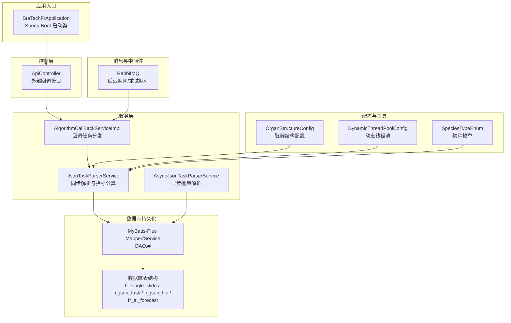
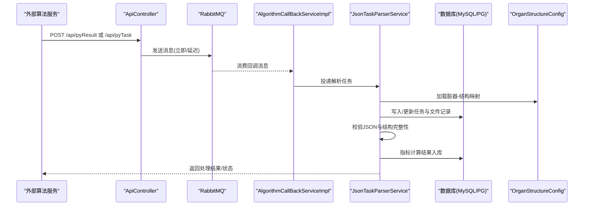
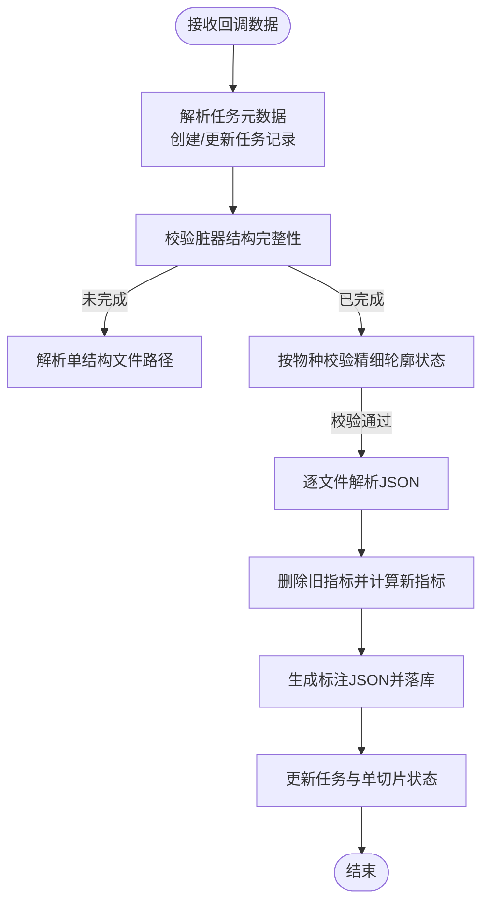
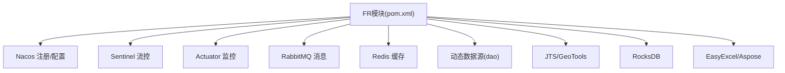

# 项目概述

<cite>
**本文引用的文件**
- [StaTechFrApplication.java](file://src/main/java/cn/staitech/fr/StaTechFrApplication.java)
- [ApiController.java](file://src/main/java/cn/staitech/fr/controller/ApiController.java)
- [JsonTaskParserService.java](file://src/main/java/cn/staitech/fr/service/strategy/json/JsonTaskParserService.java)
- [AsyncJsonTaskParserService.java](file://src/main/java/cn/staitech/fr/service/strategy/json/AsyncJsonTaskParserService.java)
- [AlgorithmCallBackServiceImpl.java](file://src/main/java/cn/staitech/fr/service/impl/AlgorithmCallBackServiceImpl.java)
- [DynamicThreadPoolConfig.java](file://src/main/java/cn/staitech/fr/config/DynamicThreadPoolConfig.java)
- [OrganStructureConfig.java](file://src/main/java/cn/staitech/fr/config/OrganStructureConfig.java)
- [SpeciesTypeEnum.java](file://src/main/java/cn/staitech/fr/enmu/SpeciesTypeEnum.java)
- [AiMessageBO.java](file://src/main/java/cn/staitech/fr/domain/in/AiMessageBO.java)
- [AiStatusEnum.java](file://src/main/java/cn/staitech/fr/enums/AiStatusEnum.java)
- [application-local.yml](file://src/main/resources/application-local.yml)
- [pom.xml](file://pom.xml)
- [V2.6.1-Mysql.sql](file://sql/V2.6.1-Mysql.sql)
</cite>

## 目录
1. [引言](#引言)
2. [项目结构](#项目结构)
3. [核心组件](#核心组件)
4. [架构总览](#架构总览)
5. [详细组件分析](#详细组件分析)
6. [依赖分析](#依赖分析)
7. [性能考量](#性能考量)
8. [故障排查指南](#故障排查指南)
9. [结论](#结论)
10. [附录](#附录)

## 引言
PACMVS数字阅片平台FR模块是PathMedics Advanced Computational Medical Visualization System（高级计算医学可视化系统）的核心子系统之一，专注于面向实验动物（犬、鼠、猴等）的数字阅片与AI辅助病理分析。该模块通过接收外部算法回调的JSON结构化结果，完成对单脏器切片的结构化解析、指标计算与结果落库，支撑高精度测量、批量处理与异步处理能力，服务于医学影像分析与病理学研究。

## 项目结构
FR模块采用标准Spring Boot工程结构，主要由应用入口、控制器层、服务层、配置与工具类组成，并通过MyBatis-Plus进行数据库访问，结合动态数据源、RabbitMQ消息队列与线程池实现异步与并发处理。资源配置集中在application-local.yml中，包含Redis、数据源、RabbitMQ、Swagger、线程池与脏器结构配置等。

图表来源
- [StaTechFrApplication.java:39-62](file://src/main/java/cn/staitech/fr/StaTechFrApplication.java#L39-L62)
- [ApiController.java:30-60](file://src/main/java/cn/staitech/fr/controller/ApiController.java#L30-L60)
- [JsonTaskParserService.java:52-107](file://src/main/java/cn/staitech/fr/service/strategy/json/JsonTaskParserService.java#L52-L107)
- [AsyncJsonTaskParserService.java:26-67](file://src/main/java/cn/staitech/fr/service/strategy/json/AsyncJsonTaskParserService.java#L26-L67)
- [AlgorithmCallBackServiceImpl.java:21-57](file://src/main/java/cn/staitech/fr/service/impl/AlgorithmCallBackServiceImpl.java#L21-L57)
- [OrganStructureConfig.java:11-44](file://src/main/java/cn/staitech/fr/config/OrganStructureConfig.java#L11-L44)
- [DynamicThreadPoolConfig.java:10-52](file://src/main/java/cn/staitech/fr/config/DynamicThreadPoolConfig.java#L10-L52)
- [application-local.yml:5-110](file://src/main/resources/application-local.yml#L5-L110)

章节来源
- [StaTechFrApplication.java:39-62](file://src/main/java/cn/staitech/fr/StaTechFrApplication.java#L39-L62)
- [pom.xml:19-211](file://pom.xml#L19-L211)

## 核心组件
- 应用入口与配置
  - 启用异步、事务管理、MyBatis分页插件、Nacos注册发现、OpenFeign客户端、Swagger等。
- 控制器
  - 提供外部算法回调接口，接收Python算法结果与任务推送，统一转发至消息生产者。
- 服务层
  - 同步解析：JsonTaskParserService负责任务元数据解析、文件路径解析、结构校验、指标计算、结果落库与状态更新。
  - 异步解析：AsyncJsonTaskParserService基于线程池并发解析多个JSON文件，提升批量处理吞吐。
  - 回调分发：AlgorithmCallBackServiceImpl将回调数据投递到独立线程池，解耦外部算法与业务处理。
- 配置与工具
  - OrganStructureConfig：加载脏器-结构映射配置，支持按物种与脏器维度进行结构识别完整性校验。
  - DynamicThreadPoolConfig：提供可监控的动态线程池，便于异步任务调度与容量控制。
  - SpeciesTypeEnum：定义实验动物种类枚举，用于区分不同物种的结构与流程差异。
- 数据模型与状态
  - AiStatusEnum：AI分析状态（未分析、脏器识别中、异常、完成）。
  - AiMessageBO：算法回调消息载体，包含切片、图像、机构、脏器、算法策略码与结构化数据列表。

章节来源
- [ApiController.java:30-60](file://src/main/java/cn/staitech/fr/controller/ApiController.java#L30-L60)
- [JsonTaskParserService.java:52-107](file://src/main/java/cn/staitech/fr/service/strategy/json/JsonTaskParserService.java#L52-L107)
- [AsyncJsonTaskParserService.java:26-67](file://src/main/java/cn/staitech/fr/service/strategy/json/AsyncJsonTaskParserService.java#L26-L67)
- [AlgorithmCallBackServiceImpl.java:21-57](file://src/main/java/cn/staitech/fr/service/impl/AlgorithmCallBackServiceImpl.java#L21-L57)
- [OrganStructureConfig.java:11-44](file://src/main/java/cn/staitech/fr/config/OrganStructureConfig.java#L11-L44)
- [DynamicThreadPoolConfig.java:10-52](file://src/main/java/cn/staitech/fr/config/DynamicThreadPoolConfig.java#L10-L52)
- [SpeciesTypeEnum.java:3-24](file://src/main/java/cn/staitech/fr/enmu/SpeciesTypeEnum.java#L3-L24)
- [AiStatusEnum.java:3-24](file://src/main/java/cn/staitech/fr/enums/AiStatusEnum.java#L3-L24)
- [AiMessageBO.java:11-38](file://src/main/java/cn/staitech/fr/domain/in/AiMessageBO.java#L11-L38)

## 架构总览
FR模块采用“外部算法回调 + 消息队列 + 任务解析 + 指标计算 + 结果落库”的链路，支持多物种、多脏器、多结构的结构化解析与批量处理。系统通过线程池与异步机制实现高并发与低延迟，配合脏器结构配置与状态机确保解析质量与一致性。

图表来源
- [ApiController.java:38-59](file://src/main/java/cn/staitech/fr/controller/ApiController.java#L38-L59)
- [AlgorithmCallBackServiceImpl.java:29-55](file://src/main/java/cn/staitech/fr/service/impl/AlgorithmCallBackServiceImpl.java#L29-L55)
- [JsonTaskParserService.java:174-263](file://src/main/java/cn/staitech/fr/service/strategy/json/JsonTaskParserService.java#L174-L263)
- [OrganStructureConfig.java:11-44](file://src/main/java/cn/staitech/fr/config/OrganStructureConfig.java#L11-L44)
- [application-local.yml:57-110](file://src/main/resources/application-local.yml#L57-L110)

## 详细组件分析

### 组件A：外部回调与消息投递（ApiController）
- 功能要点
  - 接收算法回调结果与任务推送，统一转换为消息发送至RabbitMQ。
  - 支持延迟消息，结合延迟队列与重试队列实现容错与幂等。
- 关键行为
  - /api/pyResult：接收算法结果，写入消息队列。
  - /api/pyTask：接收算法任务，按配置的延迟时间发送延迟消息。
- 适用场景
  - Python算法侧异步产出结构化JSON，通过HTTP回调进入FR模块进行结构化解析与指标计算。

章节来源
- [ApiController.java:30-60](file://src/main/java/cn/staitech/fr/controller/ApiController.java#L30-L60)
- [application-local.yml:305-311](file://src/main/resources/application-local.yml#L305-L311)

### 组件B：同步解析与指标计算（JsonTaskParserService）
- 功能要点
  - 解析任务元数据与文件列表，校验脏器结构完整性。
  - 根据算法策略码选择解析器，逐文件解析并落库。
  - 删除旧指标、计算新指标、生成标注JSON并更新状态。
- 并发与线程池
  - 通过注入的ExecutorService与TTL包装，保证线程上下文传递与优雅关闭。
- 特殊处理
  - 对特定结构（如轮廓或特殊结构）进行单独处理与面积/周长更新。
  - 针对不同物种（如大鼠）进行精细轮廓状态校验后再执行解析。

图表来源
- [JsonTaskParserService.java:174-452](file://src/main/java/cn/staitech/fr/service/strategy/json/JsonTaskParserService.java#L174-L452)

章节来源
- [JsonTaskParserService.java:52-107](file://src/main/java/cn/staitech/fr/service/strategy/json/JsonTaskParserService.java#L52-L107)
- [JsonTaskParserService.java:174-452](file://src/main/java/cn/staitech/fr/service/strategy/json/JsonTaskParserService.java#L174-L452)

### 组件C：异步批量解析（AsyncJsonTaskParserService）
- 功能要点
  - 基于自定义线程池并发解析多个JSON文件，提升批量处理吞吐。
  - 使用CountDownLatch协调任务完成，确保指标计算前的数据一致性。
- 适用场景
  - 多结构/多切片批量导入，缩短端到端处理时延。

章节来源
- [AsyncJsonTaskParserService.java:26-67](file://src/main/java/cn/staitech/fr/service/strategy/json/AsyncJsonTaskParserService.java#L26-L67)
- [AsyncJsonTaskParserService.java:68-213](file://src/main/java/cn/staitech/fr/service/strategy/json/AsyncJsonTaskParserService.java#L68-L213)

### 组件D：动态线程池与监控（DynamicThreadPoolConfig）
- 功能要点
  - 提供可监控的线程池Bean，记录提交、开始、完成阶段的队列长度与活跃线程数。
  - 适用于高并发场景下的任务调度与容量控制。

章节来源
- [DynamicThreadPoolConfig.java:10-52](file://src/main/java/cn/staitech/fr/config/DynamicThreadPoolConfig.java#L10-L52)

### 组件E：脏器结构配置（OrganStructureConfig）
- 功能要点
  - 从配置文件加载“物种+脏器”到结构ID集合的映射，用于结构识别完整性校验。
- 适用场景
  - 不同物种与脏器的结构集合差异较大，通过配置驱动解析策略。

章节来源
- [OrganStructureConfig.java:11-44](file://src/main/java/cn/staitech/fr/config/OrganStructureConfig.java#L11-L44)
- [application-local.yml:107-303](file://src/main/resources/application-local.yml#L107-L303)

### 组件F：物种枚举与状态枚举
- 物种枚举（SpeciesTypeEnum）
  - 支持大鼠、小鼠、犬、猴等，用于流程分支与校验。
- AI状态枚举（AiStatusEnum）
  - 统一AI分析状态，便于前端与业务侧展示与控制。

章节来源
- [SpeciesTypeEnum.java:3-24](file://src/main/java/cn/staitech/fr/enmu/SpeciesTypeEnum.java#L3-L24)
- [AiStatusEnum.java:3-24](file://src/main/java/cn/staitech/fr/enums/AiStatusEnum.java#L3-L24)

## 依赖分析
- 外部依赖
  - Spring Cloud Alibaba（Nacos注册与配置）、Sentinel限流、Actuator监控。
  - RabbitMQ（AMQP）、Redis（缓存/会话）、MySQL/PostgreSQL（主从双写）。
  - JTS/GeoTools（几何与GeoJSON处理）、RocksDB（高性能KV）、EasyExcel/Aspose-Word（报表导出）。
- 内部模块
  - 与系统API模块、安全模块、Swagger模块集成，提供统一鉴权与文档。

图表来源
- [pom.xml:19-211](file://pom.xml#L19-L211)

章节来源
- [pom.xml:19-211](file://pom.xml#L19-L211)

## 性能考量
- 异步与并发
  - 通过线程池与异步解析服务，显著提升多结构/多切片场景下的吞吐量。
- 线程池监控
  - 动态线程池提供提交/开始/完成阶段的日志统计，便于容量评估与调优。
- I/O与存储
  - JSON文件解析与指标计算涉及磁盘I/O，建议结合文件系统与存储策略优化。
- 数据库
  - 主从分离与分页插件提升读写性能；注意索引设计与批量写入策略。

## 故障排查指南
- 回调接口
  - 检查ApiController日志与RabbitMQ连接配置，确认消息是否正确入队与消费。
- 任务解析
  - 关注JsonTaskParserService的状态更新与异常捕获，查看脏器结构完整性校验与文件存在性。
- 线程池
  - 查看DynamicThreadPoolConfig的监控日志，确认队列积压与线程活跃度。
- 数据一致性
  - 核对fr_json_task、fr_json_file、fr_ai_forecast等表状态字段，确保任务与指标落库顺序正确。

章节来源
- [ApiController.java:30-60](file://src/main/java/cn/staitech/fr/controller/ApiController.java#L30-L60)
- [JsonTaskParserService.java:265-452](file://src/main/java/cn/staitech/fr/service/strategy/json/JsonTaskParserService.java#L265-L452)
- [DynamicThreadPoolConfig.java:10-52](file://src/main/java/cn/staitech/fr/config/DynamicThreadPoolConfig.java#L10-L52)

## 结论
FR模块围绕“多物种、多脏器、多结构”的AI数字阅片需求，构建了从算法回调、任务解析、指标计算到结果落库的完整链路。通过异步与并发处理、动态线程池监控、脏器结构配置与状态机管理，实现了高精度测量、批量处理与稳定可靠的异步处理机制，为医学影像分析与病理学研究提供了坚实的技术支撑。

## 附录
- 数据库表结构概览
  - 单脏器切片表：记录单切片状态、结构化时间、面积/周长等。
  - JSON解析任务表：记录任务元数据、状态与执行时间。
  - JSON文件表：记录结构文件路径、状态与执行时间。
  - 量化指标表：存储结构化后的定量指标与结果。
  - 轮廓JSON表：存储标注JSON文件路径与结构大小。

章节来源
- [V2.6.1-Mysql.sql:47-146](file://sql/V2.6.1-Mysql.sql#L47-L146)